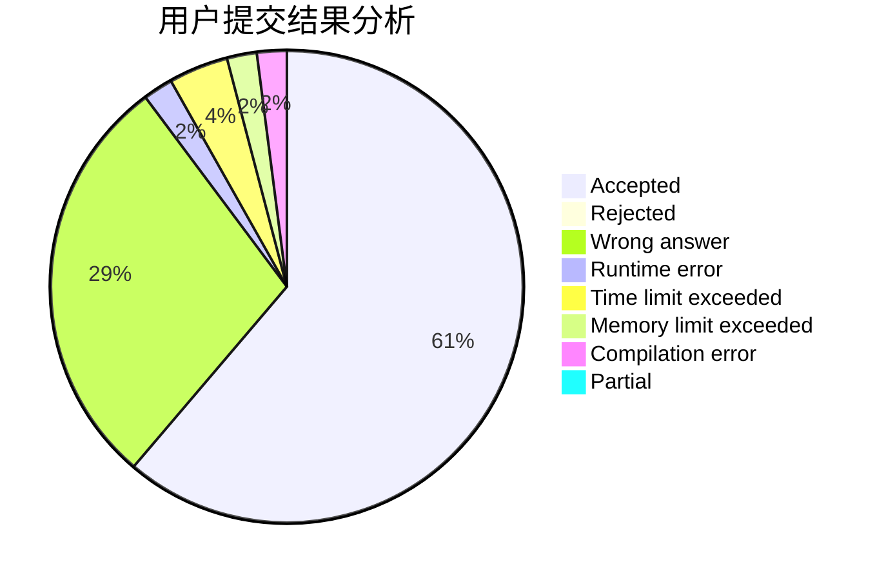
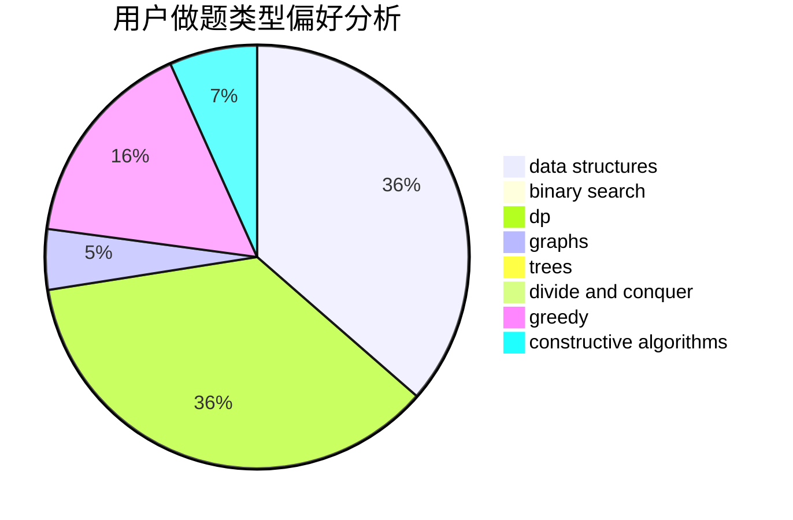
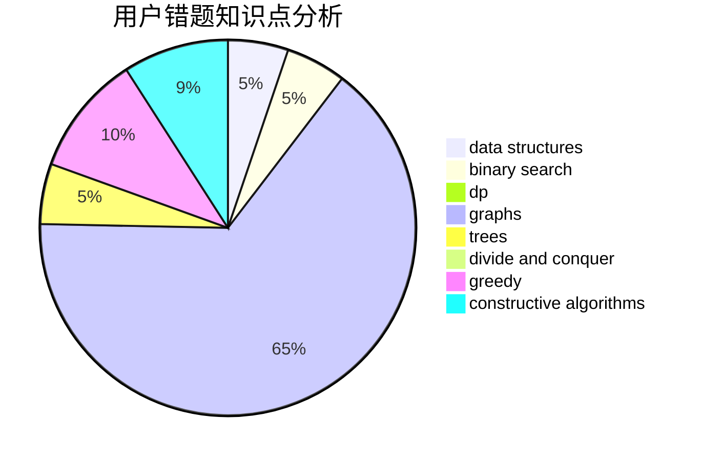

# AmamiyaKokoro

<!-- tabs:start -->

#### **用户提交结果分析**

#### **用户做题类型偏好分析**

#### **用户错题知识点分析**

<!-- tabs:end -->
# 推荐题目
[323C](https://codeforces.com/contest/323/problem/C)		data structures		  
[327A](https://codeforces.com/contest/327/problem/A)		brute force,
                        dp,
                        implementation		  
[1290F](https://codeforces.com/contest/1290/problem/F)		dp		  
[1256F](https://codeforces.com/contest/1256/problem/F)		constructive algorithms,
                        sortings,
                        strings		  
[325D](https://codeforces.com/contest/325/problem/D)		dsu		  
[325B](https://codeforces.com/contest/325/problem/B)		binary search,
                        math		  
[327D](https://codeforces.com/contest/327/problem/D)		constructive algorithms,
                        dfs and similar,
                        graphs		  
[325E](https://codeforces.com/contest/325/problem/E)		combinatorics,
                        dfs and similar,
                        dsu,
                        graphs,
                        greedy		  
[323B](https://codeforces.com/contest/323/problem/B)		constructive algorithms,
                        graphs		  
[328A](https://codeforces.com/contest/328/problem/A)		implementation		  
