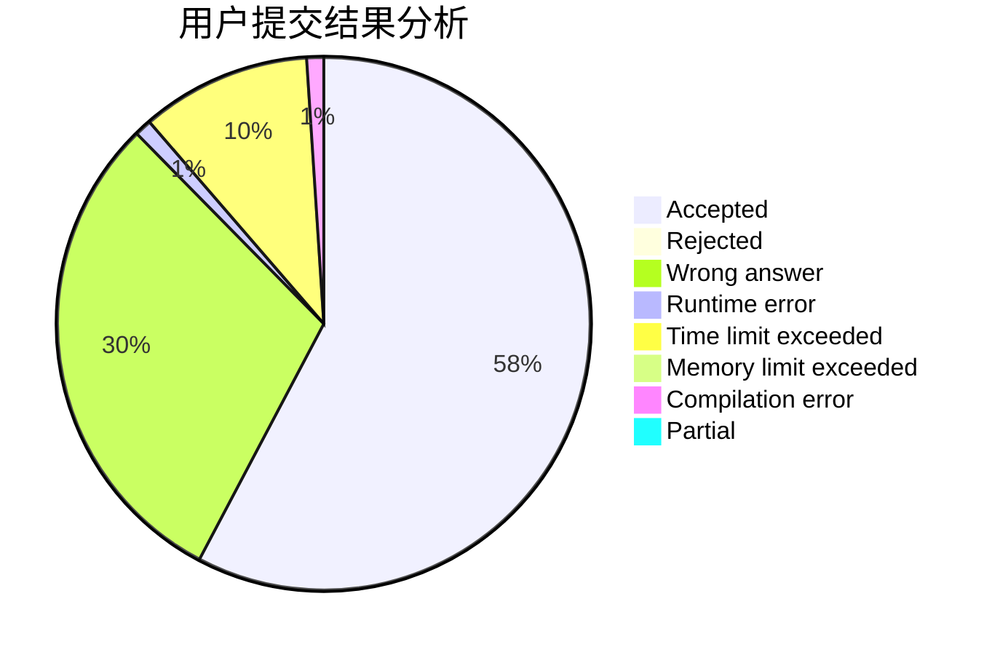
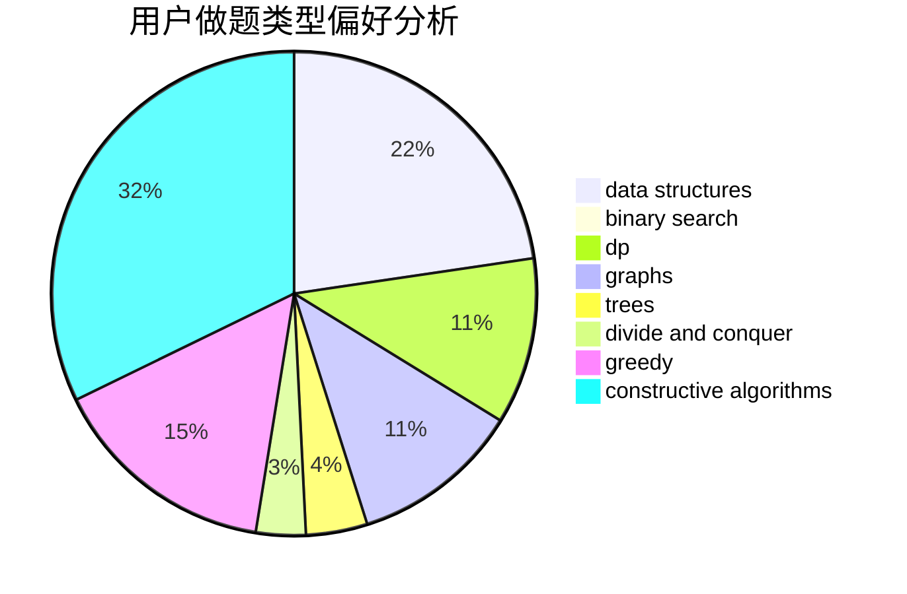
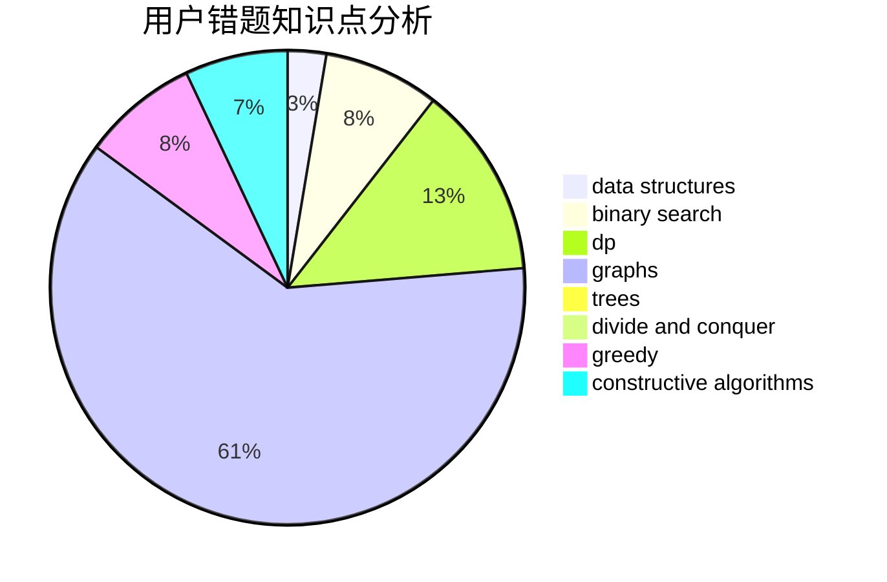

# adhklp

<!-- tabs:start -->

#### **用户提交结果分析**

#### **用户做题类型偏好分析**

#### **用户错题知识点分析**

<!-- tabs:end -->
# 推荐题目
[445A](https://codeforces.com/contest/445/problem/A)		dfs and similar,
                        implementation		  
[304D](https://codeforces.com/contest/304/problem/D)		dsu,graphs,sortings,trees		  
[883G](https://codeforces.com/contest/883/problem/G)		dfs and similar,
                        graphs		  
[913B](https://codeforces.com/contest/913/problem/B)		implementation,
                        trees		  
[388D](https://codeforces.com/contest/388/problem/D)		math		  
[708C](https://codeforces.com/contest/708/problem/C)		data structures,
                        dfs and similar,
                        dp,
                        graphs,
                        greedy,
                        trees		  
[866D](https://codeforces.com/contest/866/problem/D)		dsu,graphs,sortings,trees		  
[314C](https://codeforces.com/contest/314/problem/C)		data structures,
                        dp		  
[1172E](https://codeforces.com/contest/1172/problem/E)		data structures		  
[1173A](https://codeforces.com/contest/1173/problem/A)		greedy		  
