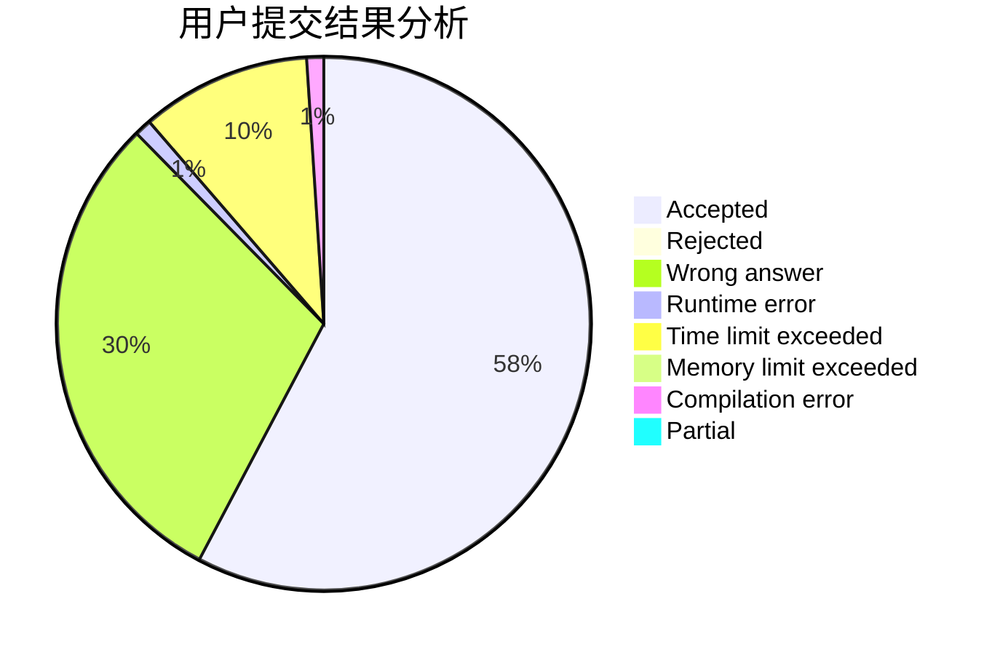
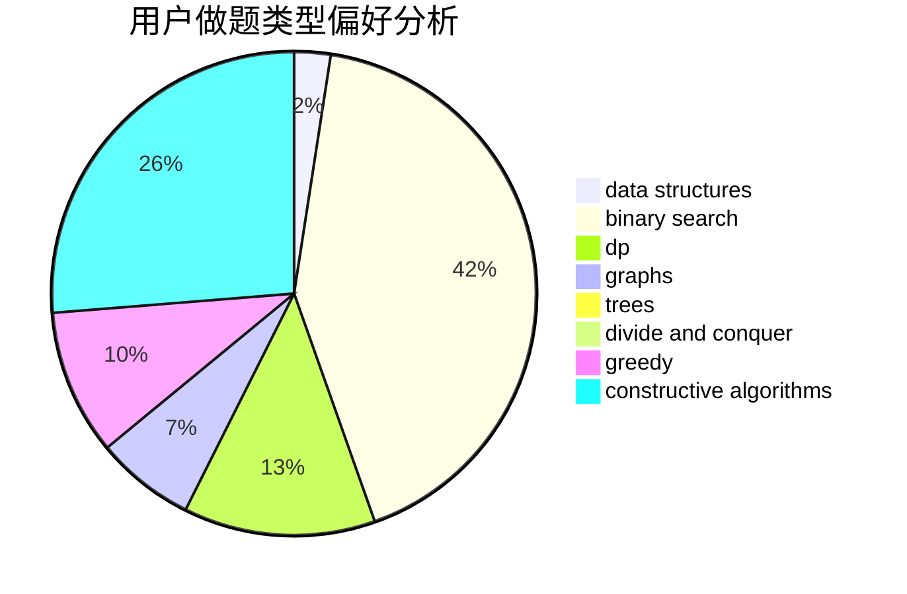
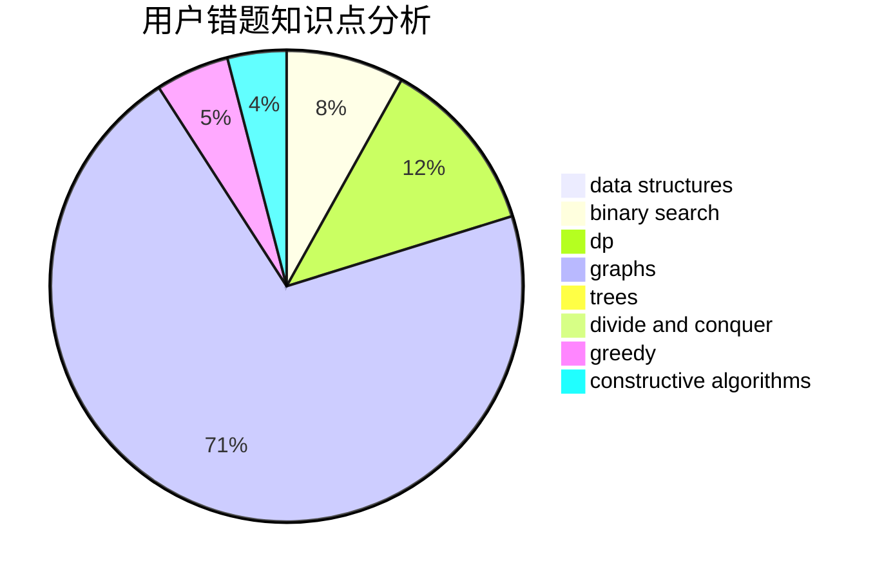

# adhklp

<!-- tabs:start -->

#### **用户提交结果分析**

#### **用户做题类型偏好分析**

#### **用户错题知识点分析**

<!-- tabs:end -->
# 推荐题目
[464E](https://codeforces.com/contest/464/problem/E)		data structures,
                        graphs,
                        shortest paths		  
[325B](https://codeforces.com/contest/325/problem/B)		binary search,
                        math		  
[901A](https://codeforces.com/contest/901/problem/A)		constructive algorithms,
                        trees		  
[931F](https://codeforces.com/contest/931/problem/F)		dsu,graphs,sortings,trees		  
[418A](https://codeforces.com/contest/418/problem/A)		dsu,graphs,sortings,trees		  
[727E](https://codeforces.com/contest/727/problem/E)		data structures,
                        hashing,
                        string suffix structures,
                        strings		  
[886F](https://codeforces.com/contest/886/problem/F)		geometry		  
[339B](https://codeforces.com/contest/339/problem/B)		implementation		  
[1175B](https://codeforces.com/contest/1175/problem/B)		data structures,
                        expression parsing,
                        implementation		  
[1175D](https://codeforces.com/contest/1175/problem/D)		greedy,
                        sortings		  
