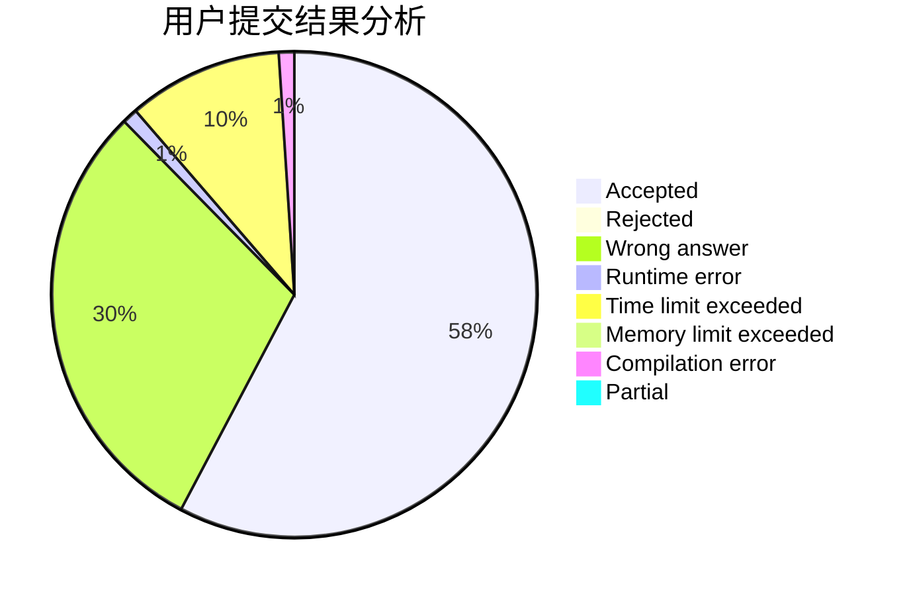
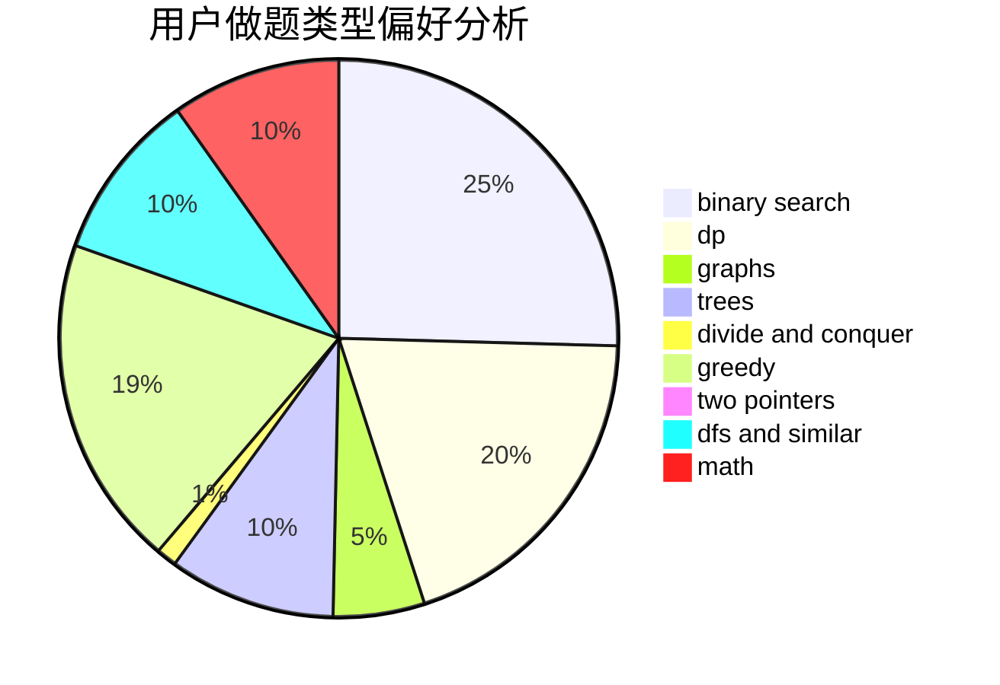

# adhklp

<!-- tabs:start -->

#### **用户提交结果分析**

#### **用户做题类型偏好分析**

<!-- tabs:end -->
# 推荐题目
[464E](https://codeforces.com/contest/464/problem/E)
[325B](https://codeforces.com/contest/325/problem/B)
[901A](https://codeforces.com/contest/901/problem/A)
[931F](https://codeforces.com/contest/931/problem/F)
[418A](https://codeforces.com/contest/418/problem/A)
[727E](https://codeforces.com/contest/727/problem/E)
[886F](https://codeforces.com/contest/886/problem/F)
[339B](https://codeforces.com/contest/339/problem/B)
[1175B](https://codeforces.com/contest/1175/problem/B)
[1175D](https://codeforces.com/contest/1175/problem/D)
