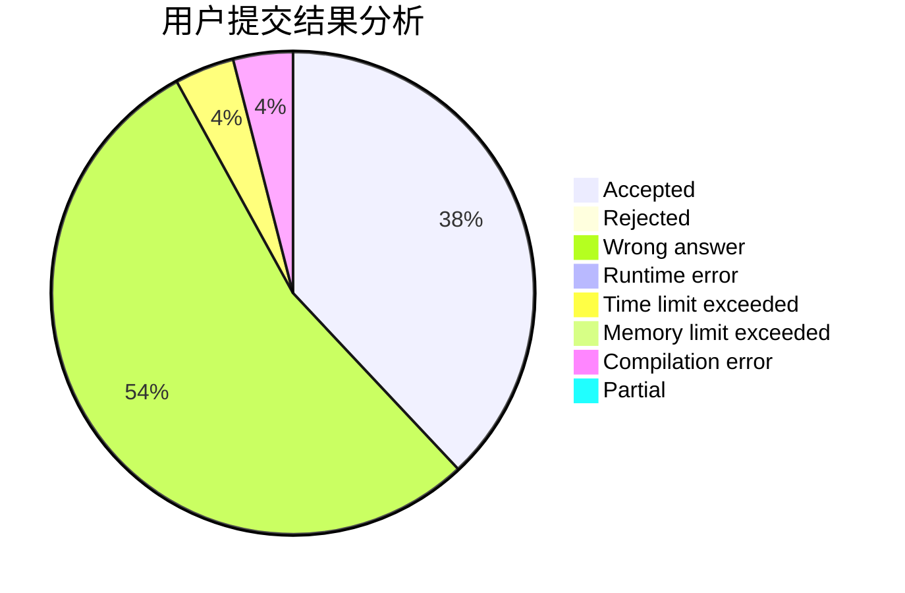
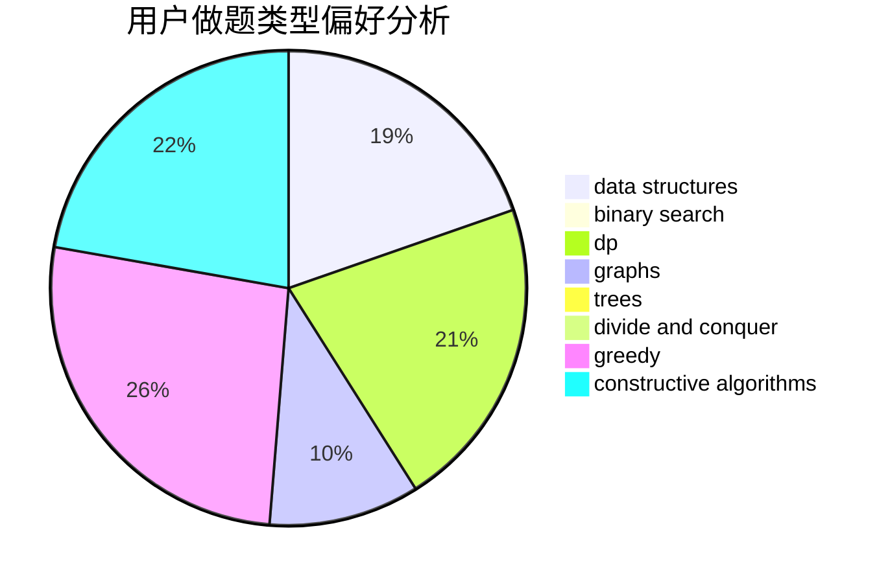

# after_the_end

<!-- tabs:start -->

#### **用户提交结果分析**

#### **用户做题类型偏好分析**

#### **用户错题知识点分析**

<!-- tabs:end -->
# 推荐题目
[1225E](https://codeforces.com/contest/1225/problem/E)		binary search,
                        dp		  
[295C](https://codeforces.com/contest/295/problem/C)		combinatorics,
                        dp,
                        graphs,
                        shortest paths		  
[1008E](https://codeforces.com/contest/1008/problem/E)		dsu,graphs,sortings,trees		  
[44C](https://codeforces.com/contest/44/problem/C)		implementation		  
[281A](https://codeforces.com/contest/281/problem/A)		implementation,
                        strings		  
[1074B](https://codeforces.com/contest/1074/problem/B)		dsu,graphs,sortings,trees		  
[1142C](https://codeforces.com/contest/1142/problem/C)		geometry		  
[500F](https://codeforces.com/contest/500/problem/F)		divide and conquer,
                        dp		  
[1307A](https://codeforces.com/contest/1307/problem/A)		greedy,
                        implementation		  
[313E](https://codeforces.com/contest/313/problem/E)		constructive algorithms,
                        data structures,
                        dsu,
                        greedy		  
