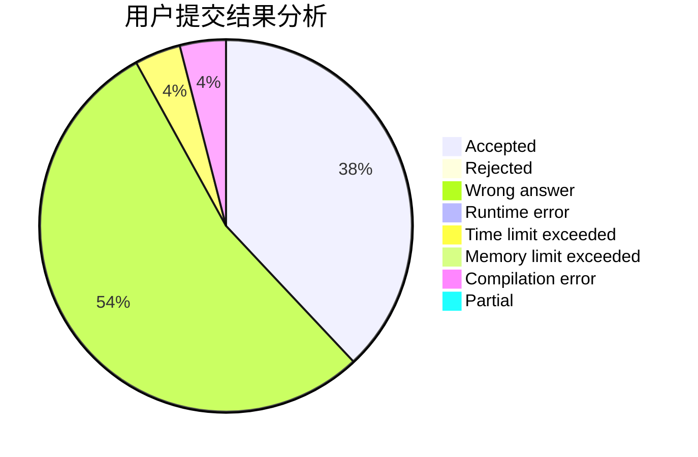
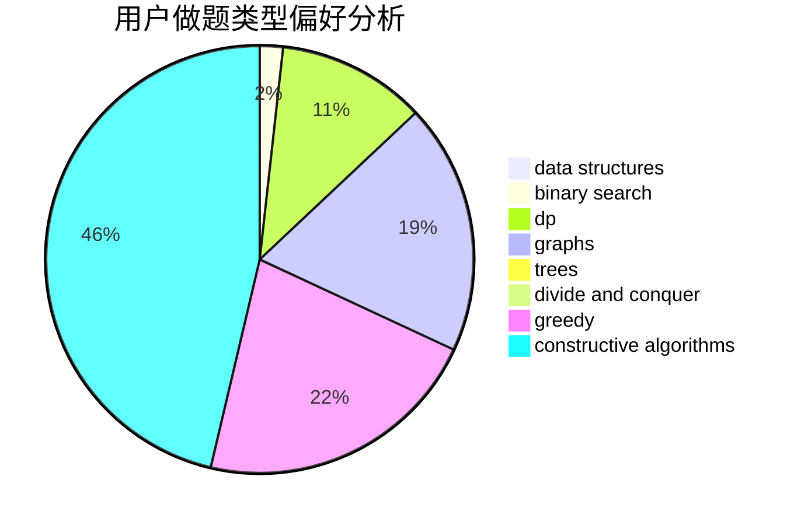

# after_the_end

<!-- tabs:start -->

#### **用户提交结果分析**

#### **用户做题类型偏好分析**

#### **用户错题知识点分析**

<!-- tabs:end -->
# 推荐题目
[1218C](https://codeforces.com/contest/1218/problem/C)		dp		  
[27D](https://codeforces.com/contest/27/problem/D)		2-sat,
                        dfs and similar,
                        dsu,
                        graphs		  
[1008B](https://codeforces.com/contest/1008/problem/B)		greedy,
                        sortings		  
[427D](https://codeforces.com/contest/427/problem/D)		dp,
                        string suffix structures,
                        strings		  
[265D](https://codeforces.com/contest/265/problem/D)		dsu,graphs,sortings,trees		  
[1073F](https://codeforces.com/contest/1073/problem/F)		dfs and similar,
                        dp,
                        greedy,
                        trees		  
[1140E](https://codeforces.com/contest/1140/problem/E)		combinatorics,
                        divide and conquer,
                        dp		  
[482B](https://codeforces.com/contest/482/problem/B)		constructive algorithms,
                        data structures,
                        trees		  
[1299E](https://codeforces.com/contest/1299/problem/E)		interactive,
                        math		  
[297A](https://codeforces.com/contest/297/problem/A)		constructive algorithms		  
