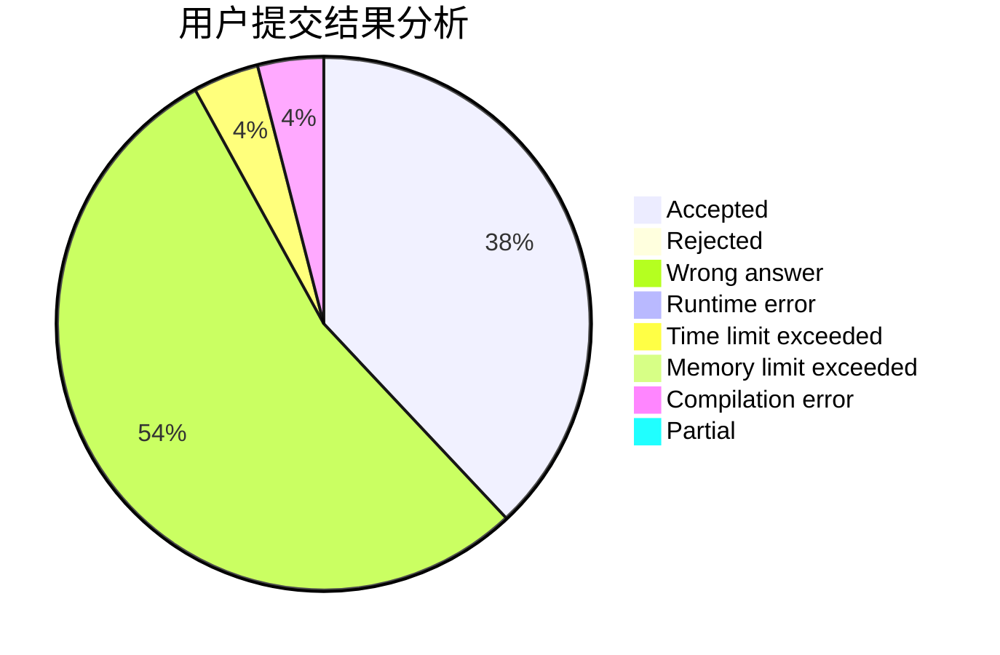
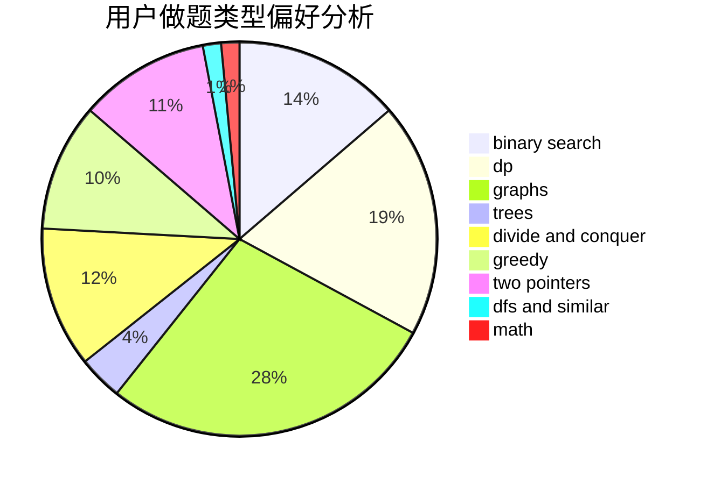

# after_the_end

<!-- tabs:start -->

#### **用户提交结果分析**

#### **用户做题类型偏好分析**

<!-- tabs:end -->
# 推荐题目
[1225E](https://codeforces.com/contest/1225/problem/E)
[295C](https://codeforces.com/contest/295/problem/C)
[1008E](https://codeforces.com/contest/1008/problem/E)
[44C](https://codeforces.com/contest/44/problem/C)
[281A](https://codeforces.com/contest/281/problem/A)
[1074B](https://codeforces.com/contest/1074/problem/B)
[1142C](https://codeforces.com/contest/1142/problem/C)
[500F](https://codeforces.com/contest/500/problem/F)
[1307A](https://codeforces.com/contest/1307/problem/A)
[313E](https://codeforces.com/contest/313/problem/E)
