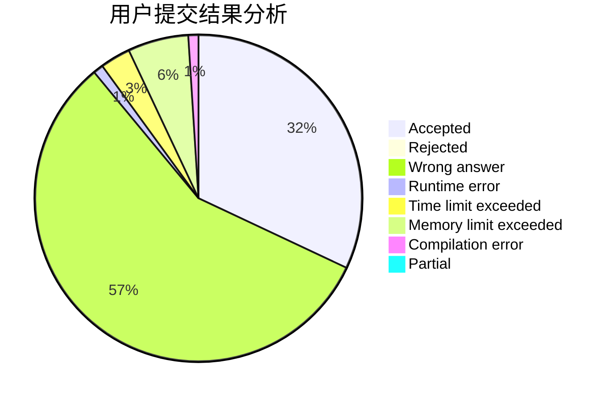
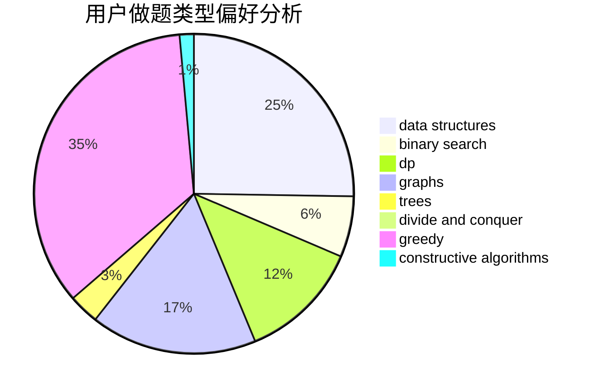
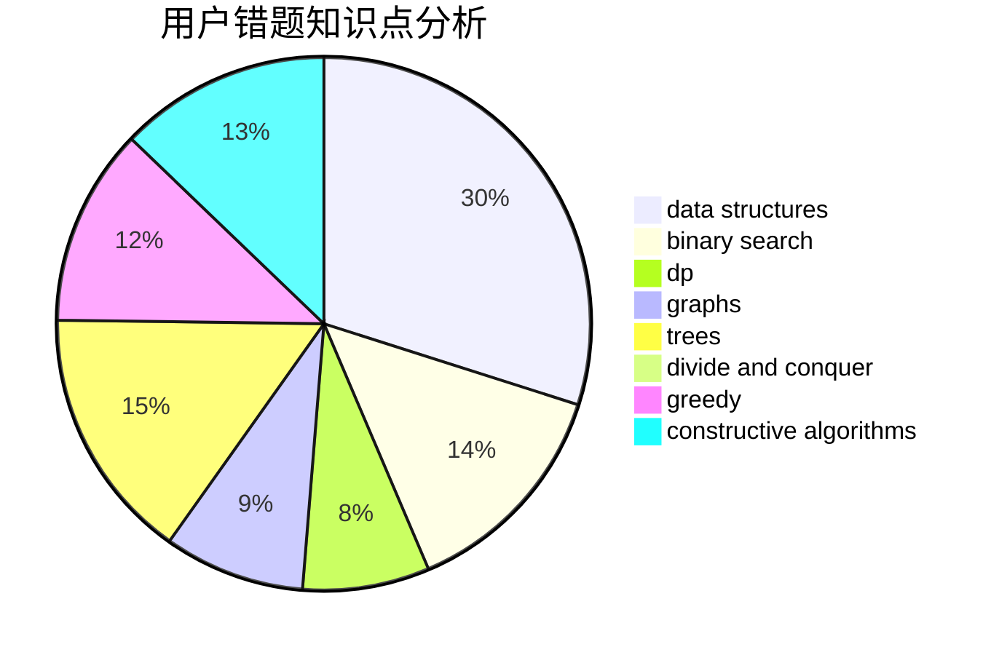

# ailanxier

<!-- tabs:start -->

#### **用户提交结果分析**

#### **用户做题类型偏好分析**

#### **用户错题知识点分析**

<!-- tabs:end -->
# 推荐题目
[785D](https://codeforces.com/contest/785/problem/D)		combinatorics,
                        dp,
                        math,
                        number theory		  
[1452A](https://codeforces.com/contest/1452/problem/A)		math		  
[1328F](https://codeforces.com/contest/1328/problem/F)		greedy		  
[1397E](https://codeforces.com/contest/1397/problem/E)		dsu,graphs,sortings,trees		  
[496B](https://codeforces.com/contest/496/problem/B)		brute force,
                        constructive algorithms,
                        implementation		  
[900D](https://codeforces.com/contest/900/problem/D)		bitmasks,
                        combinatorics,
                        dp,
                        math,
                        number theory		  
[6C](https://codeforces.com/contest/6/problem/C)		greedy,
                        two pointers		  
[859E](https://codeforces.com/contest/859/problem/E)		combinatorics,
                        dfs and similar,
                        dsu,
                        graphs,
                        trees		  
[575E](https://codeforces.com/contest/575/problem/E)		geometry		  
[241B](https://codeforces.com/contest/241/problem/B)		binary search,
                        bitmasks,
                        data structures,
                        math		  
