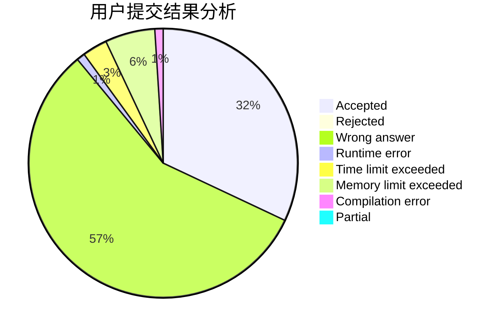
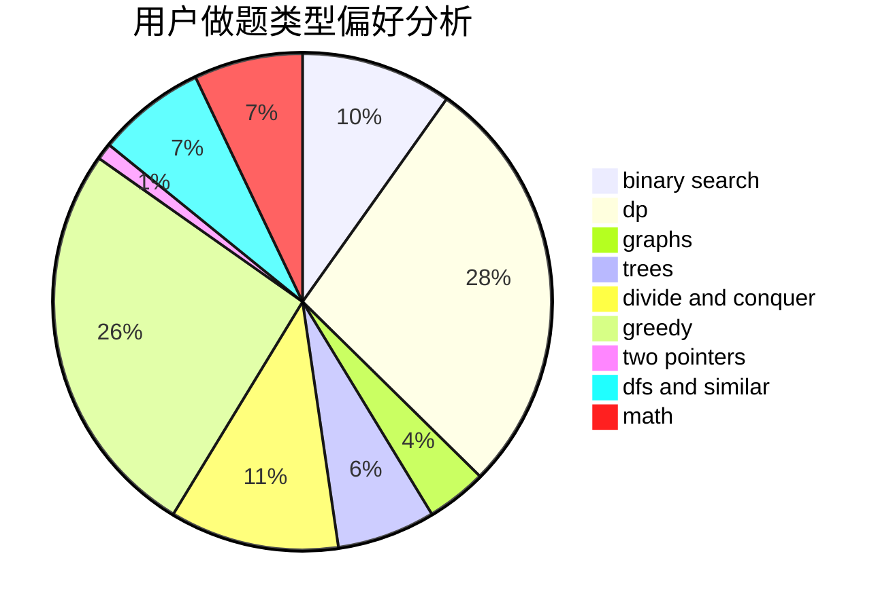

# ailanxier

<!-- tabs:start -->

#### **用户提交结果分析**

#### **用户做题类型偏好分析**

<!-- tabs:end -->
# 推荐题目
[802I](https://codeforces.com/contest/802/problem/I)
[1461D](https://codeforces.com/contest/1461/problem/D)
[13352](https://codeforces.com/contest/1335/problem/2)
[1406D](https://codeforces.com/contest/1406/problem/D)
[515E](https://codeforces.com/contest/515/problem/E)
[917B](https://codeforces.com/contest/917/problem/B)
[717E](https://codeforces.com/contest/717/problem/E)
[877B](https://codeforces.com/contest/877/problem/B)
[597A](https://codeforces.com/contest/597/problem/A)
[261E](https://codeforces.com/contest/261/problem/E)
