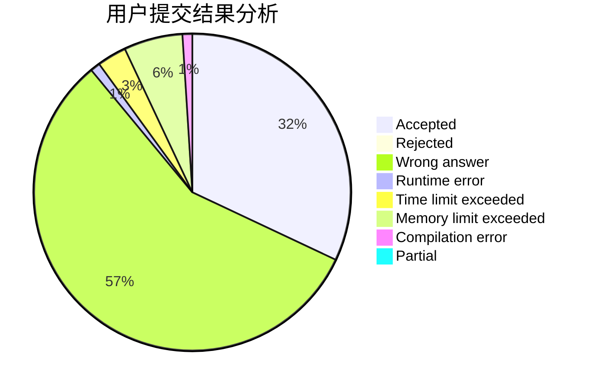
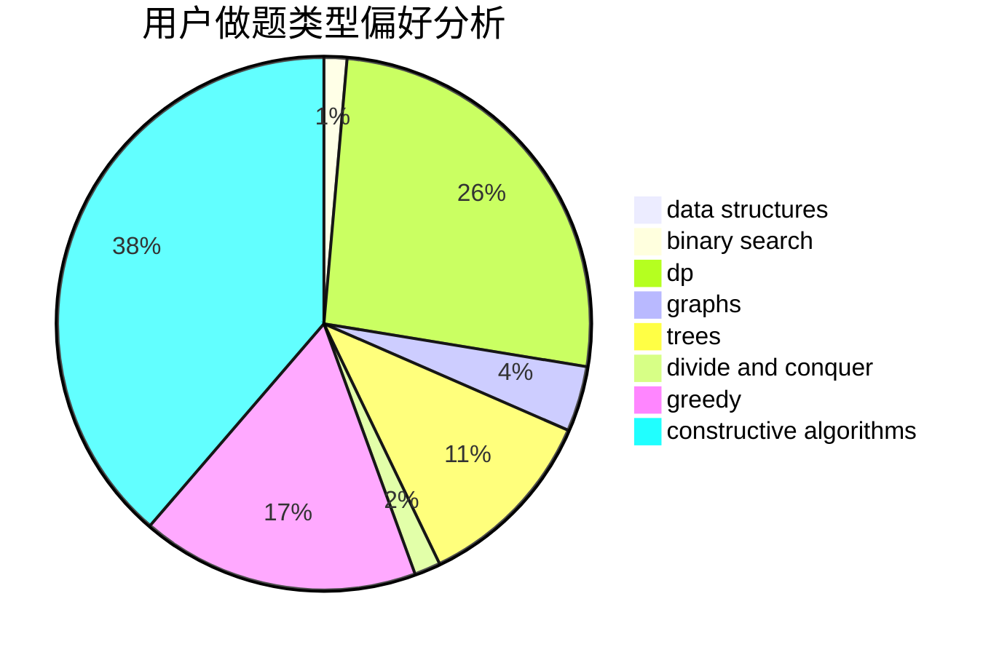
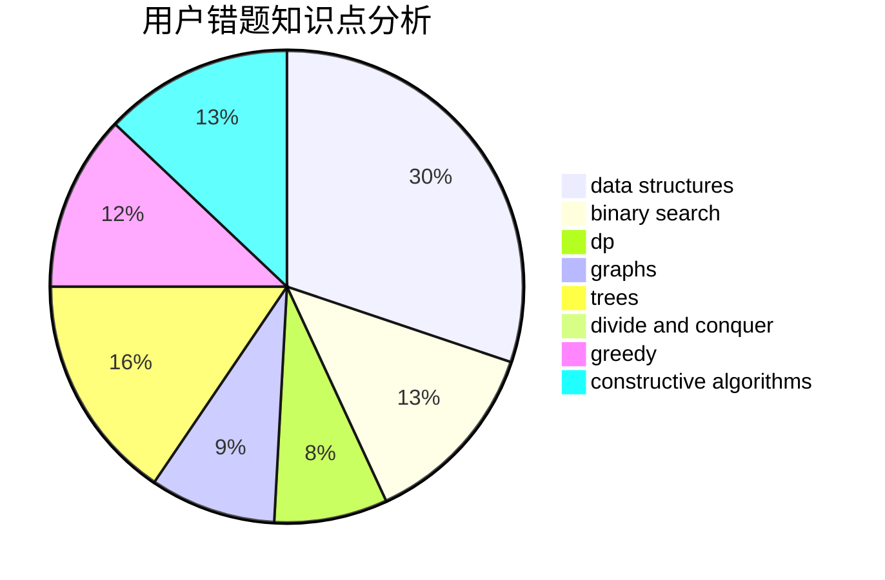

# ailanxier

<!-- tabs:start -->

#### **用户提交结果分析**

#### **用户做题类型偏好分析**

#### **用户错题知识点分析**

<!-- tabs:end -->
# 推荐题目
[802I](https://codeforces.com/contest/802/problem/I)		string suffix structures		  
[1461D](https://codeforces.com/contest/1461/problem/D)		binary search,
                        brute force,
                        data structures,
                        divide and conquer,
                        implementation,
                        sortings		  
[13352](https://codeforces.com/contest/1335/problem/2)		dsu,graphs,sortings,trees		  
[1406D](https://codeforces.com/contest/1406/problem/D)		constructive algorithms,
                        data structures,
                        greedy,
                        math		  
[515E](https://codeforces.com/contest/515/problem/E)		data structures		  
[917B](https://codeforces.com/contest/917/problem/B)		dfs and similar,
                        dp,
                        games,
                        graphs		  
[717E](https://codeforces.com/contest/717/problem/E)		dfs and similar		  
[877B](https://codeforces.com/contest/877/problem/B)		brute force,
                        dp		  
[597A](https://codeforces.com/contest/597/problem/A)		math		  
[261E](https://codeforces.com/contest/261/problem/E)		brute force,
                        dp,
                        two pointers		  
