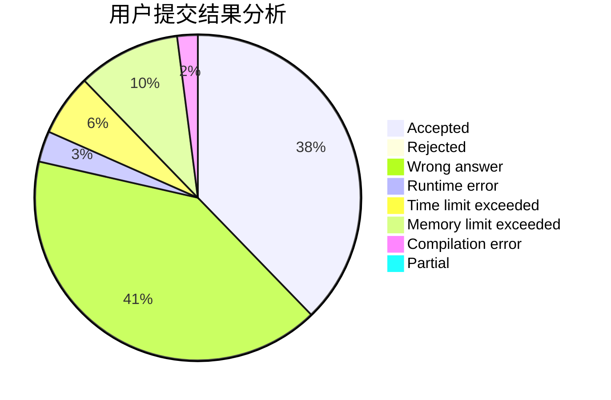
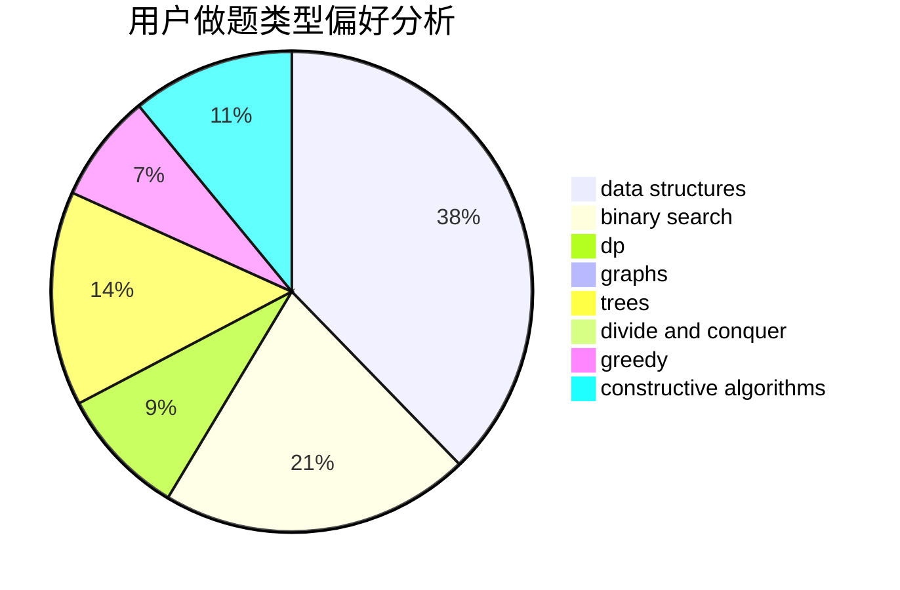
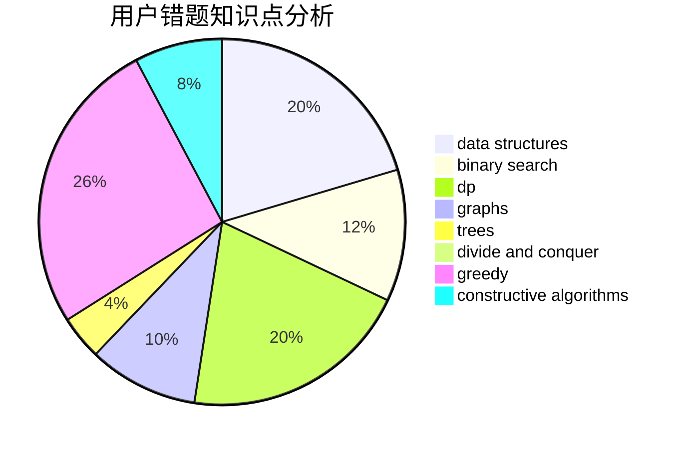

# ajil

<!-- tabs:start -->

#### **用户提交结果分析**

#### **用户做题类型偏好分析**

#### **用户错题知识点分析**

<!-- tabs:end -->
# 推荐题目
[1336C](https://codeforces.com/contest/1336/problem/C)		dp,
                        strings		  
[498D](https://codeforces.com/contest/498/problem/D)		data structures,
                        dp,
                        number theory		  
[630F](https://codeforces.com/contest/630/problem/F)		combinatorics,
                        math		  
[839D](https://codeforces.com/contest/839/problem/D)		combinatorics,
                        dp,
                        math,
                        number theory		  
[123D](https://codeforces.com/contest/123/problem/D)		string suffix structures		  
[1278F](https://codeforces.com/contest/1278/problem/F)		combinatorics,
                        dp,
                        math,
                        number theory,
                        probabilities		  
[1181C](https://codeforces.com/contest/1181/problem/C)		brute force,
                        combinatorics,
                        dp,
                        implementation		  
[1205C](https://codeforces.com/contest/1205/problem/C)		implementation,
                        interactive		  
[543D](https://codeforces.com/contest/543/problem/D)		dp,
                        trees		  
[229B](https://codeforces.com/contest/229/problem/B)		binary search,
                        data structures,
                        graphs,
                        shortest paths		  
