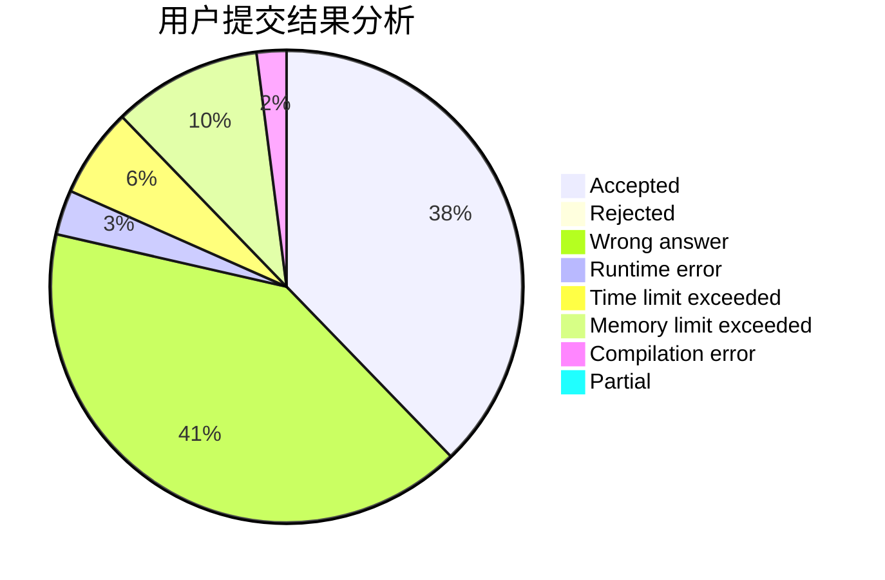
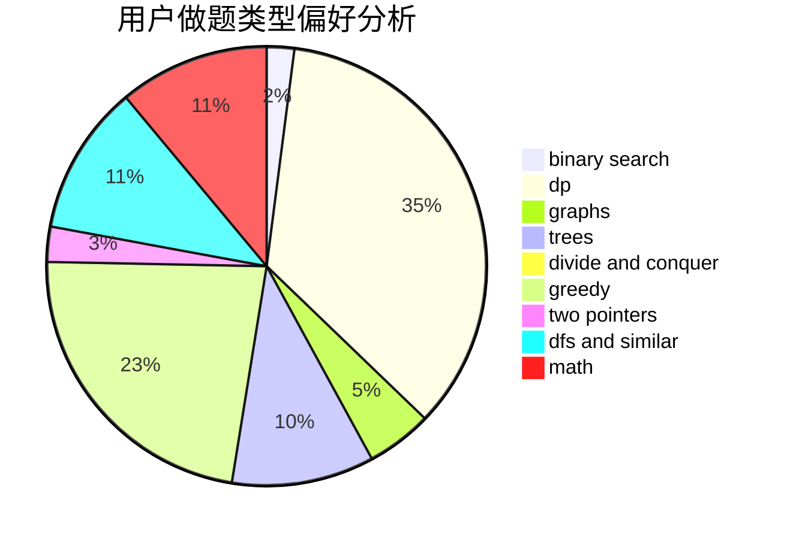

# ajil

<!-- tabs:start -->

#### **用户提交结果分析**

#### **用户做题类型偏好分析**

<!-- tabs:end -->
# 推荐题目
[1343D](https://codeforces.com/contest/1343/problem/D)
[519D](https://codeforces.com/contest/519/problem/D)
[660B](https://codeforces.com/contest/660/problem/B)
[859A](https://codeforces.com/contest/859/problem/A)
[1245B](https://codeforces.com/contest/1245/problem/B)
[1285A](https://codeforces.com/contest/1285/problem/A)
[1183H](https://codeforces.com/contest/1183/problem/H)
[1209F](https://codeforces.com/contest/1209/problem/F)
[567F](https://codeforces.com/contest/567/problem/F)
[248E](https://codeforces.com/contest/248/problem/E)
