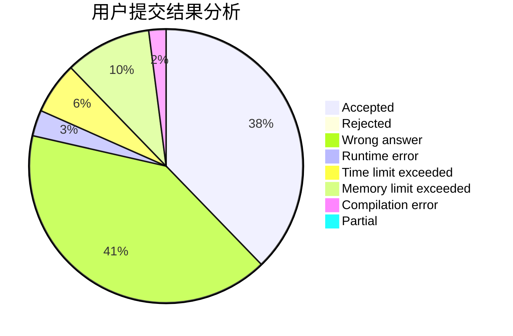
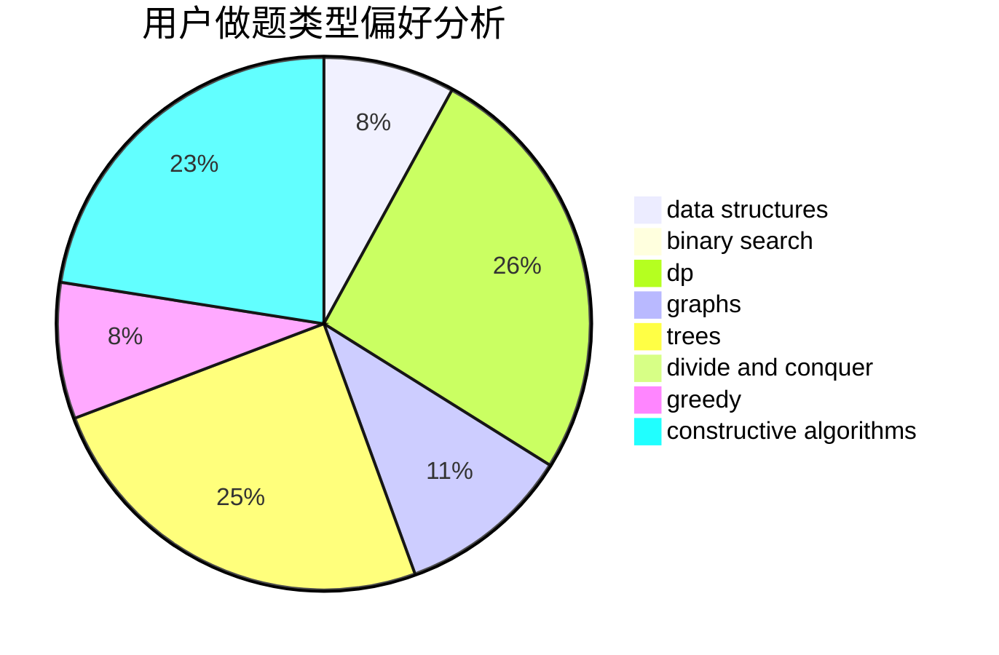
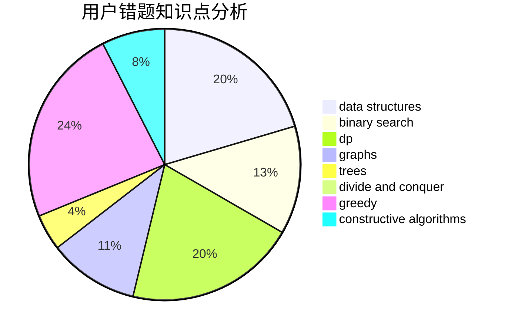

# ajil

<!-- tabs:start -->

#### **用户提交结果分析**

#### **用户做题类型偏好分析**

#### **用户错题知识点分析**

<!-- tabs:end -->
# 推荐题目
[1343D](https://codeforces.com/contest/1343/problem/D)		brute force,
                        data structures,
                        greedy,
                        two pointers		  
[519D](https://codeforces.com/contest/519/problem/D)		data structures,
                        dp,
                        two pointers		  
[660B](https://codeforces.com/contest/660/problem/B)		implementation		  
[859A](https://codeforces.com/contest/859/problem/A)		greedy,
                        implementation		  
[1245B](https://codeforces.com/contest/1245/problem/B)		constructive algorithms,
                        dp,
                        greedy		  
[1285A](https://codeforces.com/contest/1285/problem/A)		math		  
[1183H](https://codeforces.com/contest/1183/problem/H)		dp,
                        strings		  
[1209F](https://codeforces.com/contest/1209/problem/F)		data structures,
                        dfs and similar,
                        graphs,
                        shortest paths,
                        strings,
                        trees		  
[567F](https://codeforces.com/contest/567/problem/F)		dp		  
[248E](https://codeforces.com/contest/248/problem/E)		dp,
                        math,
                        probabilities		  
