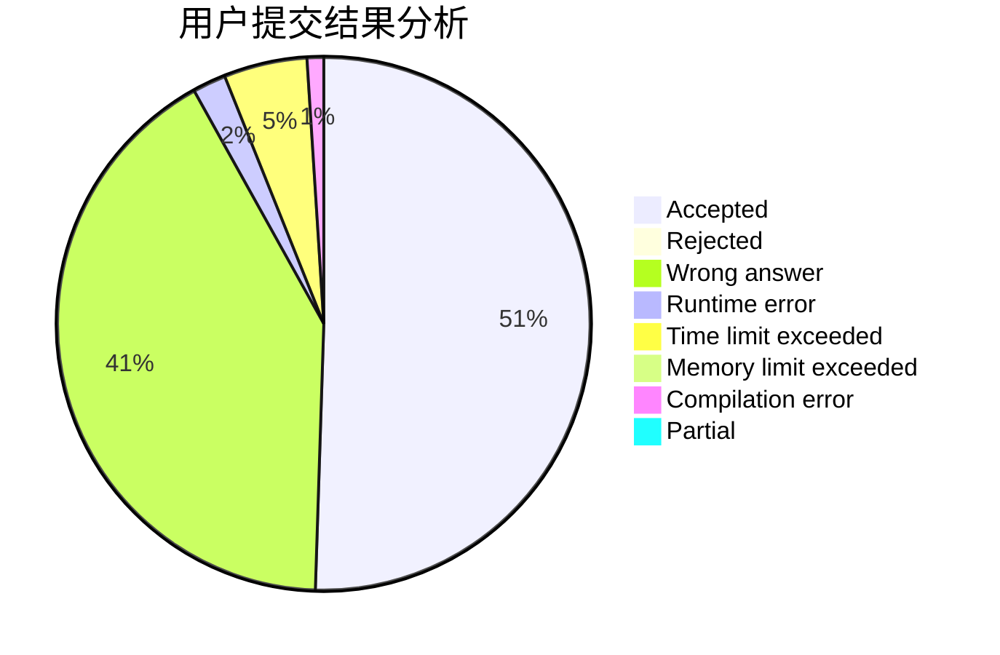
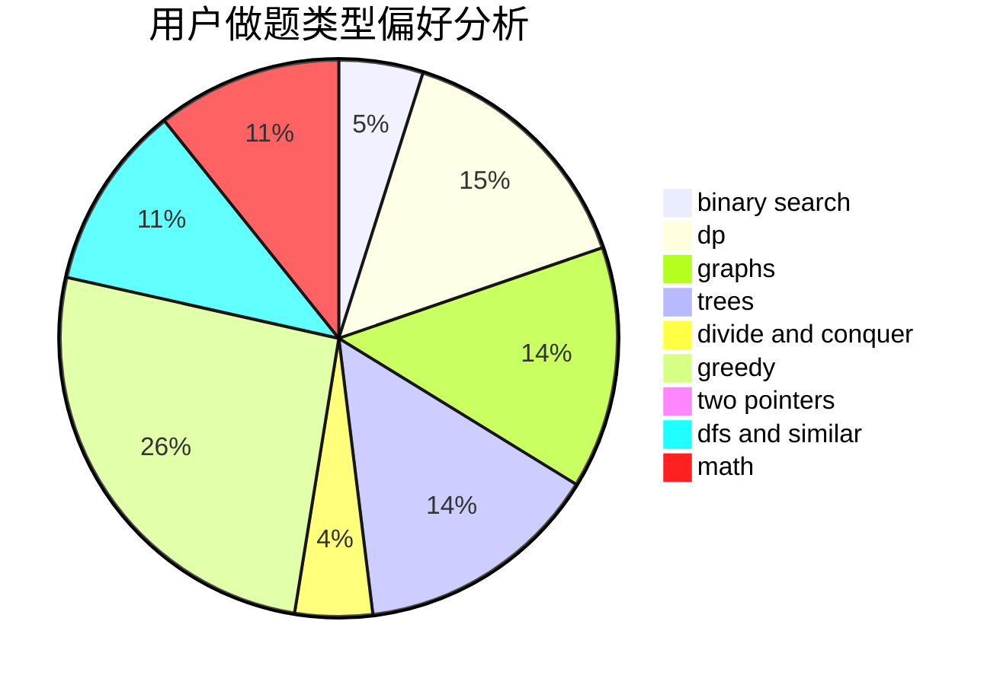

# ajj

<!-- tabs:start -->

#### **用户提交结果分析**

#### **用户做题类型偏好分析**

<!-- tabs:end -->
# 推荐题目
[13132](https://codeforces.com/contest/1313/problem/2)
[543E](https://codeforces.com/contest/543/problem/E)
[201C](https://codeforces.com/contest/201/problem/C)
[592A](https://codeforces.com/contest/592/problem/A)
[1033E](https://codeforces.com/contest/1033/problem/E)
[472G](https://codeforces.com/contest/472/problem/G)
[1191A](https://codeforces.com/contest/1191/problem/A)
[859E](https://codeforces.com/contest/859/problem/E)
[932B](https://codeforces.com/contest/932/problem/B)
[1182F](https://codeforces.com/contest/1182/problem/F)
