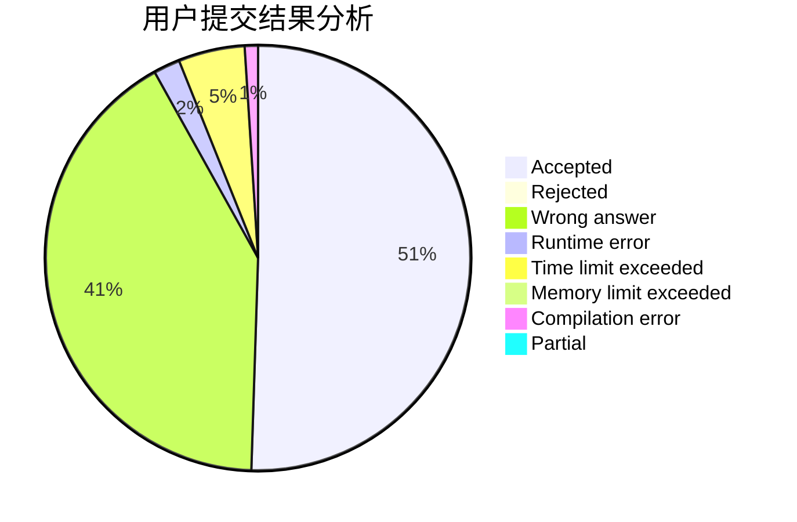
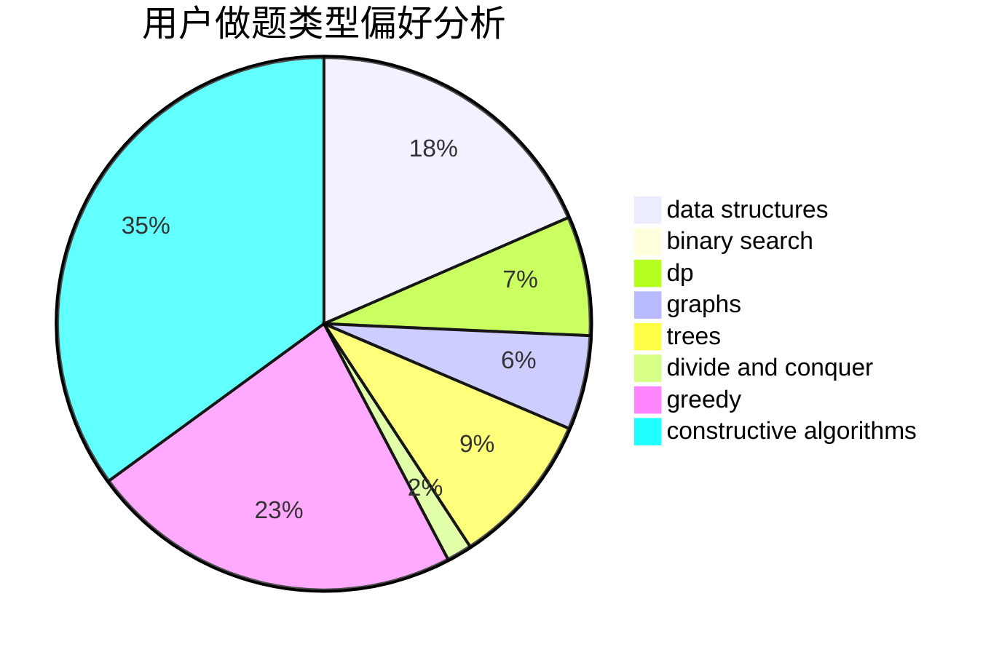
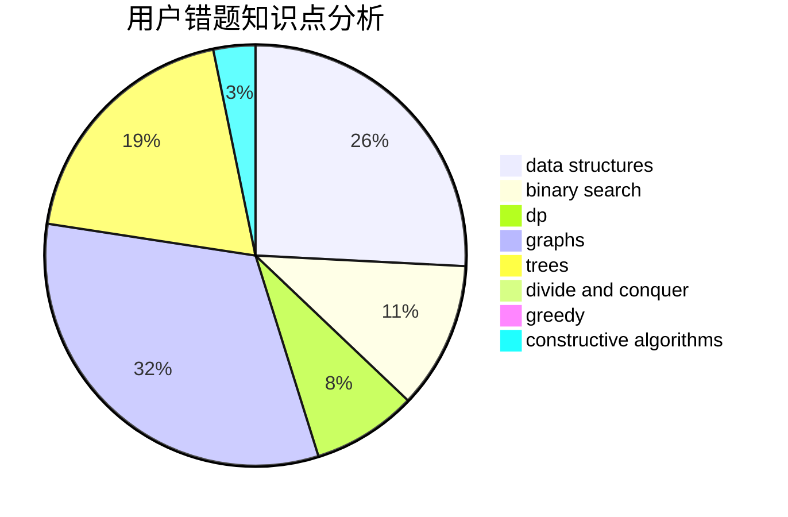

# ajj

<!-- tabs:start -->

#### **用户提交结果分析**

#### **用户做题类型偏好分析**

#### **用户错题知识点分析**

<!-- tabs:end -->
# 推荐题目
[13132](https://codeforces.com/contest/1313/problem/2)		dsu,graphs,sortings,trees		  
[543E](https://codeforces.com/contest/543/problem/E)		constructive algorithms,
                        data structures		  
[201C](https://codeforces.com/contest/201/problem/C)		dp		  
[592A](https://codeforces.com/contest/592/problem/A)		implementation		  
[1033E](https://codeforces.com/contest/1033/problem/E)		binary search,
                        constructive algorithms,
                        dfs and similar,
                        graphs,
                        interactive		  
[472G](https://codeforces.com/contest/472/problem/G)		bitmasks,
                        data structures,
                        fft		  
[1191A](https://codeforces.com/contest/1191/problem/A)		brute force		  
[859E](https://codeforces.com/contest/859/problem/E)		combinatorics,
                        dfs and similar,
                        dsu,
                        graphs,
                        trees		  
[932B](https://codeforces.com/contest/932/problem/B)		binary search,
                        data structures,
                        dfs and similar		  
[1182F](https://codeforces.com/contest/1182/problem/F)		binary search,
                        data structures,
                        number theory		  
