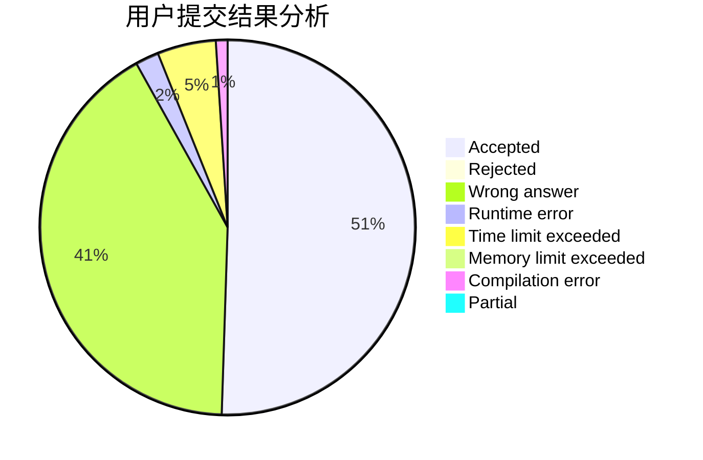
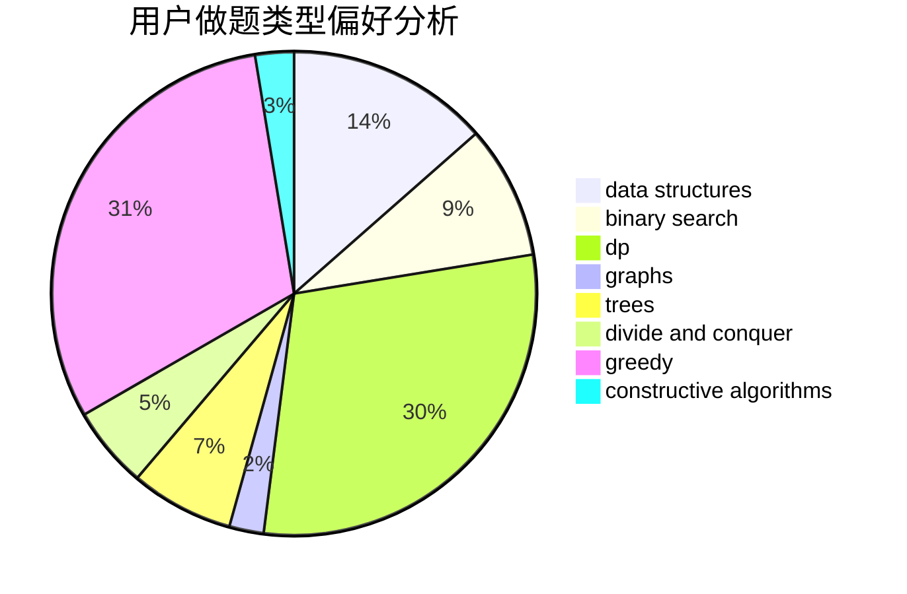
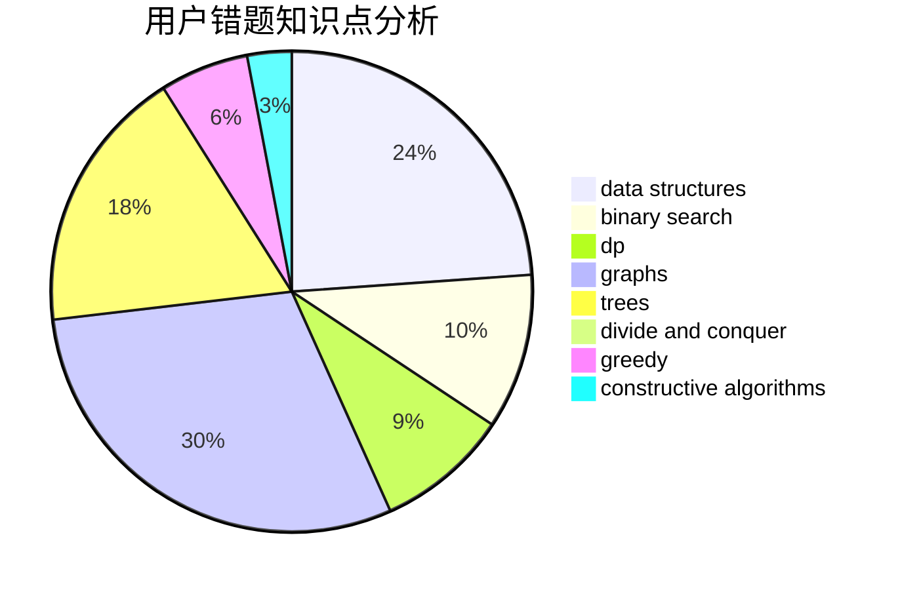

# ajj

<!-- tabs:start -->

#### **用户提交结果分析**

#### **用户做题类型偏好分析**

#### **用户错题知识点分析**

<!-- tabs:end -->
# 推荐题目
[1304D](https://codeforces.com/contest/1304/problem/D)		constructive algorithms,
                        graphs,
                        greedy,
                        two pointers		  
[516E](https://codeforces.com/contest/516/problem/E)		math,
                        number theory		  
[176D](https://codeforces.com/contest/176/problem/D)		dp		  
[571D](https://codeforces.com/contest/571/problem/D)		binary search,
                        data structures,
                        dsu,
                        trees		  
[1033B](https://codeforces.com/contest/1033/problem/B)		math,
                        number theory		  
[451E](https://codeforces.com/contest/451/problem/E)		bitmasks,
                        combinatorics,
                        number theory		  
[1187D](https://codeforces.com/contest/1187/problem/D)		data structures,
                        sortings		  
[840A](https://codeforces.com/contest/840/problem/A)		combinatorics,
                        greedy,
                        math,
                        number theory,
                        sortings		  
[913D](https://codeforces.com/contest/913/problem/D)		binary search,
                        brute force,
                        data structures,
                        greedy,
                        sortings		  
[117D](https://codeforces.com/contest/117/problem/D)		divide and conquer,
                        math		  
