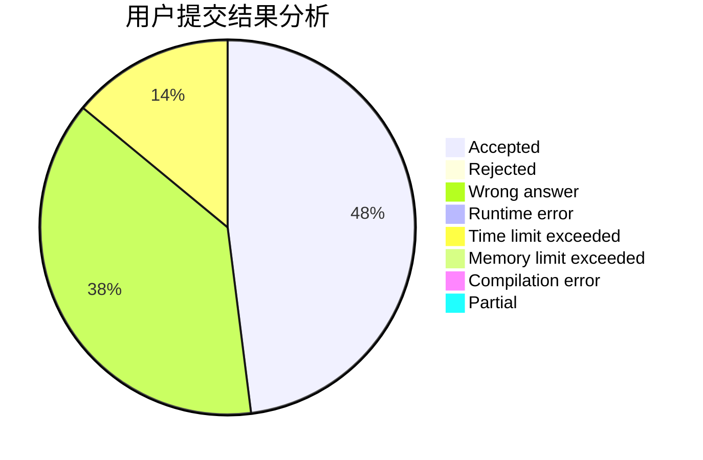
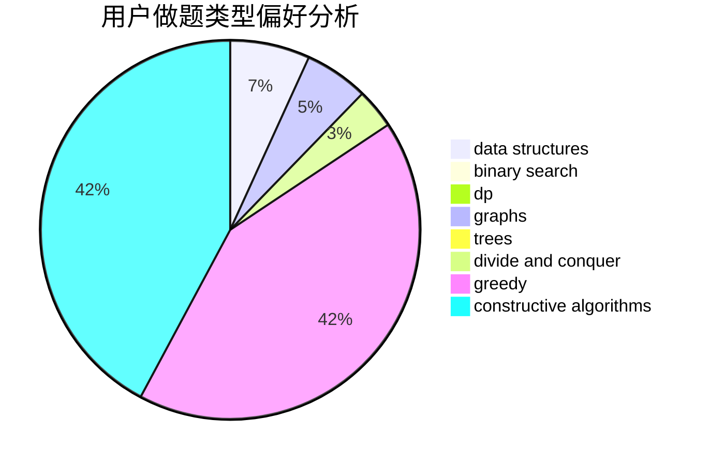
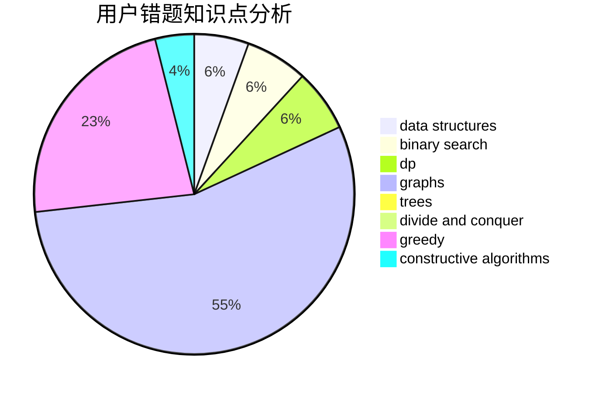

# alan10086

<!-- tabs:start -->

#### **用户提交结果分析**

#### **用户做题类型偏好分析**

#### **用户错题知识点分析**

<!-- tabs:end -->
# 推荐题目
[1483A](https://codeforces.com/contest/1483/problem/A)		dsu,graphs,sortings,trees		  
[1214G](https://codeforces.com/contest/1214/problem/G)		bitmasks,
                        data structures		  
[1367E](https://codeforces.com/contest/1367/problem/E)		brute force,
                        dfs and similar,
                        dp,
                        graphs,
                        greedy,
                        number theory		  
[930A](https://codeforces.com/contest/930/problem/A)		dfs and similar,
                        graphs,
                        trees		  
[739D](https://codeforces.com/contest/739/problem/D)		graph matchings		  
[452C](https://codeforces.com/contest/452/problem/C)		combinatorics,
                        math,
                        probabilities		  
[584C](https://codeforces.com/contest/584/problem/C)		constructive algorithms,
                        greedy,
                        strings		  
[510B](https://codeforces.com/contest/510/problem/B)		dfs and similar		  
[722C](https://codeforces.com/contest/722/problem/C)		data structures,
                        dsu		  
[163D](https://codeforces.com/contest/163/problem/D)		brute force		  
