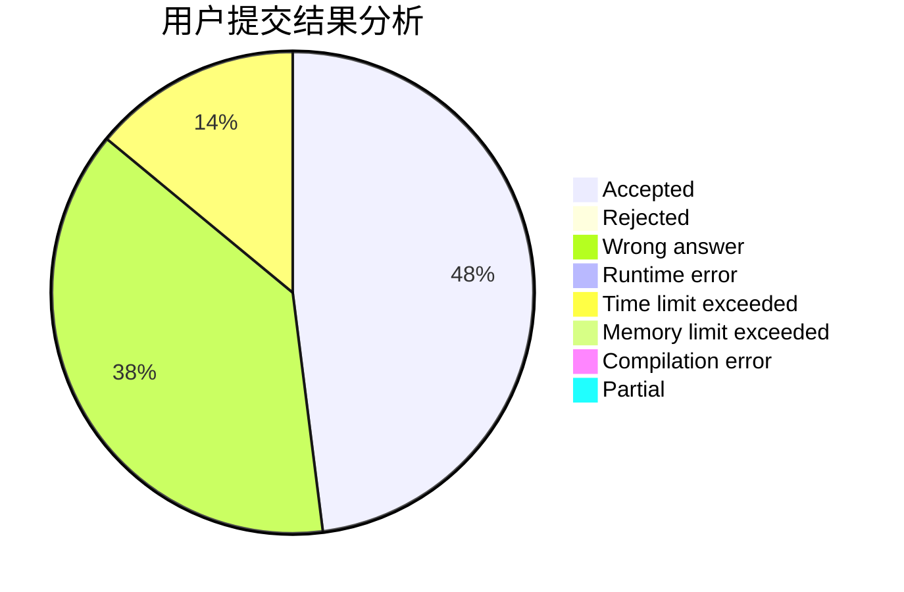
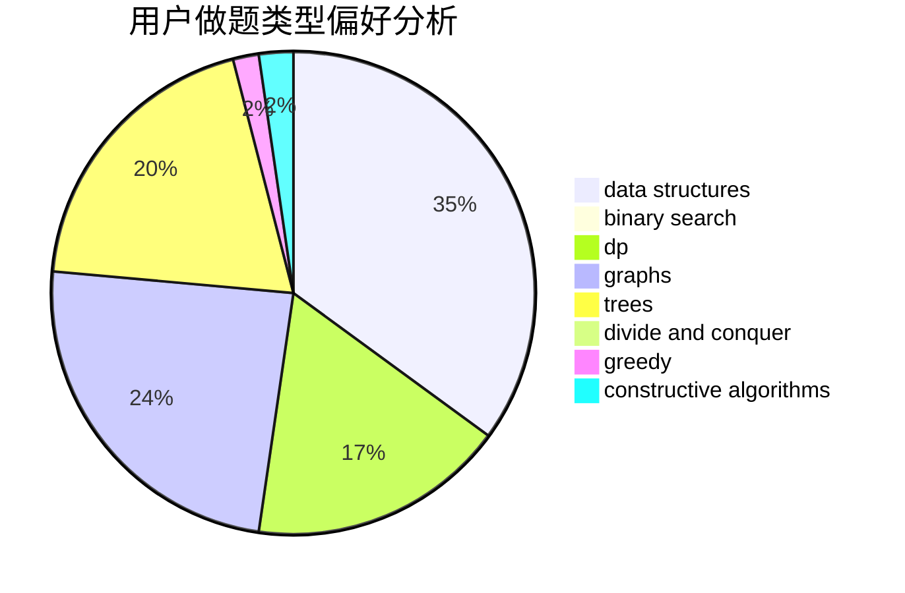

# alan10086

<!-- tabs:start -->

#### **用户提交结果分析**

#### **用户做题类型偏好分析**

#### **用户错题知识点分析**

<!-- tabs:end -->
# 推荐题目
[1490F](https://codeforces.com/contest/1490/problem/F)		binary search,
                        data structures,
                        greedy,
                        math,
                        sortings		  
[1220C](https://codeforces.com/contest/1220/problem/C)		games,
                        greedy,
                        strings		  
[1374B](https://codeforces.com/contest/1374/problem/B)		math		  
[94C](https://codeforces.com/contest/94/problem/C)		dsu,graphs,sortings,trees		  
[75D](https://codeforces.com/contest/75/problem/D)		data structures,
                        dp,
                        greedy,
                        implementation,
                        math,
                        trees		  
[474C](https://codeforces.com/contest/474/problem/C)		brute force,
                        geometry		  
[604C](https://codeforces.com/contest/604/problem/C)		dsu,graphs,sortings,trees		  
[533E](https://codeforces.com/contest/533/problem/E)		constructive algorithms,
                        dp,
                        greedy,
                        hashing,
                        strings,
                        two pointers		  
[739D](https://codeforces.com/contest/739/problem/D)		graph matchings		  
[189B](https://codeforces.com/contest/189/problem/B)		brute force,
                        math		  
