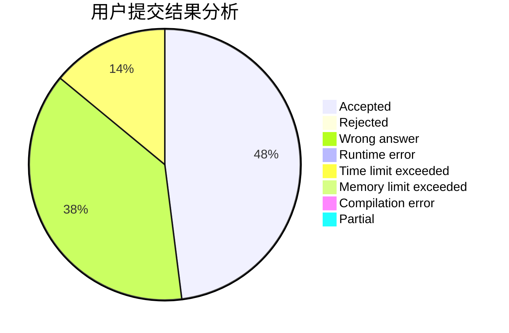
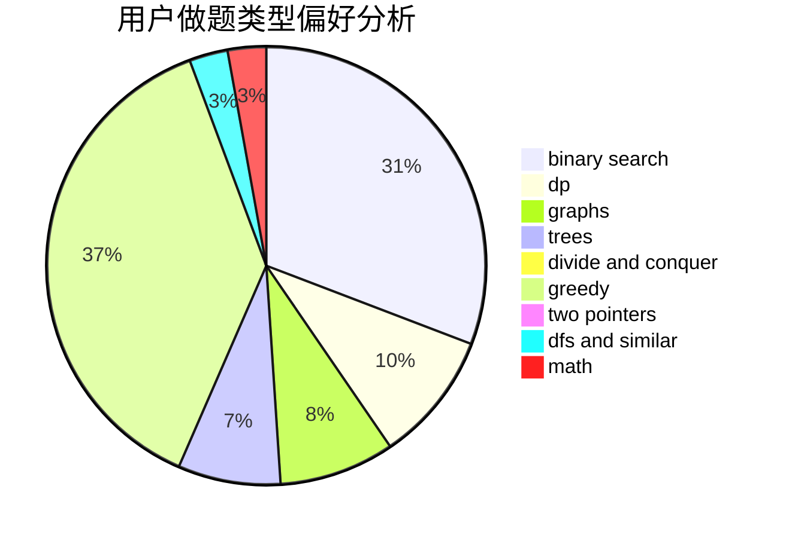

# alan10086

<!-- tabs:start -->

#### **用户提交结果分析**

#### **用户做题类型偏好分析**

<!-- tabs:end -->
# 推荐题目
[1490F](https://codeforces.com/contest/1490/problem/F)
[1220C](https://codeforces.com/contest/1220/problem/C)
[1374B](https://codeforces.com/contest/1374/problem/B)
[94C](https://codeforces.com/contest/94/problem/C)
[75D](https://codeforces.com/contest/75/problem/D)
[474C](https://codeforces.com/contest/474/problem/C)
[604C](https://codeforces.com/contest/604/problem/C)
[533E](https://codeforces.com/contest/533/problem/E)
[739D](https://codeforces.com/contest/739/problem/D)
[189B](https://codeforces.com/contest/189/problem/B)
