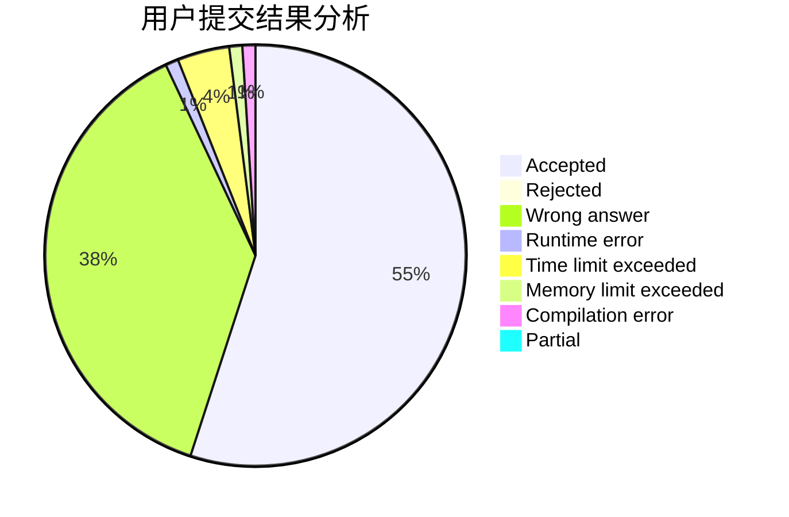
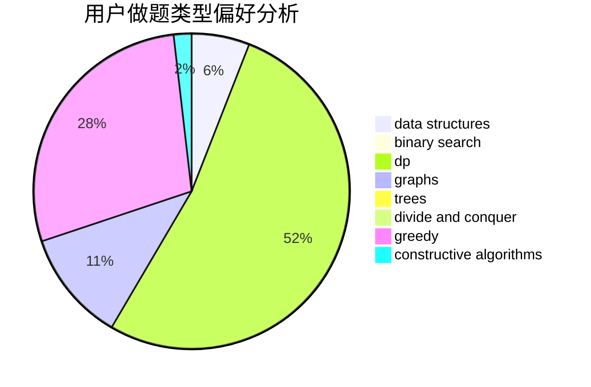
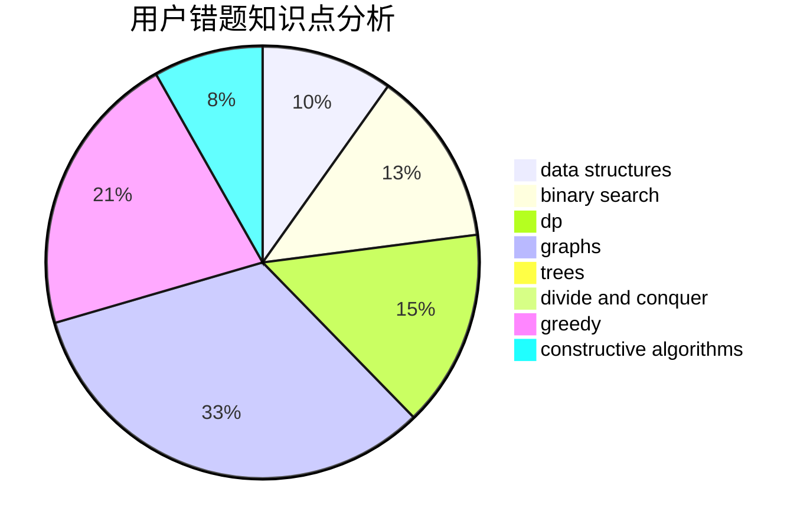

# aleng

<!-- tabs:start -->

#### **用户提交结果分析**

#### **用户做题类型偏好分析**

#### **用户错题知识点分析**

<!-- tabs:end -->
# 推荐题目
[1301A](https://codeforces.com/contest/1301/problem/A)		implementation,
                        strings		  
[1484C](https://codeforces.com/contest/1484/problem/C)		dsu,graphs,sortings,trees		  
[44C](https://codeforces.com/contest/44/problem/C)		implementation		  
[1063F](https://codeforces.com/contest/1063/problem/F)		data structures,
                        dp,
                        string suffix structures		  
[1174E](https://codeforces.com/contest/1174/problem/E)		combinatorics,
                        dp,
                        math,
                        number theory		  
[1225E](https://codeforces.com/contest/1225/problem/E)		binary search,
                        dp		  
[1089G](https://codeforces.com/contest/1089/problem/G)		math		  
[685C](https://codeforces.com/contest/685/problem/C)		binary search,
                        math		  
[59A](https://codeforces.com/contest/59/problem/A)		implementation,
                        strings		  
[348C](https://codeforces.com/contest/348/problem/C)		brute force,
                        data structures		  
