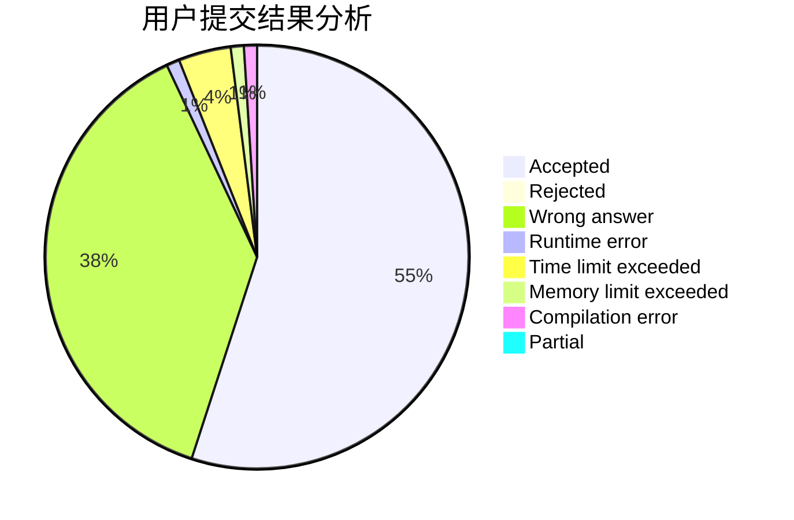
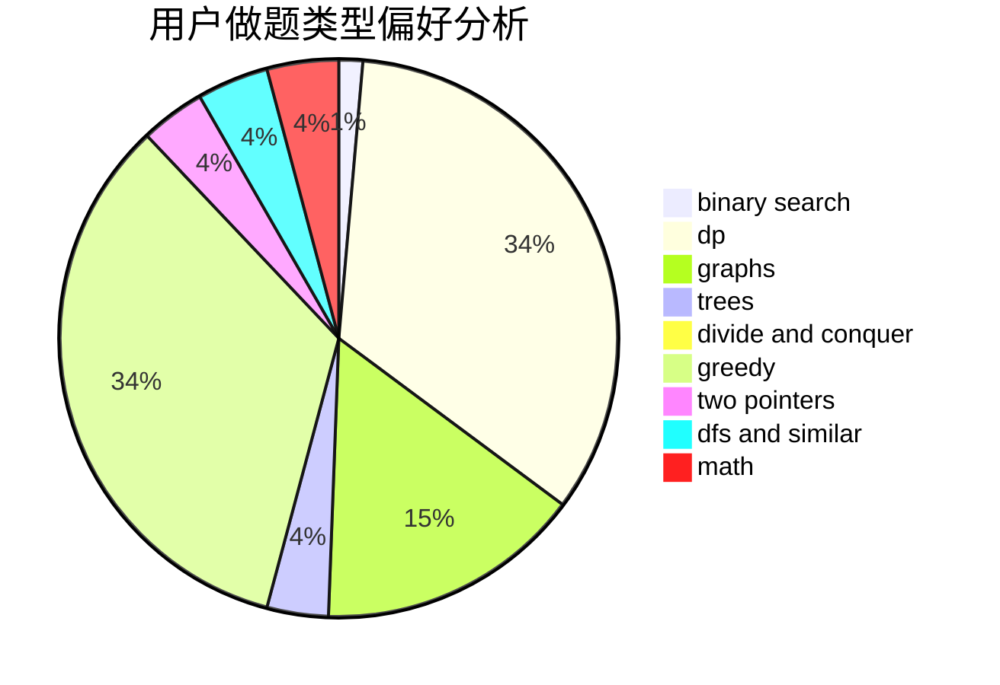

# aleng

<!-- tabs:start -->

#### **用户提交结果分析**

#### **用户做题类型偏好分析**

<!-- tabs:end -->
# 推荐题目
[1310D](https://codeforces.com/contest/1310/problem/D)
[1491G](https://codeforces.com/contest/1491/problem/G)
[471C](https://codeforces.com/contest/471/problem/C)
[1064C](https://codeforces.com/contest/1064/problem/C)
[11781](https://codeforces.com/contest/1178/problem/1)
[1234A](https://codeforces.com/contest/1234/problem/A)
[1089L](https://codeforces.com/contest/1089/problem/L)
[707E](https://codeforces.com/contest/707/problem/E)
[618B](https://codeforces.com/contest/618/problem/B)
[375C](https://codeforces.com/contest/375/problem/C)
