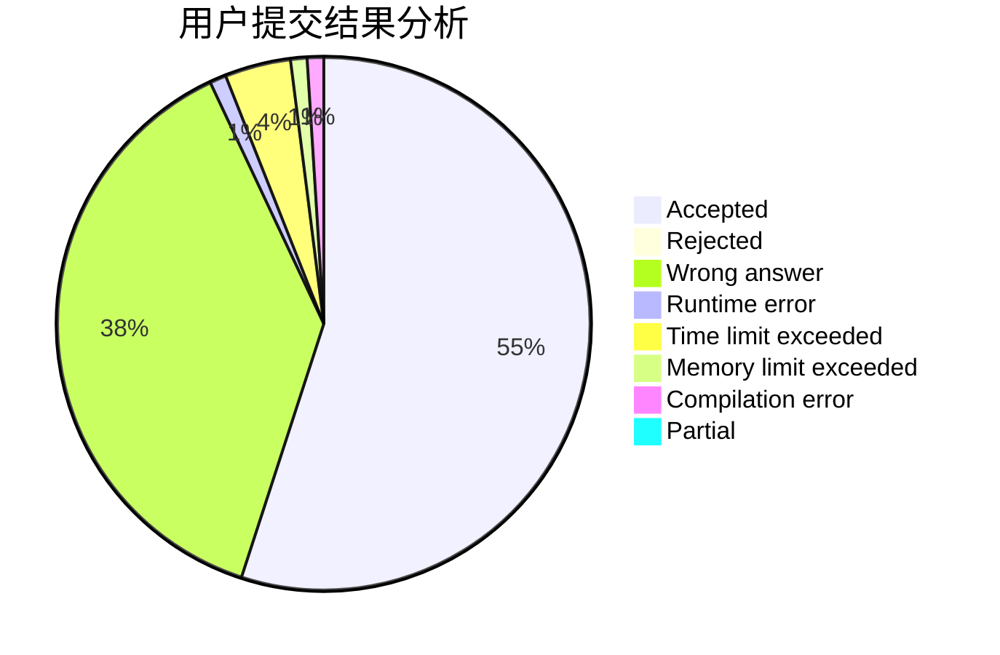
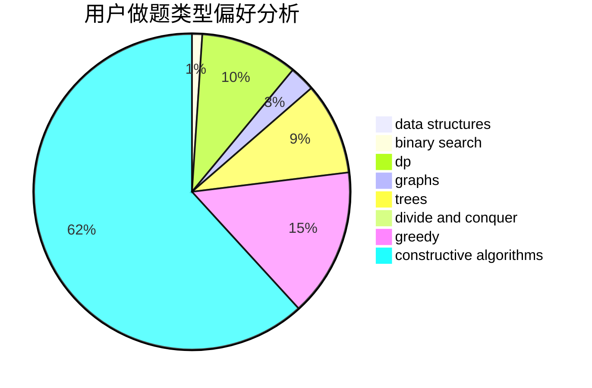
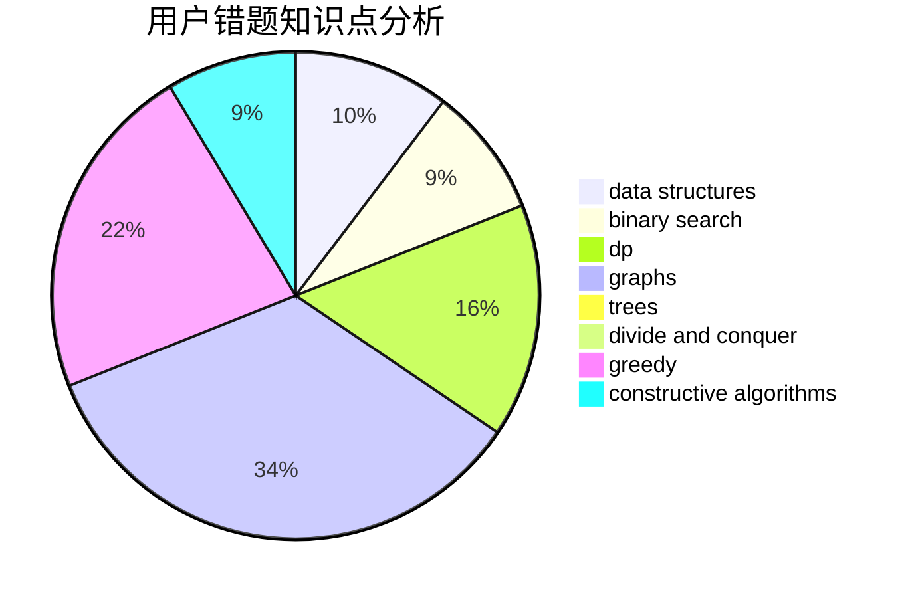

# aleng

<!-- tabs:start -->

#### **用户提交结果分析**

#### **用户做题类型偏好分析**

#### **用户错题知识点分析**

<!-- tabs:end -->
# 推荐题目
[1310D](https://codeforces.com/contest/1310/problem/D)		dp,
                        graphs,
                        probabilities		  
[1491G](https://codeforces.com/contest/1491/problem/G)		constructive algorithms,
                        graphs,
                        math		  
[471C](https://codeforces.com/contest/471/problem/C)		binary search,
                        brute force,
                        greedy,
                        math		  
[1064C](https://codeforces.com/contest/1064/problem/C)		dsu,graphs,sortings,trees		  
[11781](https://codeforces.com/contest/1178/problem/1)		dsu,graphs,sortings,trees		  
[1234A](https://codeforces.com/contest/1234/problem/A)		math		  
[1089L](https://codeforces.com/contest/1089/problem/L)		nan		  
[707E](https://codeforces.com/contest/707/problem/E)		data structures		  
[618B](https://codeforces.com/contest/618/problem/B)		constructive algorithms		  
[375C](https://codeforces.com/contest/375/problem/C)		bitmasks,
                        shortest paths		  
