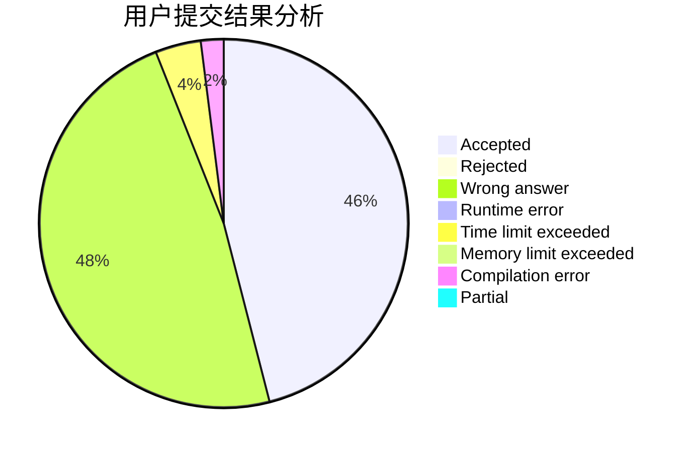
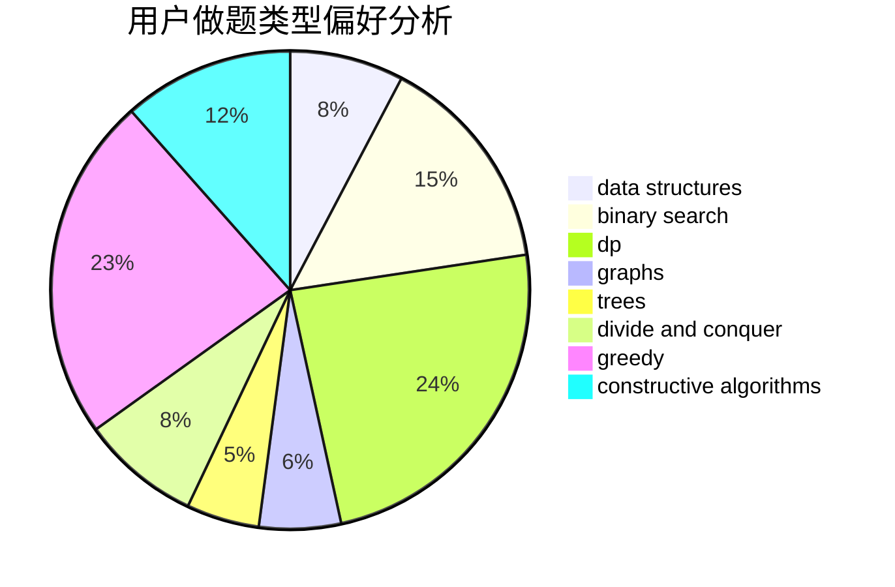
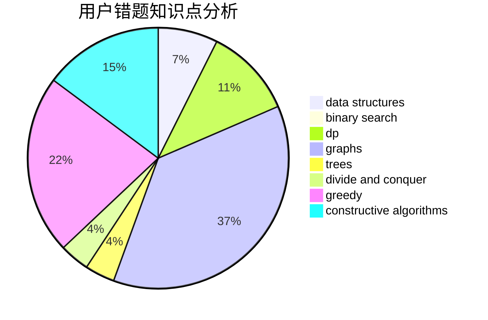

# almzsyp

<!-- tabs:start -->

#### **用户提交结果分析**

#### **用户做题类型偏好分析**

#### **用户错题知识点分析**

<!-- tabs:end -->
# 推荐题目
[855G](https://codeforces.com/contest/855/problem/G)		dfs and similar,
                        dp,
                        graphs,
                        trees		  
[1389B](https://codeforces.com/contest/1389/problem/B)		brute force,
                        dp,
                        greedy		  
[166C](https://codeforces.com/contest/166/problem/C)		greedy,
                        math,
                        sortings		  
[1079C](https://codeforces.com/contest/1079/problem/C)		dsu,graphs,sortings,trees		  
[516E](https://codeforces.com/contest/516/problem/E)		math,
                        number theory		  
[572A](https://codeforces.com/contest/572/problem/A)		sortings		  
[1420C1](https://codeforces.com/contest/1420C/problem/1)		constructive algorithms,
                        dp,
                        greedy		  
[297D](https://codeforces.com/contest/297/problem/D)		constructive algorithms		  
[404C](https://codeforces.com/contest/404/problem/C)		dfs and similar,
                        graphs,
                        sortings		  
[1138F](https://codeforces.com/contest/1138/problem/F)		dsu,graphs,sortings,trees		  
