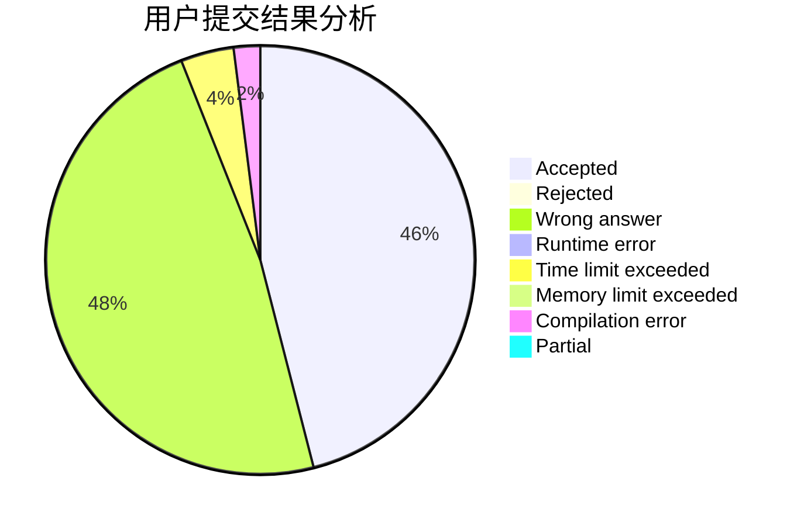
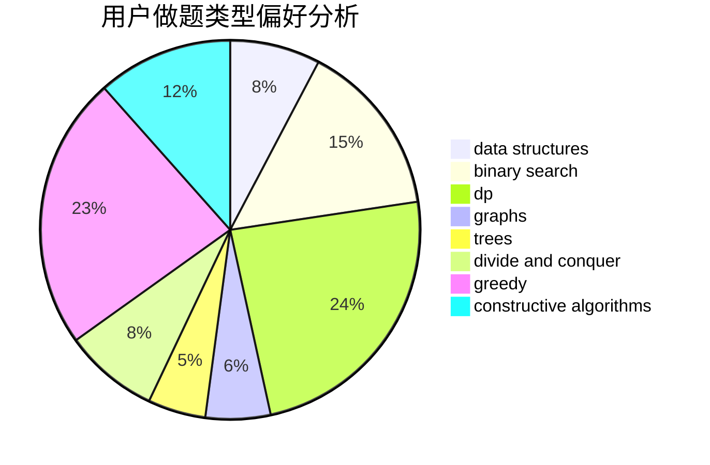
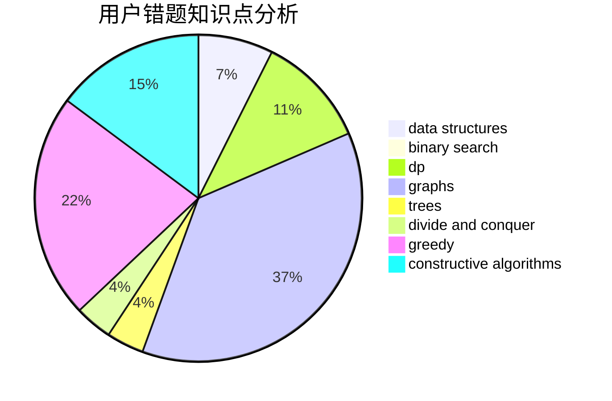

# almzsyp
<!-- tabs:start -->
#### **用户提交结果分析**

#### **用户做题类型偏好分析**

#### **用户错题知识点分析**

<!-- tabs:end -->
# 推荐题目
[Pokémon Army (easy version)](http://codeforces.com/problemset/problem/1420/C1)		constructive algorithms,
                        dp,
                        greedy		  
[Obtain a Permutation](http://codeforces.com/problemset/problem/1294/E)		greedy,
                        implementation,
                        math		  
[Subarray Sorting](http://codeforces.com/problemset/problem/1187/D)		data structures,
                        sortings		  
[Candies and Two Sisters](http://codeforces.com/problemset/problem/1335/A)		math		  
[Shooting Gallery](http://codeforces.com/problemset/problem/30/C)		dp,
                        probabilities		  
[Orac and LCM](http://codeforces.com/problemset/problem/1349/A)		data structures,
                        math,
                        number theory		  
[Arrays](http://codeforces.com/problemset/problem/572/A)		sortings		  
[Median](http://codeforces.com/problemset/problem/166/C)		greedy,
                        math,
                        sortings		  
[Keep talking and nobody explodes -- easy](http://codeforces.com/problemset/problem/1302/F)		bitmasks,
                        brute force,
                        expression parsing		  
[Cooperative Game](https://codeforces.com/contest/1138/problem/F)		constructive algorithms,
                        interactive,
                        number theory		  
<!-- tabs:start -->
#### **data structures**
[Pokémon Army (easy version)](http://codeforces.com/problemset/problem/1187/D)		data structures,
                        sortings		  
[Obtain a Permutation](http://codeforces.com/problemset/problem/1349/A)		data structures,
                        math,
                        number theory		  
[Subarray Sorting](http://codeforces.com/problemset/problem/1023/G)		data structures,
                        flows,
                        trees		  
[Candies and Two Sisters](http://codeforces.com/problemset/problem/1056/G)		brute force,
                        data structures,
                        graphs		  
[Shooting Gallery](http://codeforces.com/problemset/problem/85/D)		binary search,
                        brute force,
                        data structures,
                        implementation		  
[Orac and LCM](http://codeforces.com/problemset/problem/817/E)		bitmasks,
                        data structures,
                        trees		  
[Arrays](http://codeforces.com/problemset/problem/1492/C)		binary search,
                        data structures,
                        dp,
                        greedy,
                        two pointers		  
[Median](http://codeforces.com/problemset/problem/1490/G)		binary search,
                        data structures,
                        math		  
[Keep talking and nobody explodes -- easy](http://codeforces.com/problemset/problem/1479/D)		binary search,
                        bitmasks,
                        brute force,
                        data structures,
                        probabilities,
                        trees		  
[Cooperative Game](http://codeforces.com/problemset/problem/1497/A)		brute force,
                        data structures,
                        greedy,
                        sortings		  
#### **binary search**
[Pokémon Army (easy version)](http://codeforces.com/problemset/problem/96/B)		binary search,
                        bitmasks,
                        brute force		  
[Obtain a Permutation](http://codeforces.com/problemset/problem/727/F)		binary search,
                        dp,
                        greedy		  
[Subarray Sorting](https://codeforces.com/contest/779/problem/D)		binary search,
                        greedy,
                        strings		  
[Candies and Two Sisters](http://codeforces.com/problemset/problem/85/D)		binary search,
                        brute force,
                        data structures,
                        implementation		  
[Shooting Gallery](http://codeforces.com/problemset/problem/1492/C)		binary search,
                        data structures,
                        dp,
                        greedy,
                        two pointers		  
[Orac and LCM](http://codeforces.com/problemset/problem/1463/D)		binary search,
                        constructive algorithms,
                        greedy,
                        two pointers		  
[Arrays](http://codeforces.com/problemset/problem/1490/G)		binary search,
                        data structures,
                        math		  
[Median](http://codeforces.com/problemset/problem/1479/D)		binary search,
                        bitmasks,
                        brute force,
                        data structures,
                        probabilities,
                        trees		  
[Keep talking and nobody explodes -- easy](http://codeforces.com/problemset/problem/1436/E)		binary search,
                        data structures,
                        two pointers		  
[Cooperative Game](http://codeforces.com/problemset/problem/1461/D)		binary search,
                        brute force,
                        data structures,
                        divide and conquer,
                        implementation,
                        sortings		  
#### **dp**
[Pokémon Army (easy version)](http://codeforces.com/problemset/problem/1420/C1)		constructive algorithms,
                        dp,
                        greedy		  
[Obtain a Permutation](http://codeforces.com/problemset/problem/30/C)		dp,
                        probabilities		  
[Subarray Sorting](http://codeforces.com/problemset/problem/963/B)		constructive algorithms,
                        dfs and similar,
                        dp,
                        greedy,
                        trees		  
[Candies and Two Sisters](http://codeforces.com/problemset/problem/289/B)		brute force,
                        dp,
                        implementation,
                        sortings,
                        ternary search		  
[Shooting Gallery](https://codeforces.com/contest/789/problem/C)		dp,
                        two pointers		  
[Orac and LCM](http://codeforces.com/problemset/problem/1428/G2)		dp,
                        greedy		  
[Arrays](http://codeforces.com/problemset/problem/453/D)		dp,
                        matrices		  
[Median](https://codeforces.com/contest/1079/problem/C)		constructive algorithms,
                        dp		  
[Keep talking and nobody explodes -- easy](http://codeforces.com/problemset/problem/682/D)		dp,
                        strings		  
[Cooperative Game](http://codeforces.com/problemset/problem/225/C)		dp,
                        matrices		  
#### **graph**
[Pokémon Army (easy version)](http://codeforces.com/problemset/problem/780/D)		2-sat,
                        graphs,
                        greedy,
                        implementation,
                        shortest paths,
                        strings		  
[Obtain a Permutation](http://codeforces.com/problemset/problem/404/C)		dfs and similar,
                        graphs,
                        sortings		  
[Subarray Sorting](http://codeforces.com/problemset/problem/1056/G)		brute force,
                        data structures,
                        graphs		  
[Candies and Two Sisters](http://codeforces.com/problemset/problem/855/G)		dfs and similar,
                        dp,
                        graphs,
                        trees		  
[Shooting Gallery](http://codeforces.com/problemset/problem/811/D)		constructive algorithms,
                        dfs and similar,
                        graphs,
                        interactive		  
[Orac and LCM](http://codeforces.com/problemset/problem/744/A)		dfs and similar,
                        graphs		  
[Arrays](http://codeforces.com/problemset/problem/1510/B)		flows,
                        graph matchings,
                        graphs		  
[Median](http://codeforces.com/problemset/problem/718/E)		bitmasks,
                        graphs		  
[Keep talking and nobody explodes -- easy](http://codeforces.com/problemset/problem/1487/C)		brute force,
                        constructive algorithms,
                        dfs and similar,
                        graphs,
                        greedy,
                        implementation,
                        math		  
[Cooperative Game](http://codeforces.com/problemset/problem/1437/C)		dp,
                        flows,
                        graph matchings,
                        greedy,
                        math,
                        sortings		  
#### **trees**
[Pokémon Army (easy version)](http://codeforces.com/problemset/problem/963/B)		constructive algorithms,
                        dfs and similar,
                        dp,
                        greedy,
                        trees		  
[Obtain a Permutation](http://codeforces.com/problemset/problem/886/C)		dsu,
                        greedy,
                        implementation,
                        trees		  
[Subarray Sorting](http://codeforces.com/problemset/problem/1023/G)		data structures,
                        flows,
                        trees		  
[Candies and Two Sisters](http://codeforces.com/problemset/problem/855/G)		dfs and similar,
                        dp,
                        graphs,
                        trees		  
[Shooting Gallery](http://codeforces.com/problemset/problem/274/B)		dfs and similar,
                        dp,
                        greedy,
                        trees		  
[Orac and LCM](http://codeforces.com/problemset/problem/817/E)		bitmasks,
                        data structures,
                        trees		  
[Arrays](http://codeforces.com/problemset/problem/1479/D)		binary search,
                        bitmasks,
                        brute force,
                        data structures,
                        probabilities,
                        trees		  
[Median](http://codeforces.com/problemset/problem/1511/C)		brute force,
                        data structures,
                        implementation,
                        trees		  
[Keep talking and nobody explodes -- easy](http://codeforces.com/problemset/problem/1499/F)		combinatorics,
                        dfs and similar,
                        dp,
                        trees		  
[Cooperative Game](http://codeforces.com/problemset/problem/1491/E)		brute force,
                        dfs and similar,
                        divide and conquer,
                        number theory,
                        trees		  
#### **divide and conquer**
[Pokémon Army (easy version)](http://codeforces.com/problemset/problem/1461/D)		binary search,
                        brute force,
                        data structures,
                        divide and conquer,
                        implementation,
                        sortings		  
[Obtain a Permutation](http://codeforces.com/problemset/problem/1466/G)		combinatorics,
                        divide and conquer,
                        hashing,
                        math,
                        string suffix structures,
                        strings		  
[Subarray Sorting](http://codeforces.com/problemset/problem/1490/D)		dfs and similar,
                        divide and conquer,
                        implementation		  
[Candies and Two Sisters](https://codeforces.com/contest/1483/problem/C)		data structures,
                        divide and conquer,
                        dp		  
[Shooting Gallery](http://codeforces.com/problemset/problem/1491/E)		brute force,
                        dfs and similar,
                        divide and conquer,
                        number theory,
                        trees		  
[Orac and LCM](http://codeforces.com/problemset/problem/1303/G)		data structures,
                        divide and conquer,
                        geometry,
                        trees		  
[Arrays](http://codeforces.com/problemset/problem/1494/D)		constructive algorithms,
                        data structures,
                        dfs and similar,
                        divide and conquer,
                        dsu,
                        greedy,
                        sortings,
                        trees		  
[Median](http://codeforces.com/problemset/problem/1482/E)		data structures,
                        divide and conquer,
                        dp		  
[Keep talking and nobody explodes -- easy](http://codeforces.com/problemset/problem/566/C)		dfs and similar,
                        divide and conquer,
                        trees		  
[Cooperative Game](http://codeforces.com/problemset/problem/1428/F)		binary search,
                        data structures,
                        divide and conquer,
                        dp,
                        two pointers		  
#### **greedy**
[Pokémon Army (easy version)](http://codeforces.com/problemset/problem/1420/C1)		constructive algorithms,
                        dp,
                        greedy		  
[Obtain a Permutation](http://codeforces.com/problemset/problem/1294/E)		greedy,
                        implementation,
                        math		  
[Subarray Sorting](http://codeforces.com/problemset/problem/166/C)		greedy,
                        math,
                        sortings		  
[Candies and Two Sisters](http://codeforces.com/problemset/problem/963/B)		constructive algorithms,
                        dfs and similar,
                        dp,
                        greedy,
                        trees		  
[Shooting Gallery](http://codeforces.com/problemset/problem/886/C)		dsu,
                        greedy,
                        implementation,
                        trees		  
[Orac and LCM](http://codeforces.com/problemset/problem/780/D)		2-sat,
                        graphs,
                        greedy,
                        implementation,
                        shortest paths,
                        strings		  
[Arrays](http://codeforces.com/problemset/problem/354/A)		brute force,
                        greedy,
                        math		  
[Median](http://codeforces.com/problemset/problem/1428/G2)		dp,
                        greedy		  
[Keep talking and nobody explodes -- easy](http://codeforces.com/problemset/problem/1151/D)		greedy,
                        math,
                        sortings		  
[Cooperative Game](http://codeforces.com/problemset/problem/727/F)		binary search,
                        dp,
                        greedy		  
#### **constructive algorithms**
[Pokémon Army (easy version)](http://codeforces.com/problemset/problem/1420/C1)		constructive algorithms,
                        dp,
                        greedy		  
[Obtain a Permutation](https://codeforces.com/contest/1138/problem/F)		constructive algorithms,
                        interactive,
                        number theory		  
[Subarray Sorting](http://codeforces.com/problemset/problem/963/B)		constructive algorithms,
                        dfs and similar,
                        dp,
                        greedy,
                        trees		  
[Candies and Two Sisters](https://codeforces.com/contest/1079/problem/C)		constructive algorithms,
                        dp		  
[Shooting Gallery](http://codeforces.com/problemset/problem/297/D)		constructive algorithms		  
[Orac and LCM](http://codeforces.com/problemset/problem/277/B)		constructive algorithms,
                        geometry		  
[Arrays](http://codeforces.com/problemset/problem/811/D)		constructive algorithms,
                        dfs and similar,
                        graphs,
                        interactive		  
[Median](http://codeforces.com/problemset/problem/1496/A)		brute force,
                        constructive algorithms,
                        greedy,
                        strings		  
[Keep talking and nobody explodes -- easy](http://codeforces.com/problemset/problem/1451/E2)		bitmasks,
                        constructive algorithms,
                        interactive,
                        math		  
[Cooperative Game](http://codeforces.com/problemset/problem/1493/A)		constructive algorithms,
                        greedy		  
#### **sortings**
[Pokémon Army (easy version)](http://codeforces.com/problemset/problem/1187/D)		data structures,
                        sortings		  
[Obtain a Permutation](http://codeforces.com/problemset/problem/572/A)		sortings		  
[Subarray Sorting](http://codeforces.com/problemset/problem/166/C)		greedy,
                        math,
                        sortings		  
[Candies and Two Sisters](http://codeforces.com/problemset/problem/289/B)		brute force,
                        dp,
                        implementation,
                        sortings,
                        ternary search		  
[Shooting Gallery](http://codeforces.com/problemset/problem/404/C)		dfs and similar,
                        graphs,
                        sortings		  
[Orac and LCM](http://codeforces.com/problemset/problem/1151/D)		greedy,
                        math,
                        sortings		  
[Arrays](https://codeforces.com/contest/1496/problem/C)		geometry,
                        greedy,
                        math,
                        sortings		  
[Median](http://codeforces.com/problemset/problem/1495/A)		geometry,
                        greedy,
                        math,
                        sortings		  
[Keep talking and nobody explodes -- easy](http://codeforces.com/problemset/problem/1497/A)		brute force,
                        data structures,
                        greedy,
                        sortings		  
[Cooperative Game](http://codeforces.com/problemset/problem/1427/A)		math,
                        sortings		  
<!-- tabs:end -->
