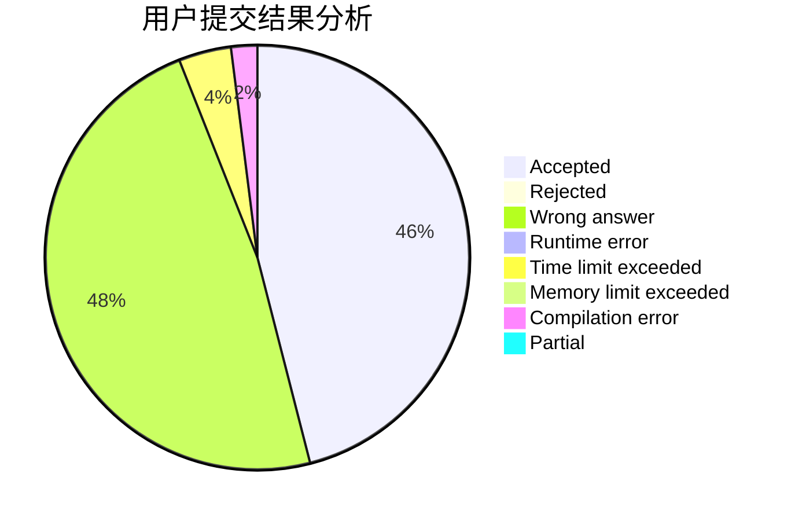
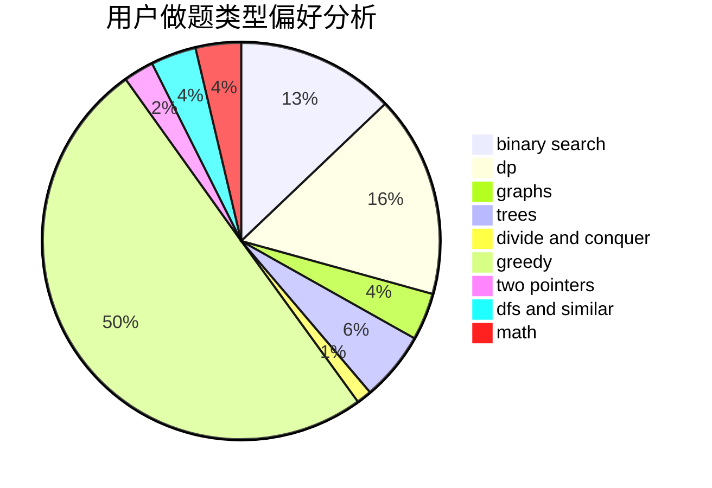

# almzsyp

<!-- tabs:start -->

#### **用户提交结果分析**

#### **用户做题类型偏好分析**

<!-- tabs:end -->
# 推荐题目
[875B](https://codeforces.com/contest/875/problem/B)
[1398E](https://codeforces.com/contest/1398/problem/E)
[193A](https://codeforces.com/contest/193/problem/A)
[107B](https://codeforces.com/contest/107/problem/B)
[543E](https://codeforces.com/contest/543/problem/E)
[592C](https://codeforces.com/contest/592/problem/C)
[14282](https://codeforces.com/contest/1428/problem/2)
[314C](https://codeforces.com/contest/314/problem/C)
[433B](https://codeforces.com/contest/433/problem/B)
[1140D](https://codeforces.com/contest/1140/problem/D)
