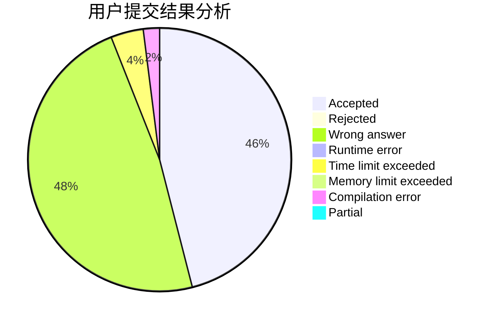
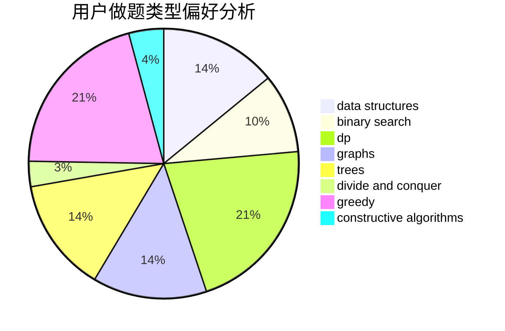
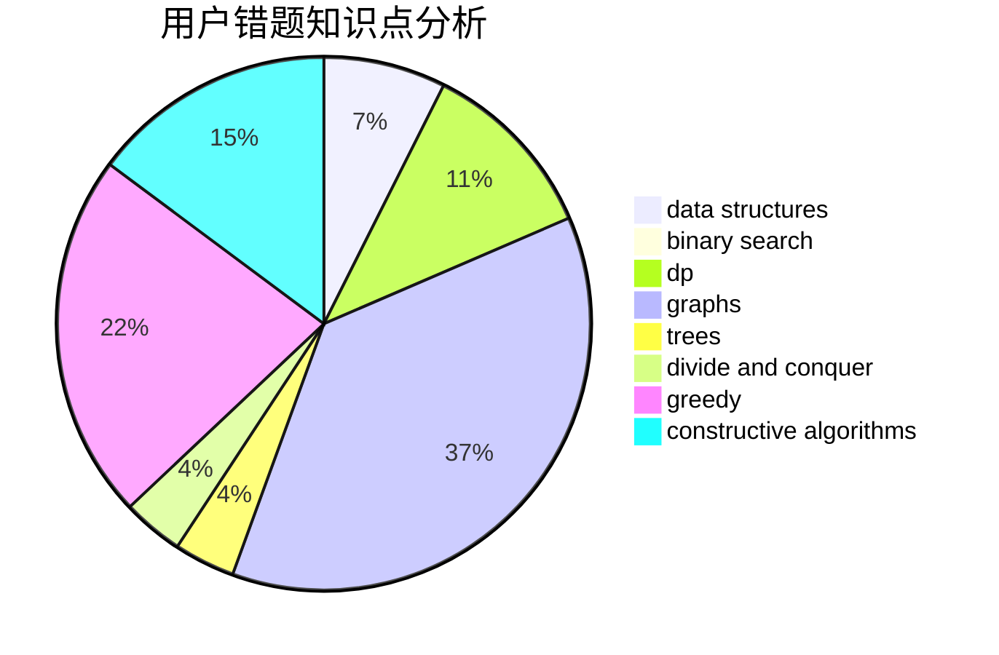

# almzsyp

<!-- tabs:start -->

#### **用户提交结果分析**

#### **用户做题类型偏好分析**

#### **用户错题知识点分析**

<!-- tabs:end -->
# 推荐题目
[875B](https://codeforces.com/contest/875/problem/B)		dsu,
                        implementation,
                        sortings,
                        two pointers		  
[1398E](https://codeforces.com/contest/1398/problem/E)		binary search,
                        data structures,
                        greedy,
                        implementation,
                        math,
                        sortings		  
[193A](https://codeforces.com/contest/193/problem/A)		constructive algorithms,
                        graphs,
                        trees		  
[107B](https://codeforces.com/contest/107/problem/B)		combinatorics,
                        dp,
                        math,
                        probabilities		  
[543E](https://codeforces.com/contest/543/problem/E)		constructive algorithms,
                        data structures		  
[592C](https://codeforces.com/contest/592/problem/C)		math		  
[14282](https://codeforces.com/contest/1428/problem/2)		dsu,graphs,sortings,trees		  
[314C](https://codeforces.com/contest/314/problem/C)		data structures,
                        dp		  
[433B](https://codeforces.com/contest/433/problem/B)		dp,
                        implementation,
                        sortings		  
[1140D](https://codeforces.com/contest/1140/problem/D)		dp,
                        greedy,
                        math		  
