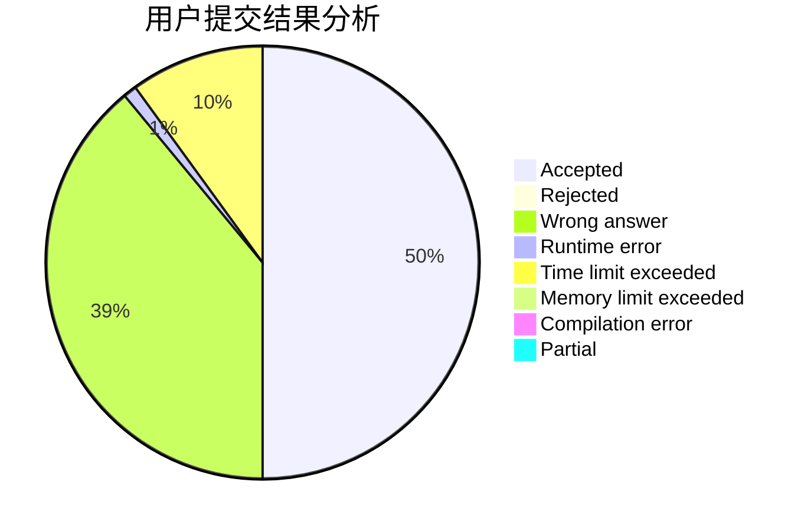
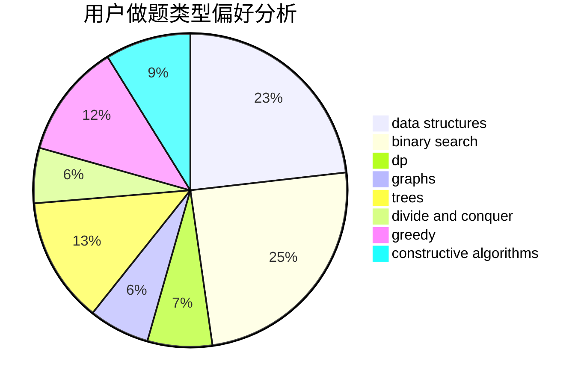
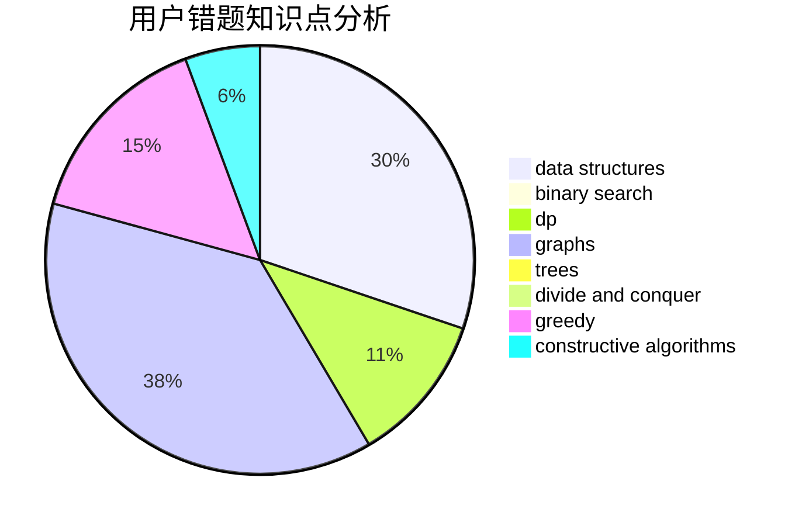

# alocytus

<!-- tabs:start -->

#### **用户提交结果分析**

#### **用户做题类型偏好分析**

#### **用户错题知识点分析**

<!-- tabs:end -->
# 推荐题目
[533E](https://codeforces.com/contest/533/problem/E)		constructive algorithms,
                        dp,
                        greedy,
                        hashing,
                        strings,
                        two pointers		  
[1073G](https://codeforces.com/contest/1073/problem/G)		data structures,
                        string suffix structures		  
[721B](https://codeforces.com/contest/721/problem/B)		implementation,
                        math,
                        sortings,
                        strings		  
[1119F](https://codeforces.com/contest/1119/problem/F)		data structures,
                        dp,
                        trees		  
[814E](https://codeforces.com/contest/814/problem/E)		combinatorics,
                        dp,
                        graphs,
                        shortest paths		  
[722F](https://codeforces.com/contest/722/problem/F)		chinese remainder theorem,
                        data structures,
                        implementation,
                        number theory,
                        two pointers		  
[456B](https://codeforces.com/contest/456/problem/B)		math,
                        number theory		  
[924C](https://codeforces.com/contest/924/problem/C)		data structures,
                        dp,
                        greedy		  
[254A](https://codeforces.com/contest/254/problem/A)		constructive algorithms,
                        sortings		  
[1154E](https://codeforces.com/contest/1154/problem/E)		data structures,
                        implementation,
                        sortings		  
