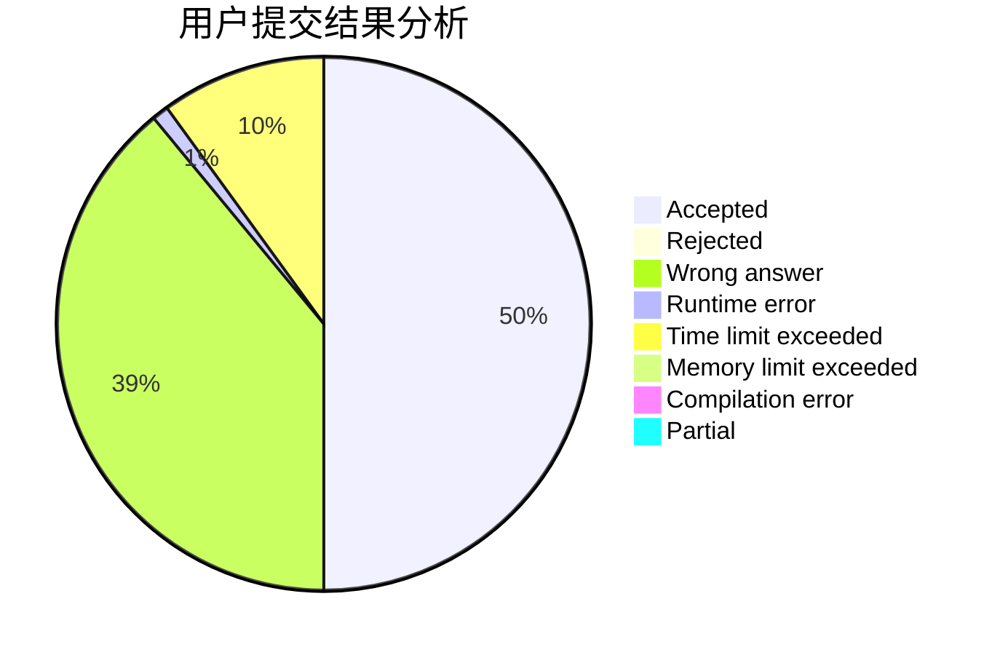
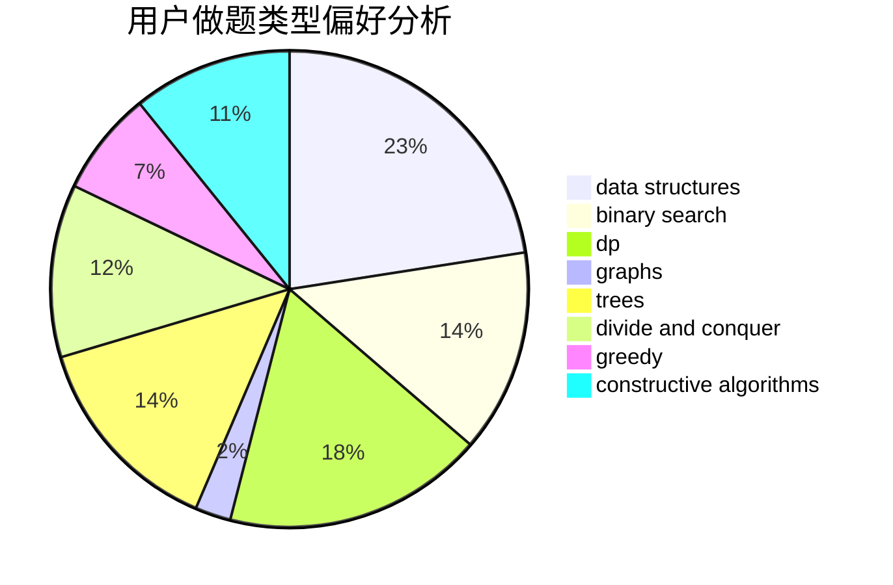
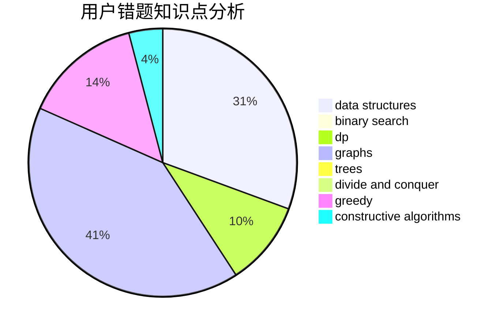

# alocytus

<!-- tabs:start -->

#### **用户提交结果分析**

#### **用户做题类型偏好分析**

#### **用户错题知识点分析**

<!-- tabs:end -->
# 推荐题目
[555C](https://codeforces.com/contest/555/problem/C)		data structures		  
[1074C](https://codeforces.com/contest/1074/problem/C)		dsu,graphs,sortings,trees		  
[738D](https://codeforces.com/contest/738/problem/D)		dsu,graphs,sortings,trees		  
[1129B](https://codeforces.com/contest/1129/problem/B)		constructive algorithms		  
[833C](https://codeforces.com/contest/833/problem/C)		brute force,
                        combinatorics,
                        greedy,
                        math		  
[73B](https://codeforces.com/contest/73/problem/B)		binary search,
                        greedy,
                        sortings		  
[477B](https://codeforces.com/contest/477/problem/B)		dsu,graphs,sortings,trees		  
[948A](https://codeforces.com/contest/948/problem/A)		brute force,
                        dfs and similar,
                        graphs,
                        implementation		  
[271E](https://codeforces.com/contest/271/problem/E)		constructive algorithms,
                        math,
                        number theory		  
[1156E](https://codeforces.com/contest/1156/problem/E)		data structures,
                        divide and conquer,
                        dsu,
                        two pointers		  
