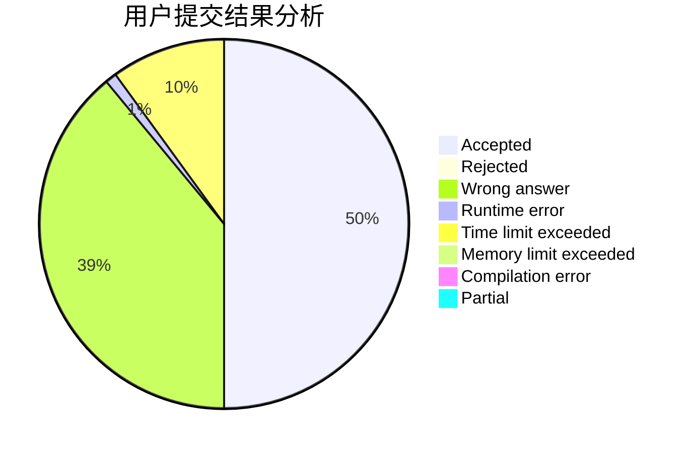
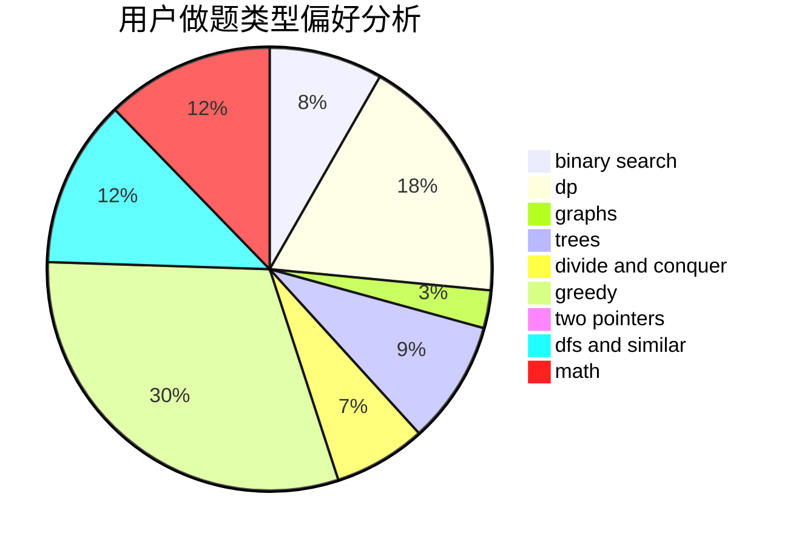

# alocytus

<!-- tabs:start -->

#### **用户提交结果分析**

#### **用户做题类型偏好分析**

<!-- tabs:end -->
# 推荐题目
[555C](https://codeforces.com/contest/555/problem/C)
[1074C](https://codeforces.com/contest/1074/problem/C)
[738D](https://codeforces.com/contest/738/problem/D)
[1129B](https://codeforces.com/contest/1129/problem/B)
[833C](https://codeforces.com/contest/833/problem/C)
[73B](https://codeforces.com/contest/73/problem/B)
[477B](https://codeforces.com/contest/477/problem/B)
[948A](https://codeforces.com/contest/948/problem/A)
[271E](https://codeforces.com/contest/271/problem/E)
[1156E](https://codeforces.com/contest/1156/problem/E)
