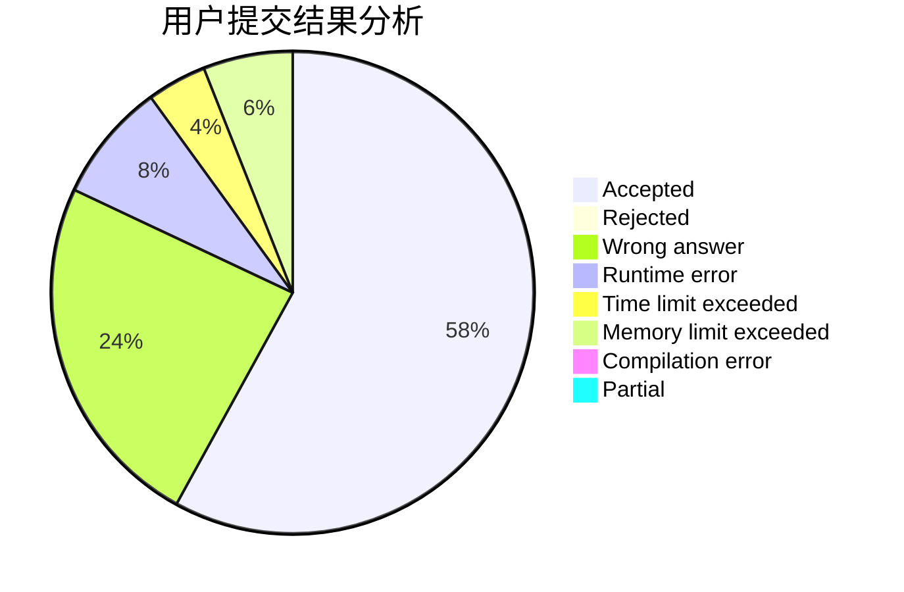
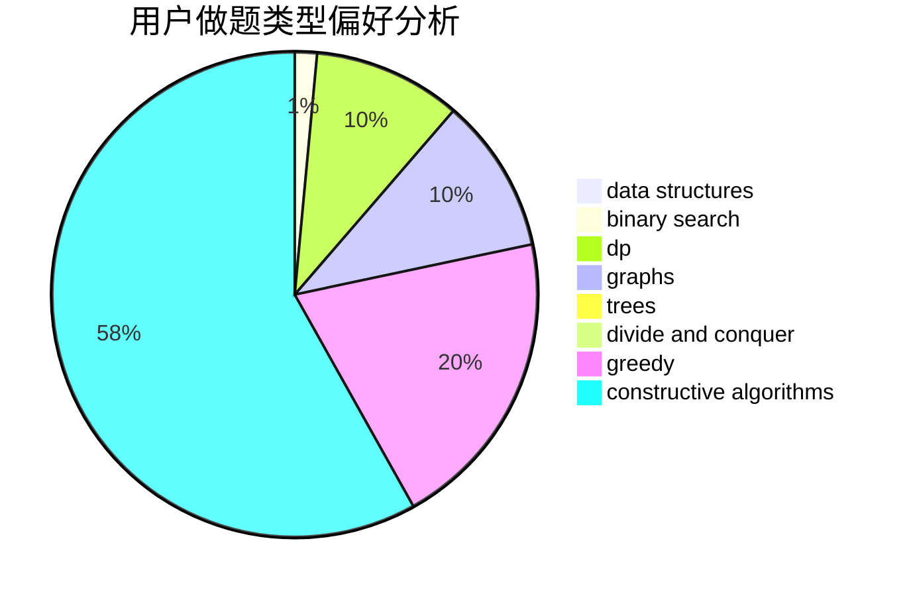
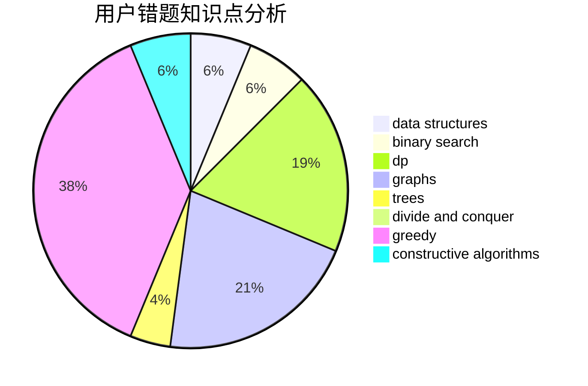

# alpha1022

<!-- tabs:start -->

#### **用户提交结果分析**

#### **用户做题类型偏好分析**

#### **用户错题知识点分析**

<!-- tabs:end -->
# 推荐题目
[894D](https://codeforces.com/contest/894/problem/D)		brute force,
                        data structures,
                        trees		  
[1190B](https://codeforces.com/contest/1190/problem/B)		games		  
[434C](https://codeforces.com/contest/434/problem/C)		dsu,graphs,sortings,trees		  
[1360B](https://codeforces.com/contest/1360/problem/B)		greedy,
                        sortings		  
[697C](https://codeforces.com/contest/697/problem/C)		dsu,graphs,sortings,trees		  
[681C](https://codeforces.com/contest/681/problem/C)		constructive algorithms,
                        data structures,
                        greedy		  
[1386A](https://codeforces.com/contest/1386/problem/A)		*special problem,
                        binary search,
                        constructive algorithms,
                        interactive		  
[1464A](https://codeforces.com/contest/1464/problem/A)		dsu,graphs,sortings,trees		  
[145C](https://codeforces.com/contest/145/problem/C)		combinatorics,
                        dp,
                        math		  
[1482E](https://codeforces.com/contest/1482/problem/E)		data structures,
                        divide and conquer,
                        dp		  
