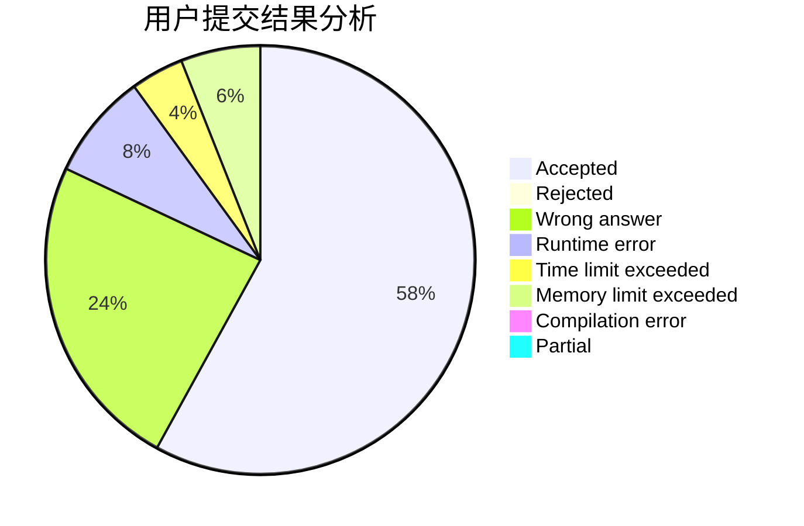
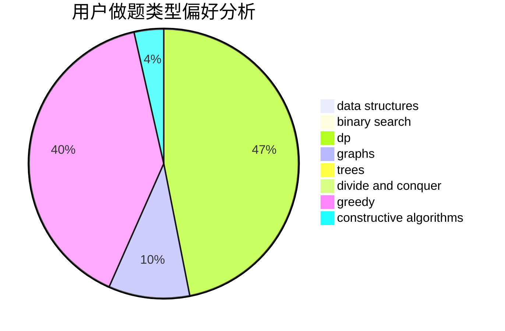

# alpha1022

<!-- tabs:start -->

#### **用户提交结果分析**

#### **用户做题类型偏好分析**

#### **用户错题知识点分析**

<!-- tabs:end -->
# 推荐题目
[912C](https://codeforces.com/contest/912/problem/C)		brute force,
                        greedy,
                        sortings		  
[11962](https://codeforces.com/contest/1196/problem/2)		dsu,graphs,sortings,trees		  
[455B](https://codeforces.com/contest/455/problem/B)		dfs and similar,
                        dp,
                        games,
                        implementation,
                        strings,
                        trees		  
[1368A](https://codeforces.com/contest/1368/problem/A)		brute force,
                        greedy,
                        implementation,
                        math		  
[714A](https://codeforces.com/contest/714/problem/A)		implementation,
                        math		  
[705B](https://codeforces.com/contest/705/problem/B)		games,
                        math		  
[1396B](https://codeforces.com/contest/1396/problem/B)		brute force,
                        constructive algorithms,
                        games,
                        greedy		  
[1471B](https://codeforces.com/contest/1471/problem/B)		brute force,
                        greedy,
                        implementation,
                        math		  
[1468I](https://codeforces.com/contest/1468/problem/I)		geometry,
                        implementation,
                        math		  
[1490C](https://codeforces.com/contest/1490/problem/C)		binary search,
                        brute force,
                        brute force,
                        math		  
