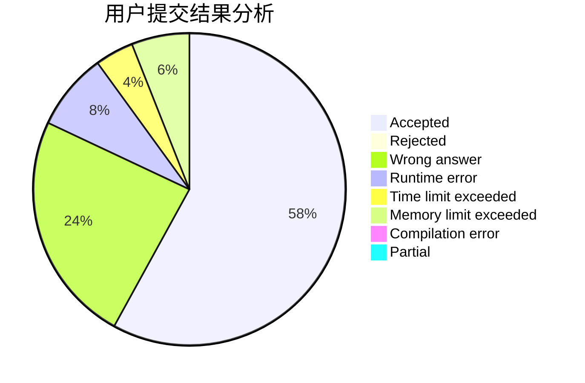
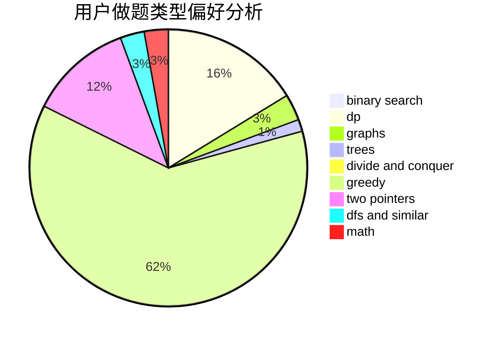

# alpha1022

<!-- tabs:start -->

#### **用户提交结果分析**

#### **用户做题类型偏好分析**

<!-- tabs:end -->
# 推荐题目
[912C](https://codeforces.com/contest/912/problem/C)
[11962](https://codeforces.com/contest/1196/problem/2)
[455B](https://codeforces.com/contest/455/problem/B)
[1368A](https://codeforces.com/contest/1368/problem/A)
[714A](https://codeforces.com/contest/714/problem/A)
[705B](https://codeforces.com/contest/705/problem/B)
[1396B](https://codeforces.com/contest/1396/problem/B)
[1471B](https://codeforces.com/contest/1471/problem/B)
[1468I](https://codeforces.com/contest/1468/problem/I)
[1490C](https://codeforces.com/contest/1490/problem/C)
