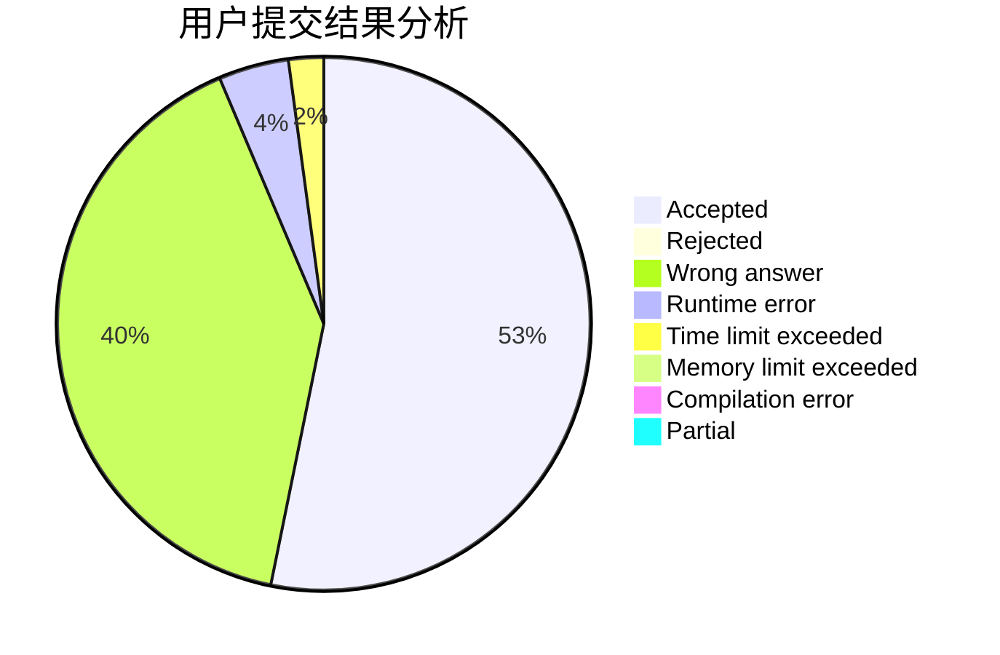
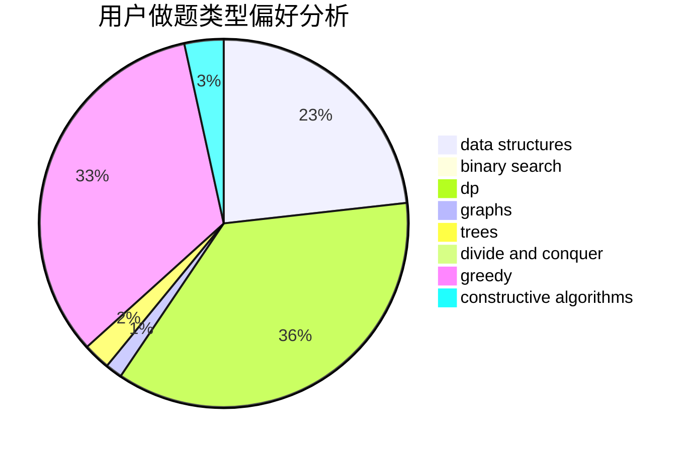

# AmateurCF

<!-- tabs:start -->

#### **用户提交结果分析**

#### **用户做题类型偏好分析**

#### **用户错题知识点分析**

<!-- tabs:end -->
# 推荐题目
[288E](https://codeforces.com/contest/288/problem/E)		dp,
                        implementation,
                        math		  
[30C](https://codeforces.com/contest/30/problem/C)		dp,
                        probabilities		  
[306D](https://codeforces.com/contest/306/problem/D)		constructive algorithms,
                        geometry		  
[30E](https://codeforces.com/contest/30/problem/E)		binary search,
                        constructive algorithms,
                        data structures,
                        greedy,
                        hashing,
                        strings		  
[1254B1](https://codeforces.com/contest/1254B/problem/1)		constructive algorithms,
                        greedy,
                        math,
                        number theory,
                        ternary search,
                        two pointers		  
[1163C2](https://codeforces.com/contest/1163C/problem/2)		data structures,
                        geometry,
                        implementation,
                        math		  
[311B](https://codeforces.com/contest/311/problem/B)		data structures,
                        dp		  
[1254A](https://codeforces.com/contest/1254/problem/A)		constructive algorithms,
                        greedy,
                        implementation		  
[1104D](https://codeforces.com/contest/1104/problem/D)		dsu,graphs,sortings,trees		  
[1066F](https://codeforces.com/contest/1066/problem/F)		dp		  
