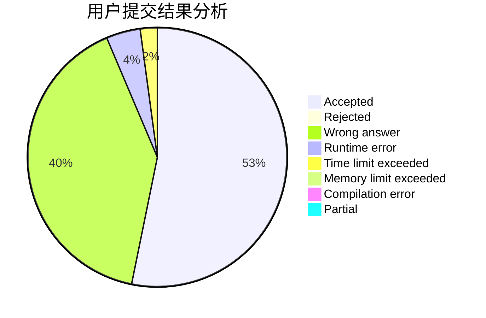
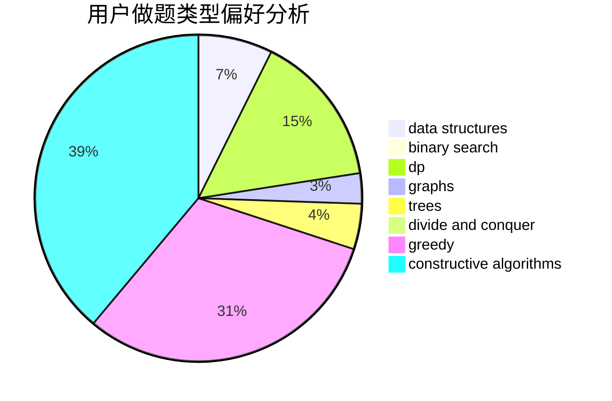

# AmateurCF

<!-- tabs:start -->

#### **用户提交结果分析**

#### **用户做题类型偏好分析**

#### **用户错题知识点分析**

<!-- tabs:end -->
# 推荐题目
[303A](https://codeforces.com/contest/303/problem/A)		constructive algorithms,
                        implementation,
                        math		  
[333B](https://codeforces.com/contest/333/problem/B)		greedy		  
[329B](https://codeforces.com/contest/329/problem/B)		dfs and similar,
                        shortest paths		  
[333E](https://codeforces.com/contest/333/problem/E)		binary search,
                        bitmasks,
                        brute force,
                        geometry,
                        sortings		  
[1261C](https://codeforces.com/contest/1261/problem/C)		dsu,graphs,sortings,trees		  
[11651](https://codeforces.com/contest/1165/problem/1)		dsu,graphs,sortings,trees		  
[334B](https://codeforces.com/contest/334/problem/B)		sortings		  
[1261A](https://codeforces.com/contest/1261/problem/A)		dsu,graphs,sortings,trees		  
[1105B](https://codeforces.com/contest/1105/problem/B)		brute force,
                        implementation,
                        strings		  
[1067C](https://codeforces.com/contest/1067/problem/C)		constructive algorithms		  
