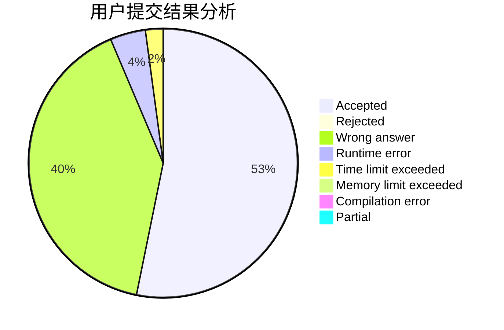
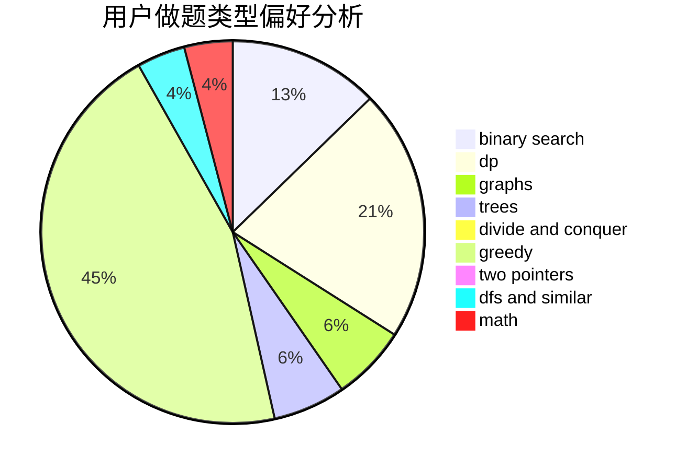

# AmateurCF

<!-- tabs:start -->

#### **用户提交结果分析**

#### **用户做题类型偏好分析**

<!-- tabs:end -->
# 推荐题目
[303A](https://codeforces.com/contest/303/problem/A)
[333B](https://codeforces.com/contest/333/problem/B)
[329B](https://codeforces.com/contest/329/problem/B)
[333E](https://codeforces.com/contest/333/problem/E)
[1261C](https://codeforces.com/contest/1261/problem/C)
[11651](https://codeforces.com/contest/1165/problem/1)
[334B](https://codeforces.com/contest/334/problem/B)
[1261A](https://codeforces.com/contest/1261/problem/A)
[1105B](https://codeforces.com/contest/1105/problem/B)
[1067C](https://codeforces.com/contest/1067/problem/C)
