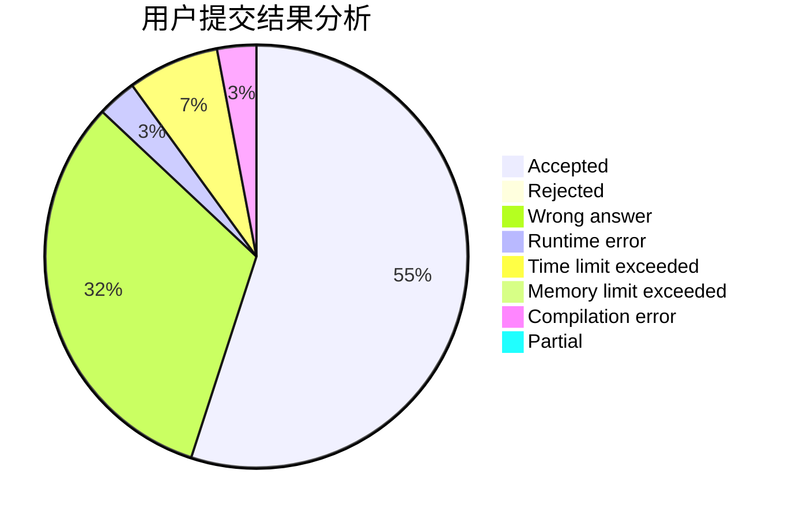
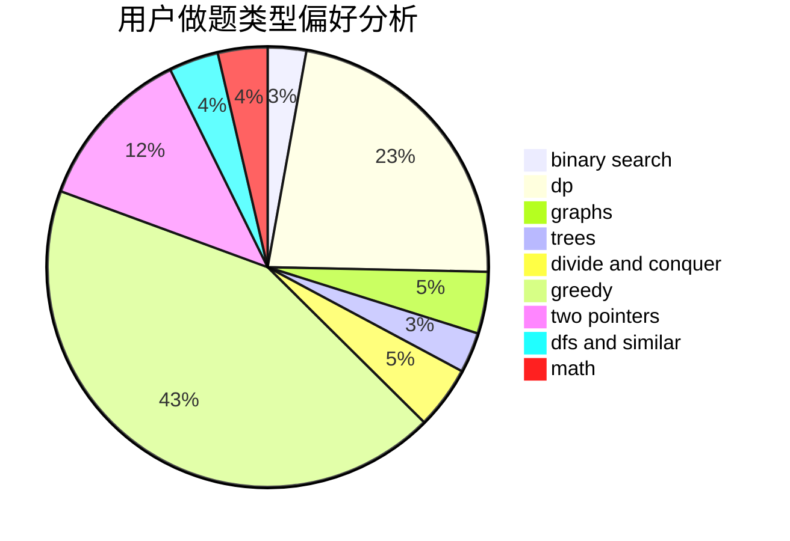

# alwaysR9

<!-- tabs:start -->

#### **用户提交结果分析**

#### **用户做题类型偏好分析**

<!-- tabs:end -->
# 推荐题目
[1220E](https://codeforces.com/contest/1220/problem/E)
[1083F](https://codeforces.com/contest/1083/problem/F)
[998D](https://codeforces.com/contest/998/problem/D)
[1282A](https://codeforces.com/contest/1282/problem/A)
[1046C](https://codeforces.com/contest/1046/problem/C)
[767D](https://codeforces.com/contest/767/problem/D)
[596A](https://codeforces.com/contest/596/problem/A)
[551E](https://codeforces.com/contest/551/problem/E)
[628B](https://codeforces.com/contest/628/problem/B)
[979E](https://codeforces.com/contest/979/problem/E)
