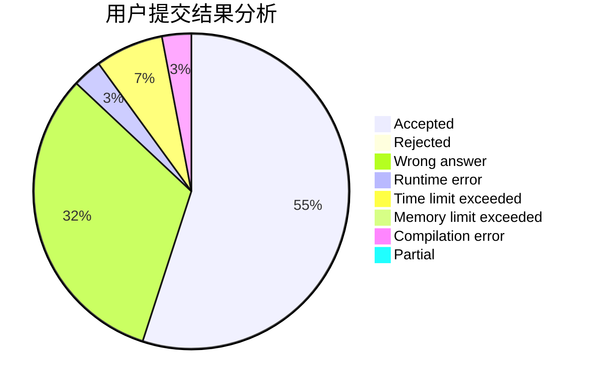
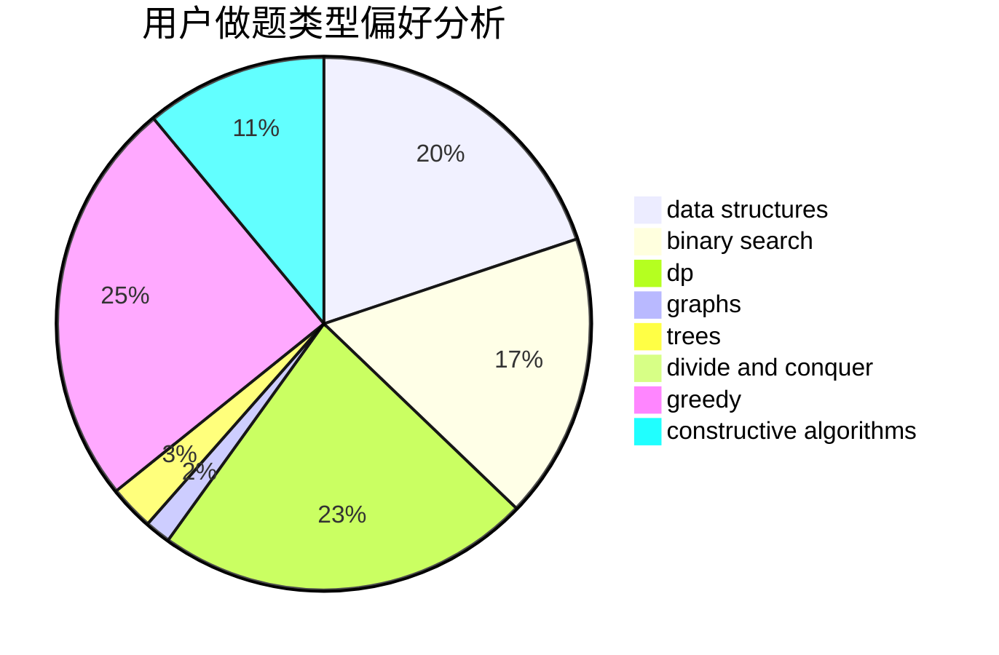

# alwaysR9

<!-- tabs:start -->

#### **用户提交结果分析**

#### **用户做题类型偏好分析**

#### **用户错题知识点分析**

<!-- tabs:end -->
# 推荐题目
[1215A](https://codeforces.com/contest/1215/problem/A)		greedy,
                        implementation,
                        math		  
[1083C](https://codeforces.com/contest/1083/problem/C)		data structures,
                        trees		  
[982F](https://codeforces.com/contest/982/problem/F)		dfs and similar,
                        graphs		  
[1276A](https://codeforces.com/contest/1276/problem/A)		dp,
                        greedy		  
[1045H](https://codeforces.com/contest/1045/problem/H)		math		  
[748C](https://codeforces.com/contest/748/problem/C)		constructive algorithms,
                        math		  
[575A](https://codeforces.com/contest/575/problem/A)		data structures,
                        math,
                        matrices		  
[527E](https://codeforces.com/contest/527/problem/E)		dfs and similar,
                        graphs		  
[609B](https://codeforces.com/contest/609/problem/B)		constructive algorithms,
                        implementation		  
[958B2](https://codeforces.com/contest/958B/problem/2)		data structures,
                        dfs and similar,
                        graphs,
                        greedy,
                        trees		  
