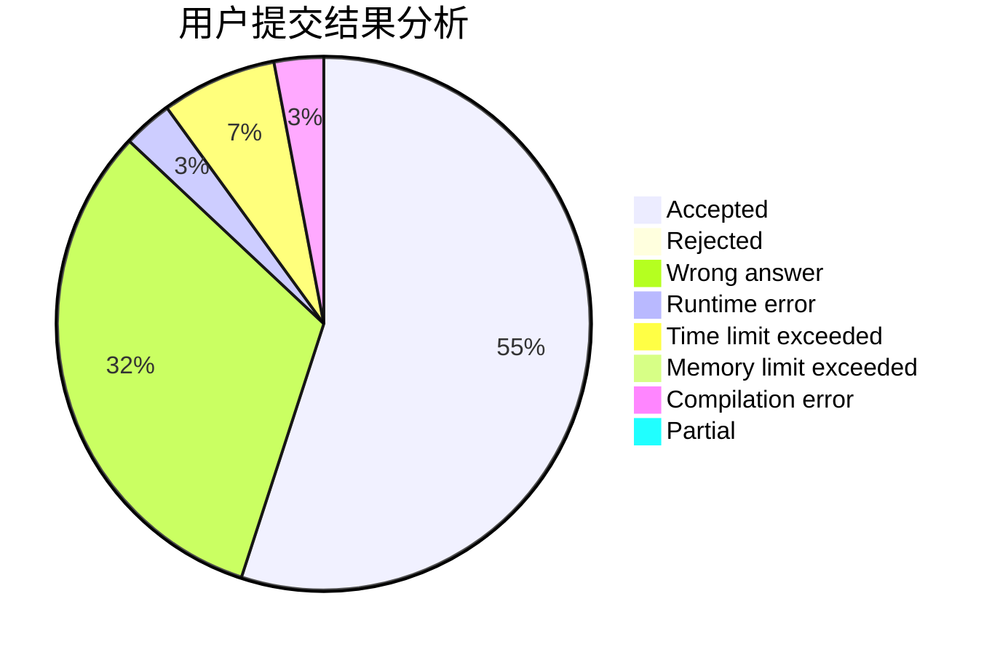
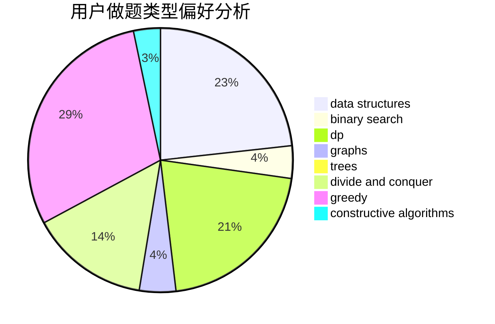

# alwaysR9

<!-- tabs:start -->

#### **用户提交结果分析**

#### **用户做题类型偏好分析**

#### **用户错题知识点分析**

<!-- tabs:end -->
# 推荐题目
[1220E](https://codeforces.com/contest/1220/problem/E)		dfs and similar,
                        dp,
                        dsu,
                        graphs,
                        greedy,
                        trees		  
[1083F](https://codeforces.com/contest/1083/problem/F)		data structures		  
[998D](https://codeforces.com/contest/998/problem/D)		dsu,graphs,sortings,trees		  
[1282A](https://codeforces.com/contest/1282/problem/A)		implementation,
                        math		  
[1046C](https://codeforces.com/contest/1046/problem/C)		greedy		  
[767D](https://codeforces.com/contest/767/problem/D)		binary search,
                        data structures,
                        greedy,
                        sortings,
                        two pointers		  
[596A](https://codeforces.com/contest/596/problem/A)		geometry,
                        implementation		  
[551E](https://codeforces.com/contest/551/problem/E)		binary search,
                        data structures,
                        implementation		  
[628B](https://codeforces.com/contest/628/problem/B)		dp		  
[979E](https://codeforces.com/contest/979/problem/E)		dp		  
