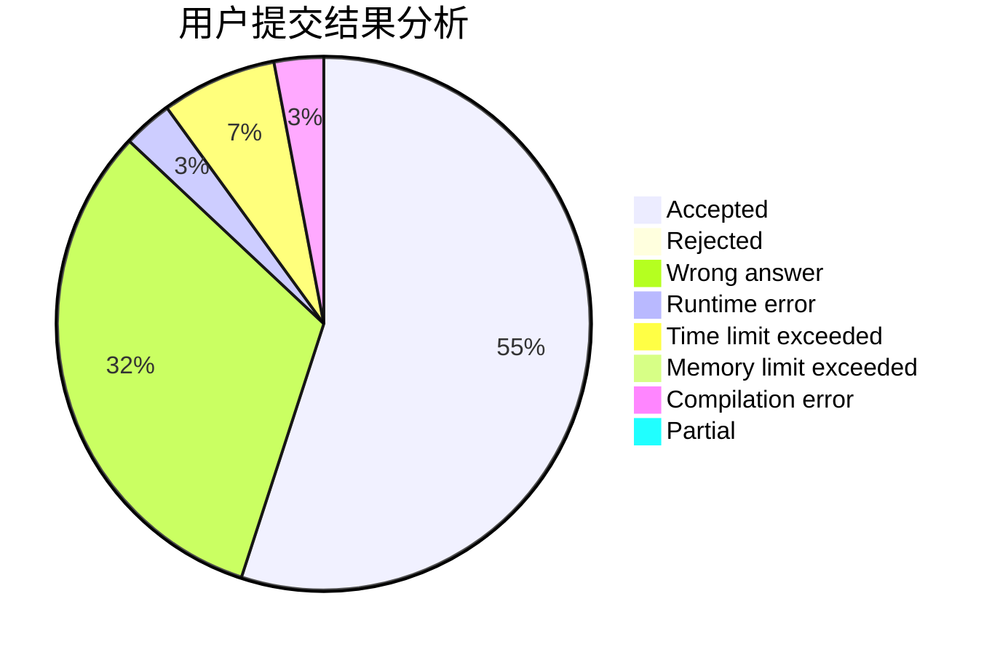
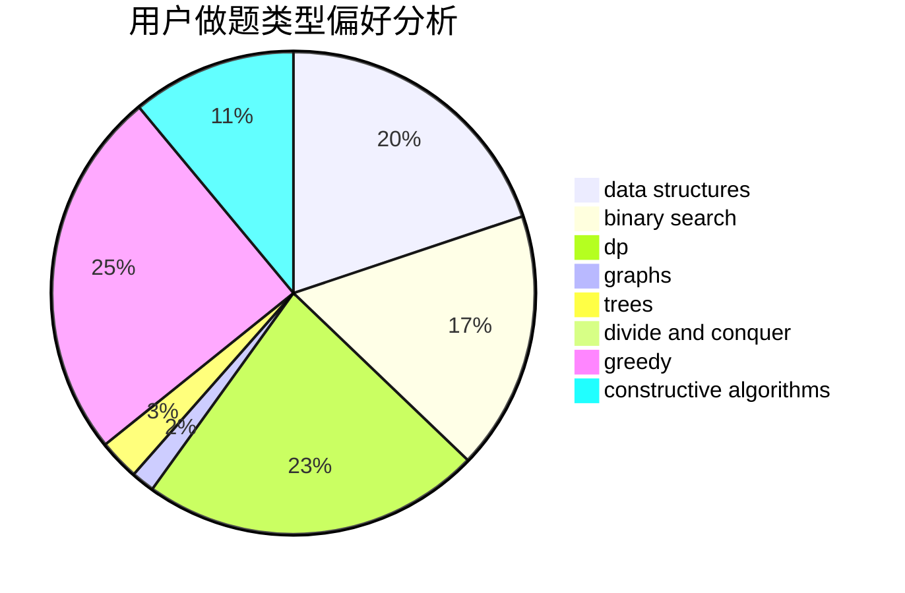

# alwaysR9
<!-- tabs:start -->
#### **用户提交结果分析**

#### **用户做题类型偏好分析**

#### **用户错题知识点分析**

<!-- tabs:end -->
# 推荐题目
[Max Mex](http://codeforces.com/problemset/problem/1083/C)		data structures,
                        trees		  
[Yellow Cards](http://codeforces.com/problemset/problem/1215/A)		greedy,
                        implementation,
                        math		  
[Fibonotci](http://codeforces.com/problemset/problem/575/A)		data structures,
                        math,
                        matrices		  
[QAQ](http://codeforces.com/problemset/problem/894/A)		brute force,
                        dp		  
[Modular Equations](http://codeforces.com/problemset/problem/495/B)		math,
                        number theory		  
[Data Center Drama](http://codeforces.com/problemset/problem/527/E)		dfs and similar,
                        graphs		  
[Maximum Control (easy)](http://codeforces.com/problemset/problem/958/B1)		implementation		  
[Santa Claus and Robot](http://codeforces.com/problemset/problem/748/C)		constructive algorithms,
                        math		  
[The Meeting Place Cannot Be Changed](http://codeforces.com/problemset/problem/982/F)		dfs and similar,
                        graphs		  
[Poman Numbers](https://codeforces.com/contest/1464/problem/C)		bitmasks,
                        greedy,
                        math,
                        strings		  
<!-- tabs:start -->
#### **data structures**
[Max Mex](http://codeforces.com/problemset/problem/1083/C)		data structures,
                        trees		  
[Yellow Cards](http://codeforces.com/problemset/problem/575/A)		data structures,
                        math,
                        matrices		  
[Fibonotci](http://codeforces.com/problemset/problem/958/B2)		data structures,
                        dfs and similar,
                        graphs,
                        greedy,
                        trees		  
[QAQ](https://codeforces.com/contest/947/problem/B)		binary search,
                        data structures		  
[Modular Equations](http://codeforces.com/problemset/problem/487/E)		data structures,
                        dfs and similar,
                        graphs,
                        trees		  
[Data Center Drama](http://codeforces.com/problemset/problem/1492/C)		binary search,
                        data structures,
                        dp,
                        greedy,
                        two pointers		  
[Maximum Control (easy)](http://codeforces.com/problemset/problem/1490/G)		binary search,
                        data structures,
                        math		  
[Santa Claus and Robot](http://codeforces.com/problemset/problem/1479/D)		binary search,
                        bitmasks,
                        brute force,
                        data structures,
                        probabilities,
                        trees		  
[The Meeting Place Cannot Be Changed](http://codeforces.com/problemset/problem/1497/A)		brute force,
                        data structures,
                        greedy,
                        sortings		  
[Poman Numbers](http://codeforces.com/problemset/problem/1491/C)		brute force,
                        data structures,
                        dp,
                        greedy,
                        implementation		  
#### **binary search**
[Max Mex](http://codeforces.com/problemset/problem/1486/C1)		binary search,
                        interactive		  
[Yellow Cards](https://codeforces.com/contest/947/problem/B)		binary search,
                        data structures		  
[Fibonotci](http://codeforces.com/problemset/problem/1492/C)		binary search,
                        data structures,
                        dp,
                        greedy,
                        two pointers		  
[QAQ](http://codeforces.com/problemset/problem/1463/D)		binary search,
                        constructive algorithms,
                        greedy,
                        two pointers		  
[Modular Equations](http://codeforces.com/problemset/problem/1490/G)		binary search,
                        data structures,
                        math		  
[Data Center Drama](http://codeforces.com/problemset/problem/1479/D)		binary search,
                        bitmasks,
                        brute force,
                        data structures,
                        probabilities,
                        trees		  
[Maximum Control (easy)](http://codeforces.com/problemset/problem/1436/E)		binary search,
                        data structures,
                        two pointers		  
[Santa Claus and Robot](http://codeforces.com/problemset/problem/1461/D)		binary search,
                        brute force,
                        data structures,
                        divide and conquer,
                        implementation,
                        sortings		  
[The Meeting Place Cannot Be Changed](http://codeforces.com/problemset/problem/1493/C)		binary search,
                        brute force,
                        constructive algorithms,
                        greedy,
                        strings		  
[Poman Numbers](http://codeforces.com/problemset/problem/1487/D)		binary search,
                        brute force,
                        math,
                        number theory		  
#### **dp**
[Max Mex](http://codeforces.com/problemset/problem/894/A)		brute force,
                        dp		  
[Yellow Cards](https://codeforces.com/contest/1281/problem/F)		dp,
                        greedy,
                        trees		  
[Fibonotci](http://codeforces.com/problemset/problem/938/F)		bitmasks,
                        dp,
                        greedy		  
[QAQ](http://codeforces.com/problemset/problem/57/D)		dp,
                        math		  
[Modular Equations](http://codeforces.com/problemset/problem/1276/A)		dp,
                        greedy		  
[Data Center Drama](https://codeforces.com/contest/259/problem/D)		brute force,
                        combinatorics,
                        dp		  
[Maximum Control (easy)](http://codeforces.com/problemset/problem/1140/D)		dp,
                        greedy,
                        math		  
[Santa Claus and Robot](http://codeforces.com/problemset/problem/893/E)		combinatorics,
                        dp,
                        math,
                        number theory		  
[The Meeting Place Cannot Be Changed](http://codeforces.com/problemset/problem/1492/C)		binary search,
                        data structures,
                        dp,
                        greedy,
                        two pointers		  
[Poman Numbers](https://codeforces.com/contest/1457/problem/C)		brute force,
                        dp,
                        implementation		  
#### **graph**
[Max Mex](http://codeforces.com/problemset/problem/527/E)		dfs and similar,
                        graphs		  
[Yellow Cards](http://codeforces.com/problemset/problem/982/F)		dfs and similar,
                        graphs		  
[Fibonotci](https://codeforces.com/contest/1464/problem/A)		dfs and similar,
                        dsu,
                        graphs		  
[QAQ](http://codeforces.com/problemset/problem/958/B2)		data structures,
                        dfs and similar,
                        graphs,
                        greedy,
                        trees		  
[Modular Equations](http://codeforces.com/problemset/problem/1255/B)		graphs,
                        implementation		  
[Data Center Drama](http://codeforces.com/problemset/problem/1037/E)		graphs		  
[Maximum Control (easy)](https://codeforces.com/contest/1440/problem/C2)		constructive algorithms,
                        graphs,
                        greedy,
                        implementation		  
[Santa Claus and Robot](http://codeforces.com/problemset/problem/487/E)		data structures,
                        dfs and similar,
                        graphs,
                        trees		  
[The Meeting Place Cannot Be Changed](http://codeforces.com/problemset/problem/1422/D)		graphs,
                        shortest paths,
                        sortings		  
[Poman Numbers](http://codeforces.com/problemset/problem/1487/C)		brute force,
                        constructive algorithms,
                        dfs and similar,
                        graphs,
                        greedy,
                        implementation,
                        math		  
#### **trees**
[Max Mex](http://codeforces.com/problemset/problem/1083/C)		data structures,
                        trees		  
[Yellow Cards](https://codeforces.com/contest/1281/problem/F)		dp,
                        greedy,
                        trees		  
[Fibonotci](http://codeforces.com/problemset/problem/958/B2)		data structures,
                        dfs and similar,
                        graphs,
                        greedy,
                        trees		  
[QAQ](http://codeforces.com/problemset/problem/487/E)		data structures,
                        dfs and similar,
                        graphs,
                        trees		  
[Modular Equations](http://codeforces.com/problemset/problem/1479/D)		binary search,
                        bitmasks,
                        brute force,
                        data structures,
                        probabilities,
                        trees		  
[Data Center Drama](http://codeforces.com/problemset/problem/1511/C)		brute force,
                        data structures,
                        implementation,
                        trees		  
[Maximum Control (easy)](http://codeforces.com/problemset/problem/1499/F)		combinatorics,
                        dfs and similar,
                        dp,
                        trees		  
[Santa Claus and Robot](http://codeforces.com/problemset/problem/1491/E)		brute force,
                        dfs and similar,
                        divide and conquer,
                        number theory,
                        trees		  
[The Meeting Place Cannot Be Changed](http://codeforces.com/problemset/problem/1466/D)		data structures,
                        greedy,
                        sortings,
                        trees		  
[Poman Numbers](http://codeforces.com/problemset/problem/1495/D)		combinatorics,
                        dfs and similar,
                        graphs,
                        math,
                        shortest paths,
                        trees		  
#### **divide and conquer**
[Max Mex](http://codeforces.com/problemset/problem/1461/D)		binary search,
                        brute force,
                        data structures,
                        divide and conquer,
                        implementation,
                        sortings		  
[Yellow Cards](http://codeforces.com/problemset/problem/1466/G)		combinatorics,
                        divide and conquer,
                        hashing,
                        math,
                        string suffix structures,
                        strings		  
[Fibonotci](http://codeforces.com/problemset/problem/1490/D)		dfs and similar,
                        divide and conquer,
                        implementation		  
[QAQ](https://codeforces.com/contest/1483/problem/C)		data structures,
                        divide and conquer,
                        dp		  
[Modular Equations](http://codeforces.com/problemset/problem/1491/E)		brute force,
                        dfs and similar,
                        divide and conquer,
                        number theory,
                        trees		  
[Data Center Drama](http://codeforces.com/problemset/problem/1303/G)		data structures,
                        divide and conquer,
                        geometry,
                        trees		  
[Maximum Control (easy)](http://codeforces.com/problemset/problem/1494/D)		constructive algorithms,
                        data structures,
                        dfs and similar,
                        divide and conquer,
                        dsu,
                        greedy,
                        sortings,
                        trees		  
[Santa Claus and Robot](http://codeforces.com/problemset/problem/1482/E)		data structures,
                        divide and conquer,
                        dp		  
[The Meeting Place Cannot Be Changed](http://codeforces.com/problemset/problem/566/C)		dfs and similar,
                        divide and conquer,
                        trees		  
[Poman Numbers](http://codeforces.com/problemset/problem/1428/F)		binary search,
                        data structures,
                        divide and conquer,
                        dp,
                        two pointers		  
#### **greedy**
[Max Mex](http://codeforces.com/problemset/problem/1215/A)		greedy,
                        implementation,
                        math		  
[Yellow Cards](https://codeforces.com/contest/1464/problem/C)		bitmasks,
                        greedy,
                        math,
                        strings		  
[Fibonotci](https://codeforces.com/contest/1281/problem/F)		dp,
                        greedy,
                        trees		  
[QAQ](http://codeforces.com/problemset/problem/938/F)		bitmasks,
                        dp,
                        greedy		  
[Modular Equations](http://codeforces.com/problemset/problem/1276/A)		dp,
                        greedy		  
[Data Center Drama](http://codeforces.com/problemset/problem/958/B2)		data structures,
                        dfs and similar,
                        graphs,
                        greedy,
                        trees		  
[Maximum Control (easy)](https://codeforces.com/contest/1440/problem/C2)		constructive algorithms,
                        graphs,
                        greedy,
                        implementation		  
[Santa Claus and Robot](http://codeforces.com/problemset/problem/1332/B)		brute force,
                        constructive algorithms,
                        greedy,
                        math,
                        number theory		  
[The Meeting Place Cannot Be Changed](http://codeforces.com/problemset/problem/1491/A)		brute force,
                        greedy,
                        implementation		  
[Poman Numbers](http://codeforces.com/problemset/problem/1140/D)		dp,
                        greedy,
                        math		  
#### **constructive algorithms**
[Max Mex](http://codeforces.com/problemset/problem/748/C)		constructive algorithms,
                        math		  
[Yellow Cards](http://codeforces.com/problemset/problem/449/C)		constructive algorithms,
                        number theory		  
[Fibonotci](https://codeforces.com/contest/1440/problem/C2)		constructive algorithms,
                        graphs,
                        greedy,
                        implementation		  
[QAQ](http://codeforces.com/problemset/problem/1332/B)		brute force,
                        constructive algorithms,
                        greedy,
                        math,
                        number theory		  
[Modular Equations](http://codeforces.com/problemset/problem/609/B)		constructive algorithms,
                        implementation		  
[Data Center Drama](http://codeforces.com/problemset/problem/1242/A)		constructive algorithms,
                        math,
                        number theory		  
[Maximum Control (easy)](http://codeforces.com/problemset/problem/1474/E)		constructive algorithms,
                        greedy		  
[Santa Claus and Robot](https://codeforces.com/contest/1447/problem/C)		constructive algorithms,
                        greedy,
                        sortings		  
[The Meeting Place Cannot Be Changed](http://codeforces.com/problemset/problem/1493/A)		constructive algorithms,
                        greedy		  
[Poman Numbers](http://codeforces.com/problemset/problem/1463/D)		binary search,
                        constructive algorithms,
                        greedy,
                        two pointers		  
#### **sortings**
[Max Mex](http://codeforces.com/problemset/problem/817/B)		combinatorics,
                        implementation,
                        math,
                        sortings		  
[Yellow Cards](http://codeforces.com/problemset/problem/723/A)		implementation,
                        math,
                        sortings		  
[Fibonotci](https://codeforces.com/contest/1447/problem/C)		constructive algorithms,
                        greedy,
                        sortings		  
[QAQ](http://codeforces.com/problemset/problem/1422/D)		graphs,
                        shortest paths,
                        sortings		  
[Modular Equations](https://codeforces.com/contest/1496/problem/C)		geometry,
                        greedy,
                        math,
                        sortings		  
[Data Center Drama](http://codeforces.com/problemset/problem/1495/A)		geometry,
                        greedy,
                        math,
                        sortings		  
[Maximum Control (easy)](http://codeforces.com/problemset/problem/1497/A)		brute force,
                        data structures,
                        greedy,
                        sortings		  
[Santa Claus and Robot](http://codeforces.com/problemset/problem/1427/A)		math,
                        sortings		  
[The Meeting Place Cannot Be Changed](http://codeforces.com/problemset/problem/1461/D)		binary search,
                        brute force,
                        data structures,
                        divide and conquer,
                        implementation,
                        sortings		  
[Poman Numbers](http://codeforces.com/problemset/problem/1437/C)		dp,
                        flows,
                        graph matchings,
                        greedy,
                        math,
                        sortings		  
<!-- tabs:end -->
