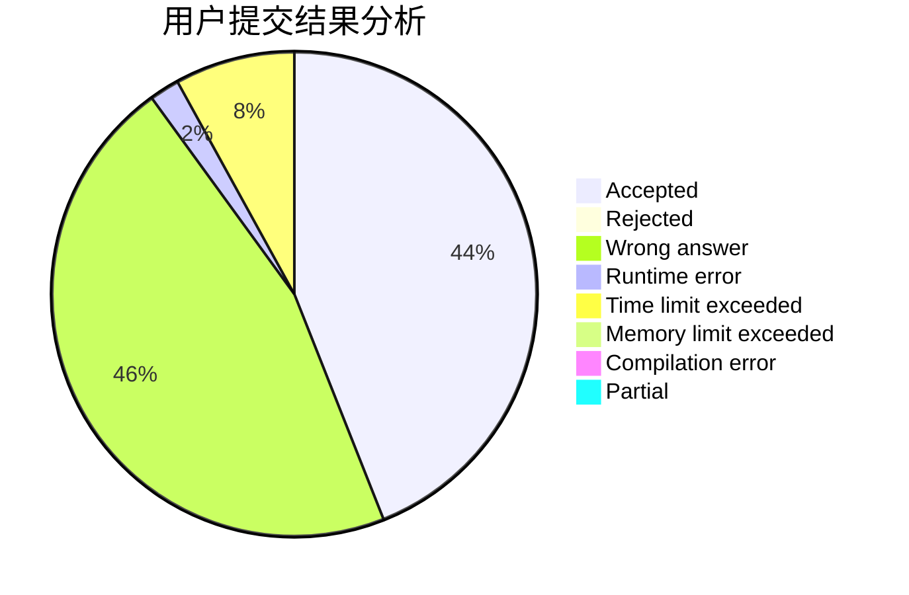
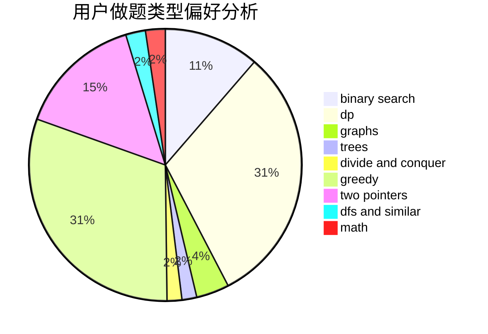

# ambrumf

<!-- tabs:start -->

#### **用户提交结果分析**

#### **用户做题类型偏好分析**

<!-- tabs:end -->
# 推荐题目
[1310C](https://codeforces.com/contest/1310/problem/C)
[834C](https://codeforces.com/contest/834/problem/C)
[1055A](https://codeforces.com/contest/1055/problem/A)
[297C](https://codeforces.com/contest/297/problem/C)
[856E](https://codeforces.com/contest/856/problem/E)
[1155F](https://codeforces.com/contest/1155/problem/F)
[691B](https://codeforces.com/contest/691/problem/B)
[1054F](https://codeforces.com/contest/1054/problem/F)
[7B](https://codeforces.com/contest/7/problem/B)
[22B](https://codeforces.com/contest/22/problem/B)
