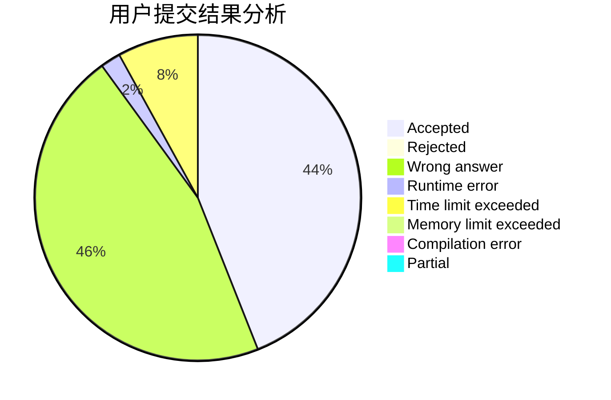
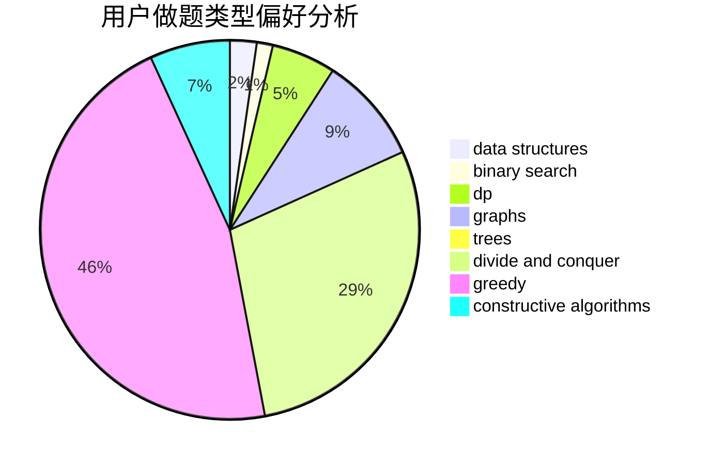
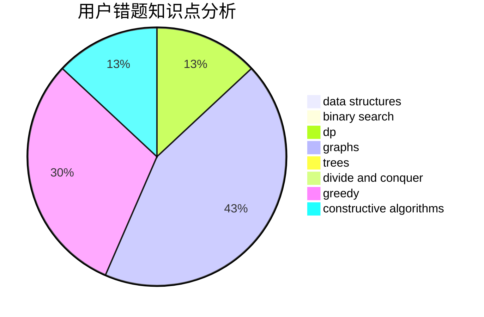

# ambrumf

<!-- tabs:start -->

#### **用户提交结果分析**

#### **用户做题类型偏好分析**

#### **用户错题知识点分析**

<!-- tabs:end -->
# 推荐题目
[1300E](https://codeforces.com/contest/1300/problem/E)		dsu,graphs,sortings,trees		  
[815C](https://codeforces.com/contest/815/problem/C)		brute force,
                        dp,
                        trees		  
[1054F](https://codeforces.com/contest/1054/problem/F)		flows,
                        graph matchings		  
[281A](https://codeforces.com/contest/281/problem/A)		implementation,
                        strings		  
[838E](https://codeforces.com/contest/838/problem/E)		dp		  
[1153F](https://codeforces.com/contest/1153/problem/F)		combinatorics,
                        dp,
                        math,
                        probabilities		  
[669A](https://codeforces.com/contest/669/problem/A)		math		  
[1054B](https://codeforces.com/contest/1054/problem/B)		implementation		  
[781D](https://codeforces.com/contest/781/problem/D)		dsu,graphs,sortings,trees		  
[208A](https://codeforces.com/contest/208/problem/A)		strings		  
