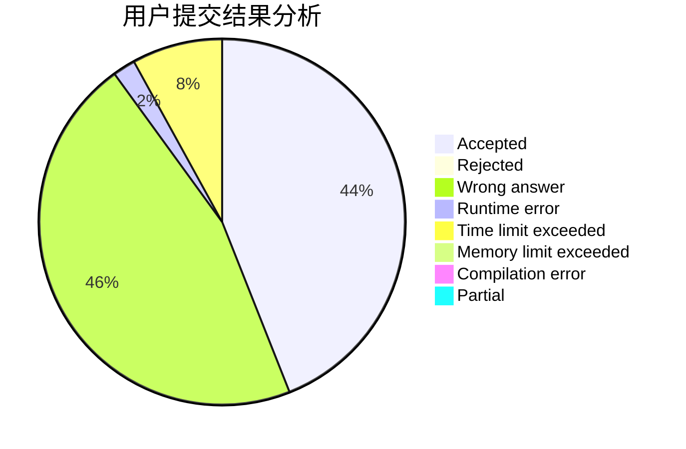
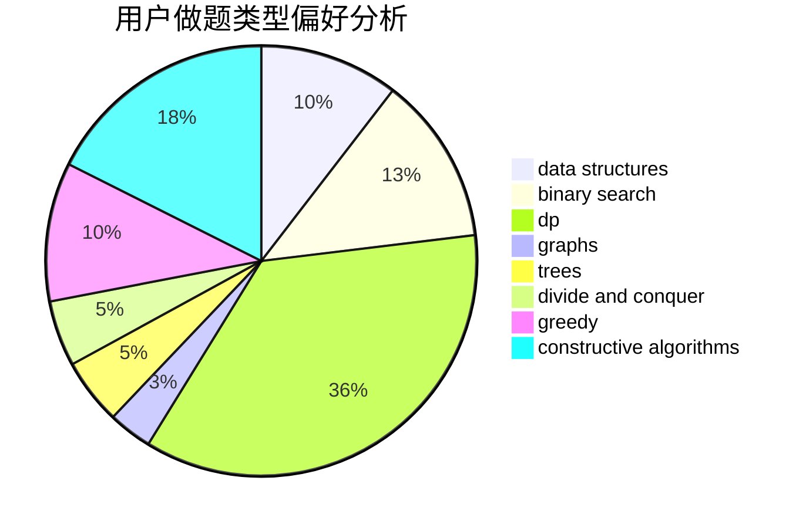
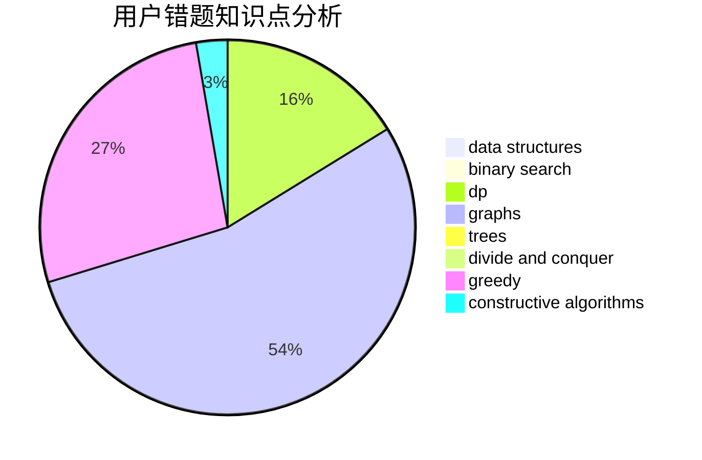

# ambrumf

<!-- tabs:start -->

#### **用户提交结果分析**

#### **用户做题类型偏好分析**

#### **用户错题知识点分析**

<!-- tabs:end -->
# 推荐题目
[1310C](https://codeforces.com/contest/1310/problem/C)		binary search,
                        dp,
                        strings		  
[834C](https://codeforces.com/contest/834/problem/C)		dsu,graphs,sortings,trees		  
[1055A](https://codeforces.com/contest/1055/problem/A)		graphs		  
[297C](https://codeforces.com/contest/297/problem/C)		constructive algorithms		  
[856E](https://codeforces.com/contest/856/problem/E)		nan		  
[1155F](https://codeforces.com/contest/1155/problem/F)		brute force,
                        dp,
                        graphs		  
[691B](https://codeforces.com/contest/691/problem/B)		implementation,
                        strings		  
[1054F](https://codeforces.com/contest/1054/problem/F)		flows,
                        graph matchings		  
[7B](https://codeforces.com/contest/7/problem/B)		implementation		  
[22B](https://codeforces.com/contest/22/problem/B)		brute force,
                        dp		  
