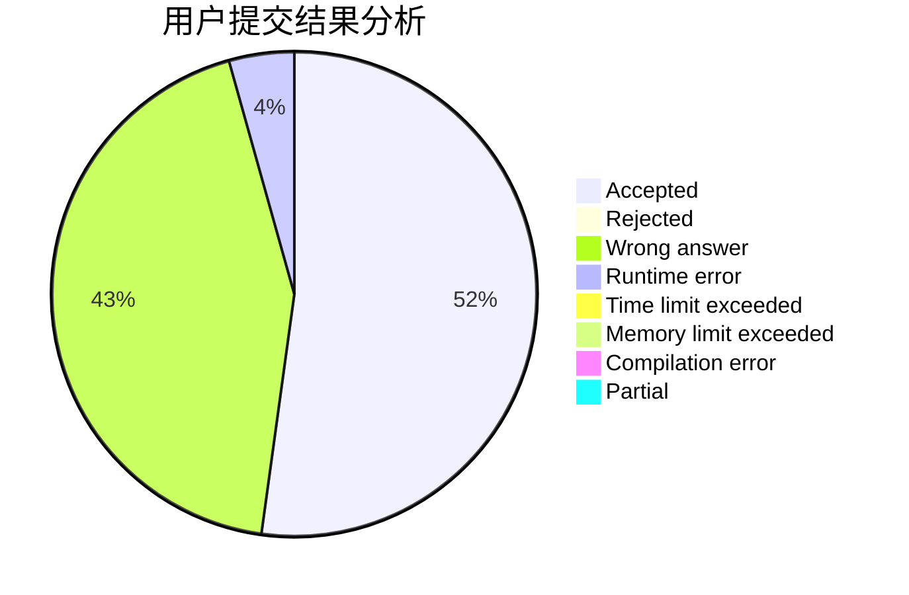
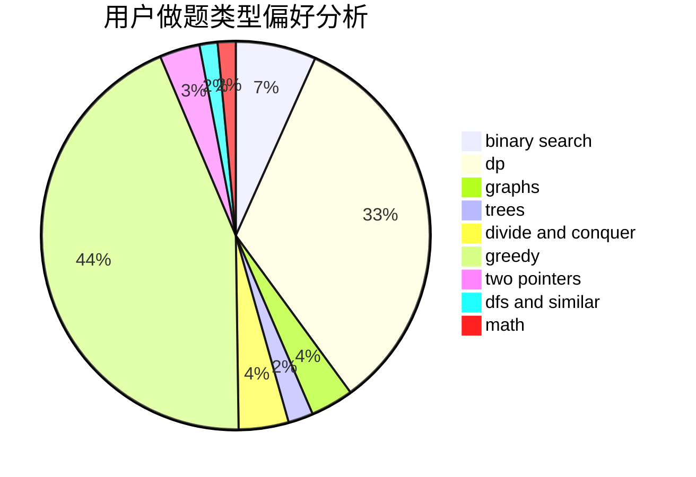

# andrewfeng

<!-- tabs:start -->

#### **用户提交结果分析**

#### **用户做题类型偏好分析**

<!-- tabs:end -->
# 推荐题目
[14791](https://codeforces.com/contest/1479/problem/1)
[700E](https://codeforces.com/contest/700/problem/E)
[279B](https://codeforces.com/contest/279/problem/B)
[1223E](https://codeforces.com/contest/1223/problem/E)
[629D](https://codeforces.com/contest/629/problem/D)
[581B](https://codeforces.com/contest/581/problem/B)
[44E](https://codeforces.com/contest/44/problem/E)
[312A](https://codeforces.com/contest/312/problem/A)
[238C](https://codeforces.com/contest/238/problem/C)
[1217E](https://codeforces.com/contest/1217/problem/E)
