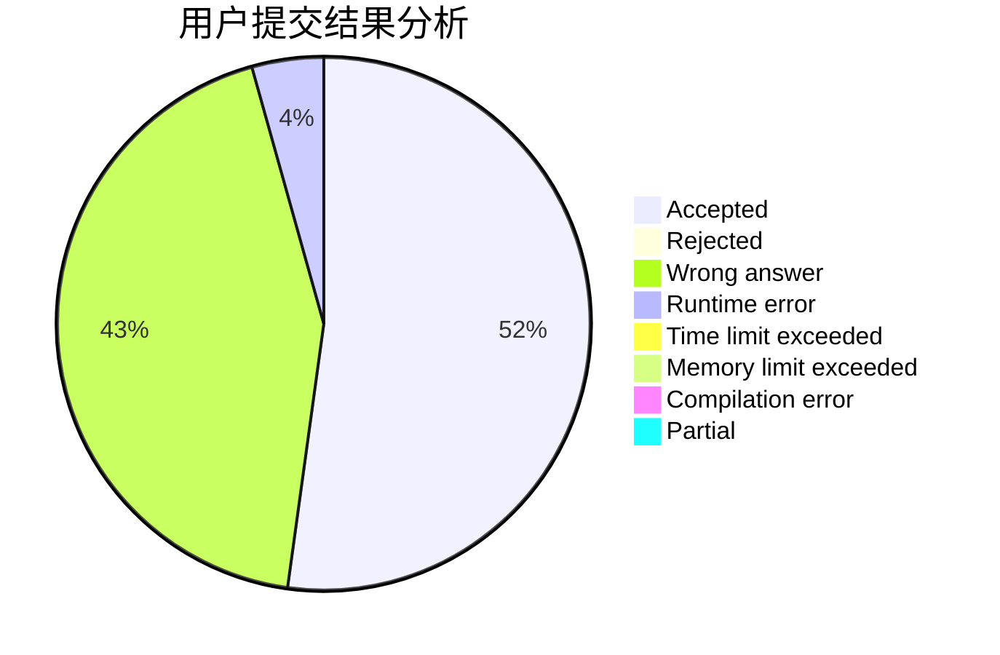
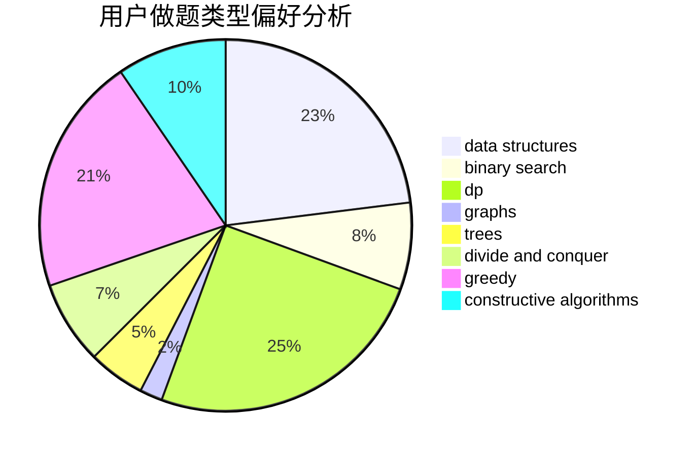
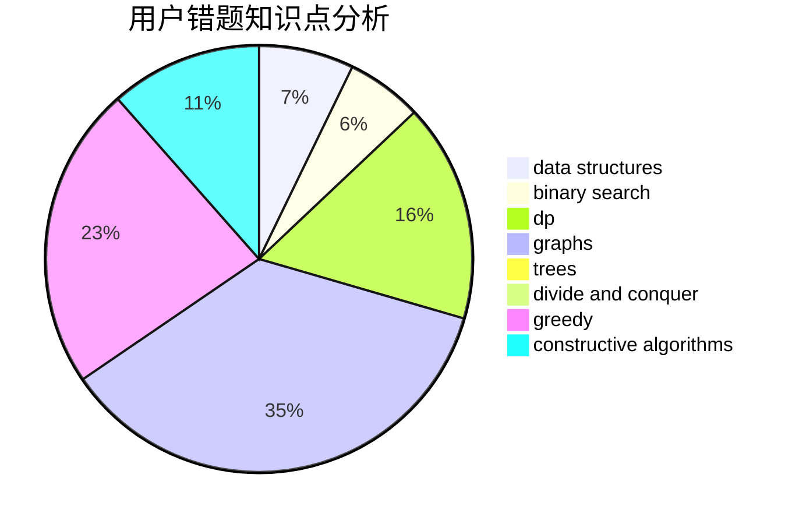

# andrewfeng

<!-- tabs:start -->

#### **用户提交结果分析**

#### **用户做题类型偏好分析**

#### **用户错题知识点分析**

<!-- tabs:end -->
# 推荐题目
[14791](https://codeforces.com/contest/1479/problem/1)		dsu,graphs,sortings,trees		  
[700E](https://codeforces.com/contest/700/problem/E)		string suffix structures,
                        strings		  
[279B](https://codeforces.com/contest/279/problem/B)		binary search,
                        brute force,
                        implementation,
                        two pointers		  
[1223E](https://codeforces.com/contest/1223/problem/E)		dp,
                        sortings,
                        trees		  
[629D](https://codeforces.com/contest/629/problem/D)		data structures,
                        dp		  
[581B](https://codeforces.com/contest/581/problem/B)		implementation,
                        math		  
[44E](https://codeforces.com/contest/44/problem/E)		dp		  
[312A](https://codeforces.com/contest/312/problem/A)		implementation,
                        strings		  
[238C](https://codeforces.com/contest/238/problem/C)		dfs and similar,
                        dp,
                        greedy,
                        trees		  
[1217E](https://codeforces.com/contest/1217/problem/E)		data structures,
                        greedy,
                        implementation,
                        math		  
