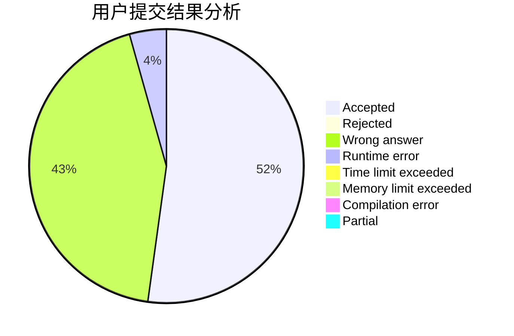
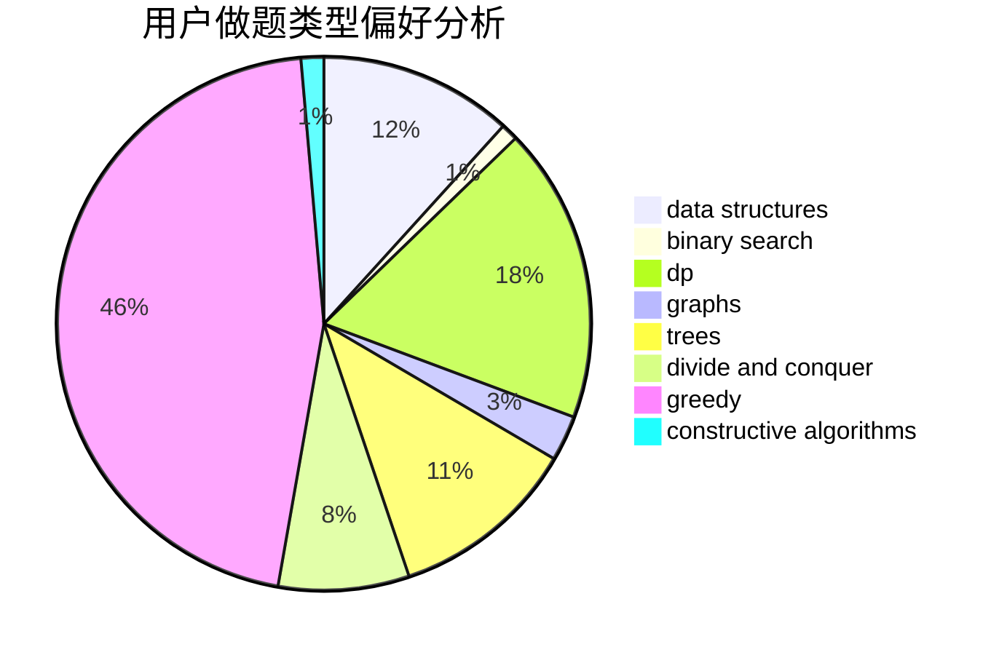

# andrewfeng

<!-- tabs:start -->

#### **用户提交结果分析**

#### **用户做题类型偏好分析**

#### **用户错题知识点分析**

<!-- tabs:end -->
# 推荐题目
[1470D](https://codeforces.com/contest/1470/problem/D)		constructive algorithms,
                        dfs and similar,
                        graph matchings,
                        graphs,
                        greedy		  
[676E](https://codeforces.com/contest/676/problem/E)		math		  
[260D](https://codeforces.com/contest/260/problem/D)		constructive algorithms,
                        dsu,
                        graphs,
                        greedy,
                        trees		  
[1217A](https://codeforces.com/contest/1217/problem/A)		binary search,
                        math		  
[610B](https://codeforces.com/contest/610/problem/B)		constructive algorithms,
                        implementation		  
[558D](https://codeforces.com/contest/558/problem/D)		data structures,
                        implementation,
                        sortings		  
[429A](https://codeforces.com/contest/429/problem/A)		dfs and similar,
                        trees		  
[295C](https://codeforces.com/contest/295/problem/C)		combinatorics,
                        dp,
                        graphs,
                        shortest paths		  
[219A](https://codeforces.com/contest/219/problem/A)		implementation,
                        strings		  
[1213C](https://codeforces.com/contest/1213/problem/C)		math		  
