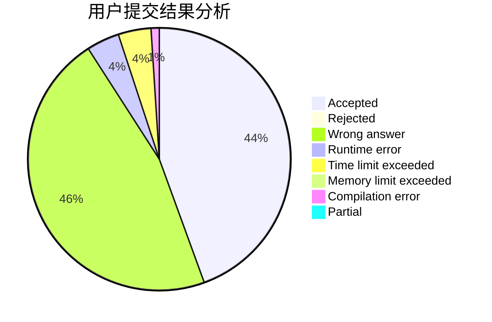
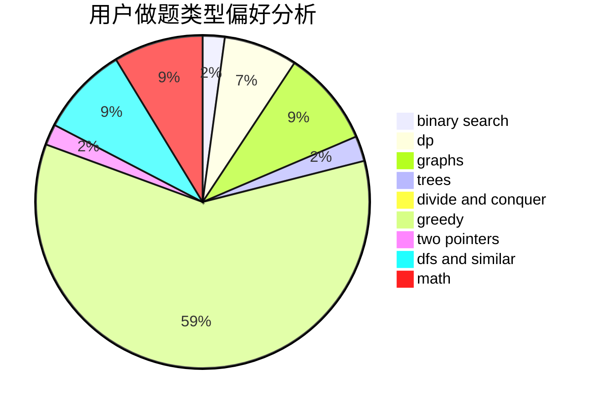

# anhpp

<!-- tabs:start -->

#### **用户提交结果分析**

#### **用户做题类型偏好分析**

<!-- tabs:end -->
# 推荐题目
[1442B](https://codeforces.com/contest/1442/problem/B)
[13131](https://codeforces.com/contest/1313/problem/1)
[1186D](https://codeforces.com/contest/1186/problem/D)
[1435E](https://codeforces.com/contest/1435/problem/E)
[1293C](https://codeforces.com/contest/1293/problem/C)
[107B](https://codeforces.com/contest/107/problem/B)
[1119A](https://codeforces.com/contest/1119/problem/A)
[680B](https://codeforces.com/contest/680/problem/B)
[1013A](https://codeforces.com/contest/1013/problem/A)
[277E](https://codeforces.com/contest/277/problem/E)
