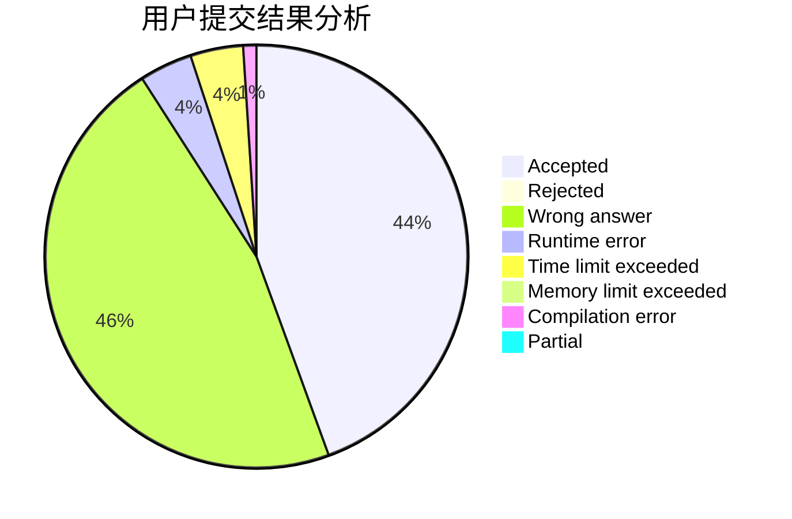
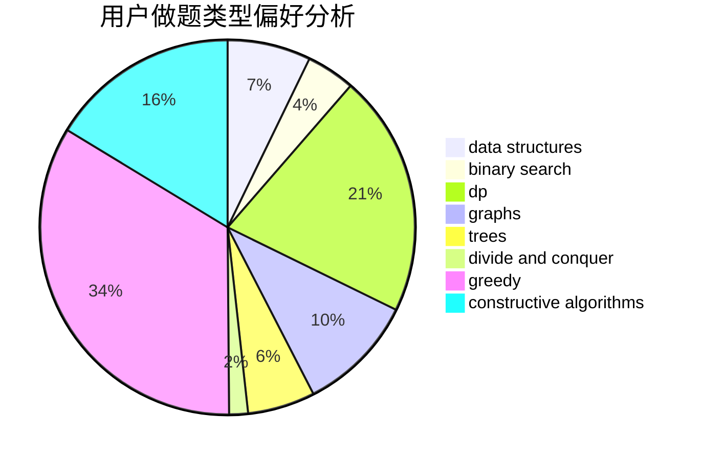
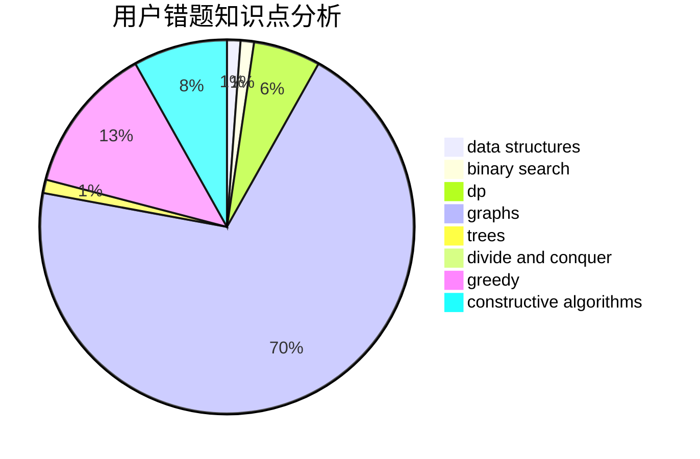

# anhpp

<!-- tabs:start -->

#### **用户提交结果分析**

#### **用户做题类型偏好分析**

#### **用户错题知识点分析**

<!-- tabs:end -->
# 推荐题目
[1432C](https://codeforces.com/contest/1432/problem/C)		dsu,graphs,sortings,trees		  
[1304C](https://codeforces.com/contest/1304/problem/C)		dp,
                        greedy,
                        implementation,
                        sortings,
                        two pointers		  
[1183F](https://codeforces.com/contest/1183/problem/F)		brute force,
                        math,
                        sortings		  
[1427B](https://codeforces.com/contest/1427/problem/B)		greedy,
                        implementation,
                        sortings		  
[1286B](https://codeforces.com/contest/1286/problem/B)		constructive algorithms,
                        data structures,
                        dfs and similar,
                        graphs,
                        greedy,
                        trees		  
[1079C](https://codeforces.com/contest/1079/problem/C)		dsu,graphs,sortings,trees		  
[1117B](https://codeforces.com/contest/1117/problem/B)		greedy,
                        math,
                        sortings		  
[660A](https://codeforces.com/contest/660/problem/A)		greedy,
                        implementation,
                        math,
                        number theory		  
[1012C](https://codeforces.com/contest/1012/problem/C)		dp		  
[25E](https://codeforces.com/contest/25/problem/E)		hashing,
                        strings		  
