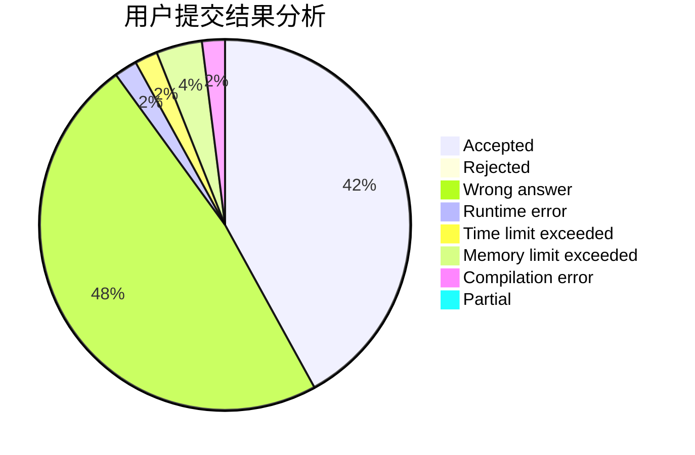
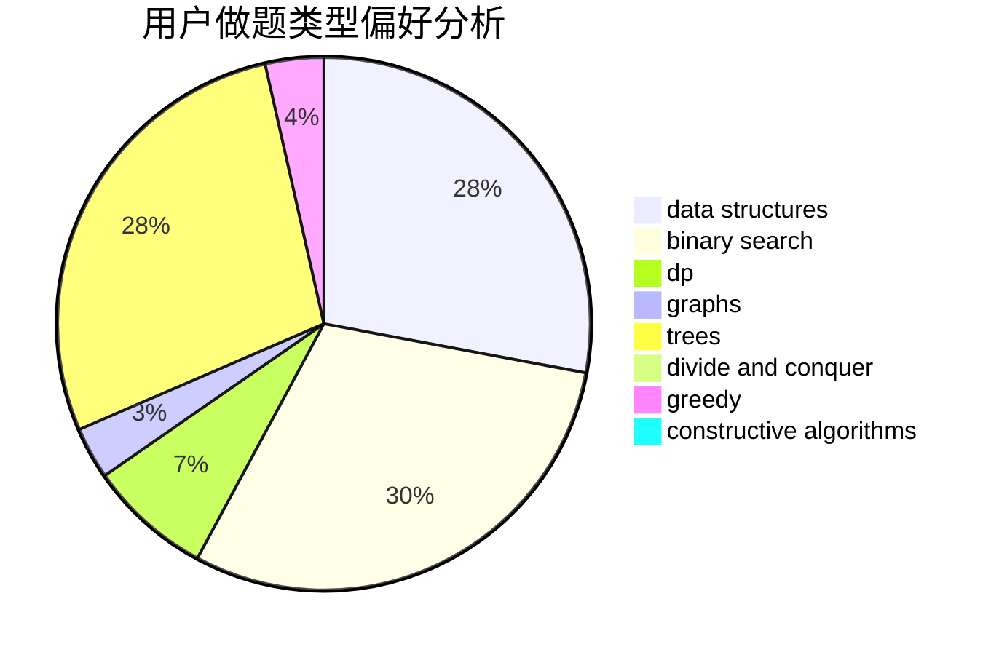
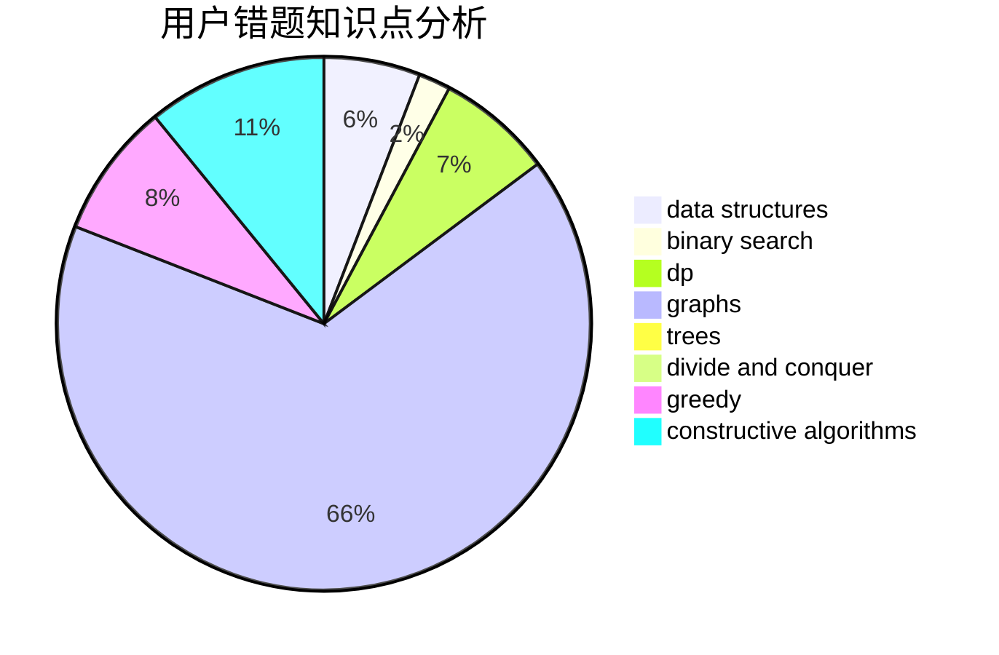

# answerend42

<!-- tabs:start -->

#### **用户提交结果分析**

#### **用户做题类型偏好分析**

#### **用户错题知识点分析**

<!-- tabs:end -->
# 推荐题目
[189A](https://codeforces.com/contest/189/problem/A)		brute force,
                        dp		  
[18A](https://codeforces.com/contest/18/problem/A)		brute force,
                        geometry		  
[1107E](https://codeforces.com/contest/1107/problem/E)		dp		  
[34A](https://codeforces.com/contest/34/problem/A)		implementation		  
[1034A](https://codeforces.com/contest/1034/problem/A)		number theory		  
[1138A](https://codeforces.com/contest/1138/problem/A)		binary search,
                        greedy,
                        implementation		  
[708D](https://codeforces.com/contest/708/problem/D)		flows		  
[620F](https://codeforces.com/contest/620/problem/F)		data structures,
                        strings,
                        trees		  
[1316A](https://codeforces.com/contest/1316/problem/A)		implementation		  
[10D](https://codeforces.com/contest/10/problem/D)		dp		  
