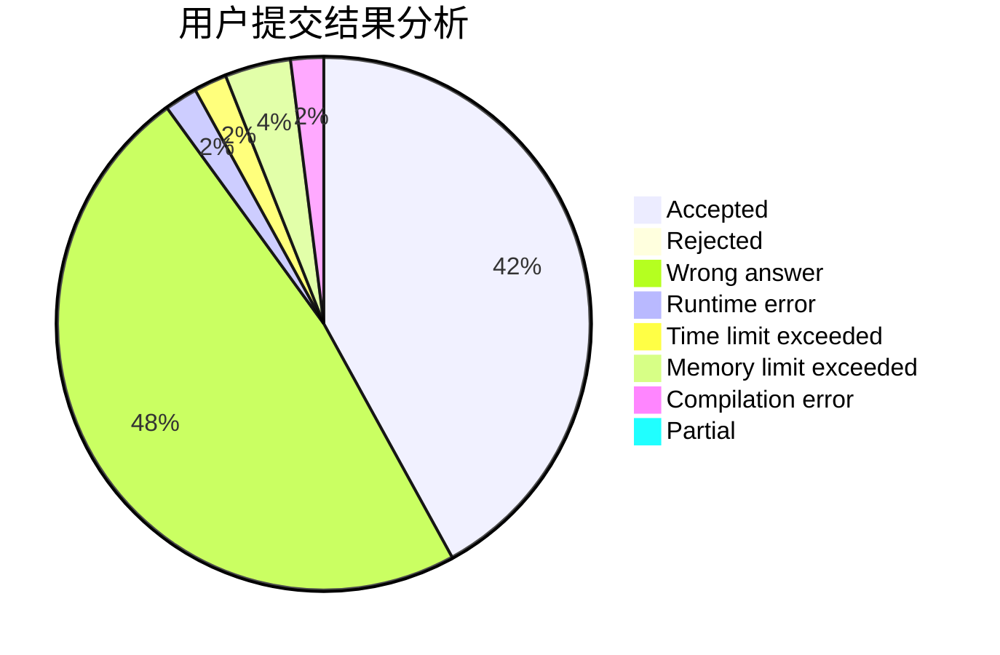
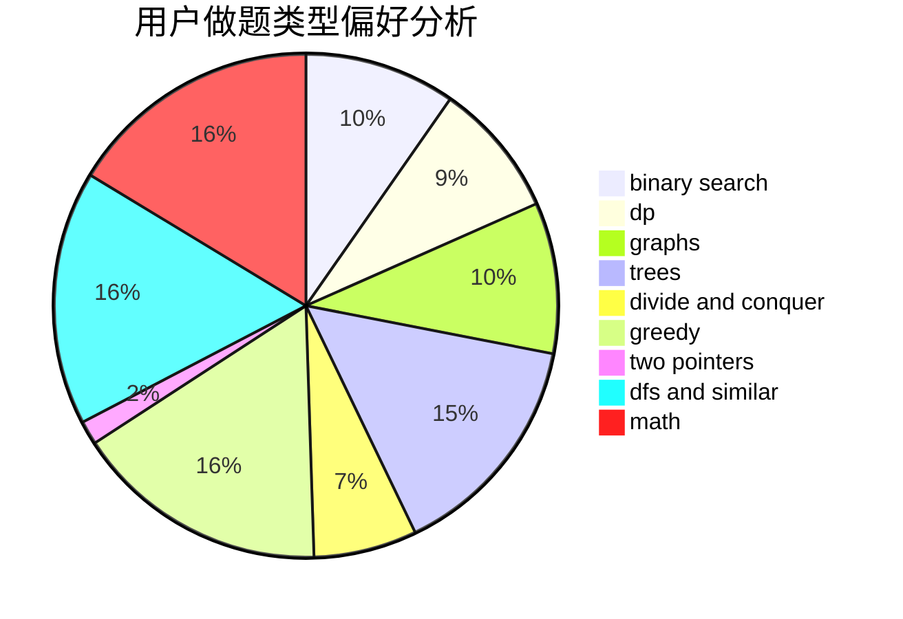

# answerend42

<!-- tabs:start -->

#### **用户提交结果分析**

#### **用户做题类型偏好分析**

<!-- tabs:end -->
# 推荐题目
[212E](https://codeforces.com/contest/212/problem/E)
[215A](https://codeforces.com/contest/215/problem/A)
[11082](https://codeforces.com/contest/1108/problem/2)
[376B](https://codeforces.com/contest/376/problem/B)
[1034D](https://codeforces.com/contest/1034/problem/D)
[113C](https://codeforces.com/contest/113/problem/C)
[727F](https://codeforces.com/contest/727/problem/F)
[644B](https://codeforces.com/contest/644/problem/B)
[1325E](https://codeforces.com/contest/1325/problem/E)
[1100B](https://codeforces.com/contest/1100/problem/B)
