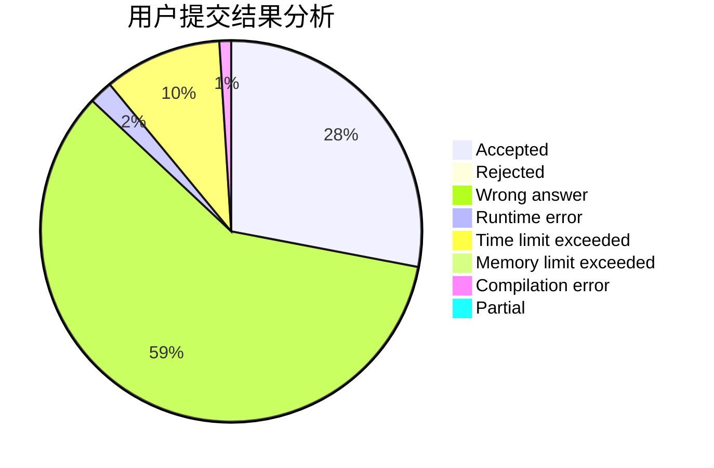
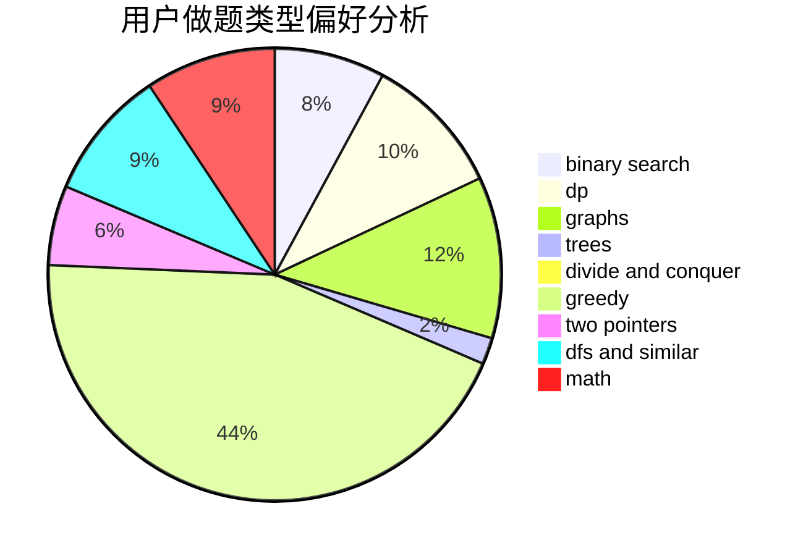

# as_lky

<!-- tabs:start -->

#### **用户提交结果分析**

#### **用户做题类型偏好分析**

<!-- tabs:end -->
# 推荐题目
[678C](https://codeforces.com/contest/678/problem/C)
[22A](https://codeforces.com/contest/22/problem/A)
[1363B](https://codeforces.com/contest/1363/problem/B)
[22E](https://codeforces.com/contest/22/problem/E)
[1364A](https://codeforces.com/contest/1364/problem/A)
[13571](https://codeforces.com/contest/1357/problem/1)
[715A](https://codeforces.com/contest/715/problem/A)
[1131D](https://codeforces.com/contest/1131/problem/D)
[456B](https://codeforces.com/contest/456/problem/B)
[879A](https://codeforces.com/contest/879/problem/A)
